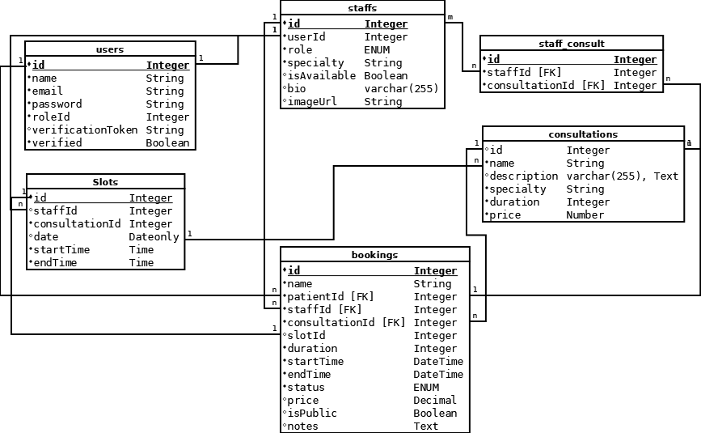

# ElitPort - Időpontfoglaló Rendszer Fejlesztői Dokumentáció

## 1. Célkitűzés és Problémamegoldás
Az ElitPort egy komplex megoldás az **Elit Klinika** számára, amely az online térbe emeli az orvosi időpontfoglalás folyamatát.

### Megoldás a kritikus problémákra:
* **Önkiszolgáló élmény:** Megszünteti a páciens oldali várakozást azáltal, hogy online, valós időben böngészhető felületet biztosít.
* **Manuális adminisztráció kiváltása:** Az automatizált slot-kezelés (idősávok) csökkenti az emberi mulasztás (pl. kettős foglalás) esélyét.
* **Erőforrás-összehangolás:** Algoritmikusan kezeli az orvos, a szolgáltatás típus és a szabad idősávok kapcsolatát.

### Fő célok:
1. **Valós slot-alapú foglalás:** Csak létező, szabad időpontokra lehet foglalni (nincs szabad szöveges időpont-megadás).
2. **Role-alapú hozzáférés:** Elkülönített jogosultsági szintek (Páciens, Orvos, Admin) a biztonságos és fenntartható működéshez.
3. **Automatizált visszacsatolás:** Foglalás utáni e-mail visszaigazolás automatikusan a rendszeren keresztül.

---

## 2. Kódolási konvenciók
* **Verziókezelés:** A kódot **Git** verziókezelővel használjuk (feature branch workflow).
* **Elnevezések:** CamelCase metódusnevek, PascalCase modellek, angol nyelvű forráskód.
* **Hibakezelés:** Minden aszinkron hívás `try-catch` blokkban, egységes JSON hibaüzenetekkel.

### Alapkönyvtárak
* **api:** A Node.js / Express alapú backend szerver forráskódja.
* **database:** Migrációk, seederek és az adatbázis konfigurációs fájljai.
* **doc:** Technikai dokumentációk, diagramok és prezentációk (ebben a könyvtárban található ez a fájl is).
* **test:** Automatizált tesztek (Mocha, Supertest).
* **web:** Az Angular alapú webes frontend forráskódja.
* **public:** Statikus állományok (képek, ikonok, globális stíluslapok).

---

## 3. Fejlesztői környezet
* **Backend:** Node.js (LTS verzió) futtatókörnyezet és Express keretrendszer.
* **Adatbázis:** SQLite3 (fájlalapú, beágyazott adatbázis a könnyű hordozhatóság és egyszerű fejlesztés érdekében).
* **Frontend:** Angular webes alkalmazás (SPA architektúra).
* **IDE:** Visual Studio Code (ajánlott).
* **API Tesztelés:** Insomnia vagy Postman a végpontok manuális ellenőrzéséhez.

---

## 4. Felhasznált technológiák
* **Szerveroldal:** Node.js / Express (REST API).
* **ORM:** Sequelize (SQLite3 támogatással az adatok absztrakciójához).
* **Kliensoldal:** Angular 20 (TypeScript alapú fejlesztés).
* **Hitelesítés:** JWT (JSON Web Token) az állapotmentes és biztonságos azonosításhoz.
* **Email:** Nodemailer (SMTP protokollon keresztüli értesítések).

---

## 5. Algoritmusok
Az alkalmazás stabilitását az alábbi logikai folyamatok biztosítják:
* **Idősáv ütközésvizsgálat:** Atomi tranzakció keretében ellenőrzi a `slotId` elérhetőségét foglaláskor; sikeres foglalás esetén azonnali zárolás (`isAvailable: false`).
* **Dátum-szinkronizáció:** A Sequelize `DATEONLY` és `TIME` típusok használata az adatbázisban az időzóna-eltolódások elkerülésére.
* **Dinamikus Sablonkezelés:** Az `EmailService` modulban futó algoritmus, amely a foglalási adatokat (orvos, dátum, ár) injektálja a HTML sablonba küldés előtt.

---

## 6. Tiszta kód és karbantarthatóság
* **Felelősség szerinti szétválasztás:** Controller, Service, Model, Middleware és Komponens rétegek szigorú elhatárolása.
* **Beszédes elnevezések:** Öndokumentáló kód, különválasztott hitelesítési (`auth`) és foglalási (`booking`) logika.
* **DRY elv:** Ismétlődés csökkentése közös service-ekkel és shared utility függvényekkel.
* **Logikai elszigetelés:** A migrációk és seederek teljesen elkülönülnek a runtime (futtatási) logikától.

---

## 7. Migrációk, seederek és adat-életciklus
### Séma felépítése (Migrations)
Az adatbázis sémája verziózott fájlokon keresztül épül fel az `api/database/migrations` mappában:
`00_create_role` -> `01_create_users` -> `02_create_staff` -> `03_create_consultations` -> `04_staff_consult` -> `05_slots` -> `06_bookings`.
Ez biztosítja a reprodukálható telepítést és a verziókövetett adatbázis-fejlesztést.

### Adatfeltöltés (Seeders)
A seederek külön modulokban töltik fel a teszteléshez szükséges alapadatokat: `users`, `staff`, `consultations`, `slots` és `bookings`.
*Forrás: api/database/seeders.*

---

## 8. Frontend architektúra és biztonság
### Service Layer
* **auth.service:** Kezeli a belépést, a token tárolást és a session logikát.
* **Domain service-ek:** A `booking`, `consultation` és `staff` hívások domain szerinti bontása a karbantarthatóságért.
* **Auth Interceptor:** Automatikusan csatolja a hitelesítési adatokat (Bearer Token) minden kimenő HTTP kéréshez.

### Felhasználói útvonalak és védelem
* **Publikus nézetek:** Információs oldal, regisztráció, belépés, szakember lista.
* **Védett nézetek:** Foglalási folyamat és adminisztratív funkciók.
* **Route Guard:** Az `auth-guard.ts` navigáció előtt ellenőrzi a jogosultságot.

---

## 9. Adatmodell és API UML
A rendszer architektúrája az MVC (Model-View-Controller) mintát követi.

[Image of Model-View-Controller architecture diagram]

Az adatbázis sémáját és a táblák közötti kapcsolatokat az alábbi diagram szemlélteti:

*Megjegyzés: A diagram szerkeszthető forrásfájlja: [adatmodell.dia](./adatmodell.dia)*

---

## 10. Végpontok (EndPoints)
A REST API JSON alapú kommunikációt használ. Főbb modulok:
* **staffs:** Személyzet lekérése, felvétele és kezelése.
* **consultations:** Vizsgálatok típusai, árai és leírásai.
* **slots:** Elérhető időpontok kezelése és generálása.
* **bookings:** Foglalási tranzakciók rögzítése és státuszkezelése.

---

## 11. Tesztelés
* **API Tesztelés:** Mocha és Supertest segítségével végzett automatizált integrációs tesztek a `test` mappában.
* **Manuális Tesztelés:** Insomnia gyűjtemény a végpontok dokumentálásához és gyors ellenőrzéséhez.

---

## 12. Fejlesztési lehetőség
### Rövid táv
* E-mail emlékeztetők küldése 24 órával az időpont előtt.
* Admin riportok (kihasználtság, bevételi adatok, no-show statisztika).
* Frontend e2e tesztkiterjesztés (pl. Cypress).

### Középtáv
* Naptár export/szinkronizáció (Google Calendar, Outlook).
* Online fizetési integráció (Stripe vagy PayPal).
