<div align="center">

# BZSH Külkereskedelmi 2025/2026 tanév
## Technikum
### **Szakma:** SZOFTVERFEJLESZTŐ ÉS -TESZTELŐ TECHNIKUS

<br><br><br><br><br><br>

# SZAKDOLGOZAT


# D O K U M E N T Á C I Ó

## Vizsgaremek

<br>

## ElitPort: Egészségügyi időpontfoglaló rendszer fejlesztése

<br><br><br><br><br><br>

<div align="left" style="display: flex; justify-content: space-between;">
  <div>
    <strong>Készítette:</strong><br>
    Nagy Etelka<br>
    SZOFTVERFEJLESZTŐ ÉS -TESZTELŐ
  </div>
  <br>
  <div align="right">
    <strong>Konzulens:</strong><br>
    [Konzulens Neve]<br>
    [Beosztása]
  </div>
</div>

<br><br><br><br><br>

### Budapest
### 2026

</div>

---

# 1. Bevezetés

A digitális transzformáció ma már az egészségügy minden területén alapvető elvárás, nem csupán a kényelem, hanem a folyamatok átláthatósága és precizitása miatt is. Dokumentációm tárgya az **ElitPort**, egy komplex egészségügyi menedzsment megoldás, amely webapplikáció formájában érhető el és amelyet az **Elit Klinika** specifikus igényeire szabva fejlesztettem ki.

### 1.1. A projekt célja és szakmai hasznosulása
A szoftver elsődleges célja a manuális, időigényes adminisztráció – például a telefonos időpontegyeztetés és a papíralapú naptárkezelés – kiváltása egy modern, **reszponzív webalkalmazással**. A rendszer egy idősáv-alapú (slot-based) online foglalási logikára épül, amely közvetlen összeköttetést teremt a klinika kínálata és a páciensek igényei között.

A szakmai megvalósítás során egy olyan **intelligens páciensmenedzsment-platform** létrehozására törekedtem, amely:
* **Reszponzív kialakítású:** Bármilyen eszközön (asztali számítógépen, táblagépen vagy okostelefonon) natív élményt nyújtó, böngészőből futtatható felületet biztosít.
* **Felhasználóbarát:** Logikus felépítésével minimalizálja a foglaláshoz szükséges időt és lépésszámot.
* **Automatizált:** Valós idejű ütközésvizsgálattal és rendszerüzenetekkel küszöböli ki az emberi hibákat és a kettős foglalásokat.

### 1.2. Témaválasztás és személyes motiváció
Témaválasztásomat egy valós piaci igény alapozta meg. Egy külföldről hazaköltöző, új magánrendelőt nyitó szakorvos tapasztalatai rávilágítottak arra, hogy a jelenlegi klinikai rendszerek gyakran nehézkesek, és nem biztosítanak megfelelő felhasználói élményt (UX) mobilböngészőkből. Ez inspirált egy olyan platformfüggetlen megoldás kifejlesztésére, amely a robusztus backend logikát dinamikus, reszponzív frontend felülettel ötvözi, közvetlenül támogatva egy induló magánpraxis digitális hatékonyságát.

### 1.3. Célcsoport és értékajánlat
Az alkalmazás két fő felhasználói csoport számára teremt közvetlen értéket:
1.  **Páciensek:** Számukra egy non-stop (24/7) elérhető online felületet biztosít, amely lehetővé teszi az aszinkron időpontfoglalást, módosítást és lemondást. A felület bármilyen eszközről elérhető, így megszünteti a telefonos várakozási időt.
2.  **Klinikai személyzet:** A rendszer automatizálja az ismétlődő feladatokat, ezzel jelentősen csökkentve az adminisztrációs terheket. A központi dashboard valós idejű átláthatóságot biztosít a napi menetrendről, a szakemberek kapacitásáról és a klinika aktuális terheltségéről.
  
A két felhasználói csoport elhatárolását egy robusztus szerepkör alapú hozzáférés-szabályozás (RBAC) biztosítja, garantálva, hogy a páciensek és a személyzet csak a számukra releváns és engedélyezett adatokhoz férjenek hozzá.

### 1.4. Fő funkciók (MVP)
A fejlesztés során az alábbi kulcsfontosságú modulok megvalósítására fókuszáltam:
* **Szerepkör-alapú hozzáférés-szabályozás (RBAC) és Hitelesítés:** Biztonságos autentikációs folyamat, amely automatikusan a megfelelő interfészre irányítja a felhasználót. A páciensek számára intuitív, kártya-alapú nézetet, míg az adminisztrátoroknak adatfókuszú, táblázatos kezelőfelületet biztosít.
* **Dinamikus Időpontfoglaló Modul:** Intelligens naptárkezelő rendszer, amely szolgáltatás- és szakember-alapú szűrést tesz lehetővé, valós idejű elérhetőségi adatok alapján.
* **Adminisztrációs Dashboard és Törzsadat-kezelés:** Központi vezérlőfelület a felhasználói jogosultságok, a szakmai szolgáltatások és az üzleti statisztikák menedzselésére.
* **Automatizált Értesítési Alrendszer:** E-mail alapú tranzakciós visszajelzések (pl. sikeres foglalás, fiókaktiválás), amelyek növelik a felhasználói élményt és a rendszer megbízhatóságát.
 

### 1.5. Funkcionális áttekintés

Az ElitPort rendszer szolgáltatásai három jól elkülöníthető pillérre épülnek, biztosítva a biztonságot és a hatékony munkafolyamatokat.

#### 1.5.1. Regisztráció és Azonosítás
A rendszer alapja a biztonságos és differenciált hozzáférés-kezelés:
* **Többszintű autentikáció:** A felhasználók azonosítása e-mail cím és titkosított (bcrypt-tel hashelt) jelszó párosával történik, garantálva az érzékeny adatok védelmét már adatbázis szinten is.
* **Szerepkör-alapú hozzáférés (RBAC):** A rendszer a bejelentkezéskor kapott JWT (JSON Web Token) alapján dinamikusan alakítja a felhasználói felületet, biztosítva a szigorú jogosultsági elkülönítést.
* **Fiók életciklus-kezelés:** Tartalmazza a regisztrációt, az e-mail alapú fiókaktiválást és a biztonságos jelszó-visszaállítási (Password Reset) folyamatot.

#### 1.5.2. Páciens felület (User Interface)
Az ügyfelek számára egy intuitív, minimalista felületet alakítottam ki:
* **Interaktív szakember-böngésző:** Az elérhető orvosok esztétikus, kártyás elrendezésben jelennek meg, segítve a gyors tájékozódást.
* **Intelligens foglalási naptár:** Valós idejű naptárnézet, amely dinamikusan kezeli a szabad idősávokat, megelőzve az ütközéseket és a túlfoglalásokat.
* **Saját profil és előzmények:** A felhasználók transzparens módon kezelhetik saját foglalásaikat, ahol lehetőség van az időpontok lemondására vagy módosítására is.

#### 1.5.3. Admin felület 
A klinika menedzsmentje számára egy hatékony vezérlőpult áll rendelkezésre:
* **Dashboard és Analitika:** Statisztikai áttekintést nyújt a napi forgalomról, a klinika telítettségéről és a pénzügyi mutatókról.
* **Felhasználó- és személyzetkezelés:** Lehetővé teszi az adatok szerkesztését, új szakemberek felvételét és a jogosultsági szintek módosítását.
* **Konzultációk menedzselése:** Egy központi, szűrhető és rendezhető táblázatos nézet, amely lehetővé teszi a foglalások teljes életciklusának (létrehozás, módosítás, törlés) adminisztrálását.

#### 1.5.4. Integrált értesítési rendszer
A rendszer folyamatos visszacsatolást biztosít a **Nodemailer** modul segítségével:
* Automatikus visszaigazolás a regisztrációról és a foglalásokról.
* Rendszerüzenetek kiküldése (aktiváló linkek, jelszó-emlékeztetők).
* Értesítés a státuszváltozásokról (pl. ha egy adminisztrátor módosít egy időpontot).

---
## 2. Tartalomjegyzék

1. [Bevezetés](#1-bevezetés)
2. [Tartalomjegyzék](#2-tartalomjegyzék)
3. [Fejlesztői dokumentáció](#3-fejlesztői-dokumentáció)
    - 3.1. [Backend](#31-backend)
        - [3.1.1. Fejlesztéshez használt eszközök és technológiák](#311-fejlesztéshez-használt-eszközök-és-technológiák)
        - [3.1.2. Fejlesztői környezet](#312-fejlesztői-környezet)
        - [3.1.3. Adatbázis felépítés és Adatmodell](#313-adatbázis-felépítés-és-adatmodell)
        - [3.1.4. Mappa struktúra](#314-mappa-struktúra)
        - [3.1.5. Környezeti változók](#315-környezeti-változók)
        - [3.1.6. Végpontok](#316-végpontok)
        - [3.1.7. Tipikus adatszerkezetek](#317-tipikus-adatszerkezetek)
        - [3.1.8. Funkciók és szervizek](#318-funkciók-és-szervizek)
        - [3.1.9. Fejlesztési lehetőségek](#319-fejlesztési-lehetőségek)
    - 3.2. [Frontend](#32-frontend)
        - [3.2.1. Mappa struktúra](#321-mappa-struktúra)
        - [3.2.2. Fejlesztéshez használt eszközök, technológiák](#322-fejlesztéshez-használt-eszközök-technológiák)
        - [3.2.3. Komponensek](#323-komponensek)
        - [3.2.4. Szervizek](#324-szervizek)
        - [3.2.5. Útvonalfigyelők](#325-útvonalfigyelők)
        - [3.2.6. Továbbfejlesztési lehetőségek](#326-továbbfejlesztési-lehetőségek)
4. [Felhasználói kézikönyv](#4-felhasználói-kézikönyv)
5. [Tesztek és Minőségbiztosítás](#5-tesztek-és-minőségbiztosítás)
    - 5.1. [Tesztelési környezetek és eszköz-specifikációk](#51-tesztelési-környezetek-és-eszköz-specifikációk)
    - 5.2. [Statikus tesztelés](#52-statikus-tesztelés)
    - 5.3. [Dinamikus tesztelés](#53-dinamikus-tesztelés)
    - 5.4. [Stressz teszt (Terheléses vizsgálat)](#54-stressz-teszt-terheléses-vizsgálat)
    - 5.5. [Integrációs tesztelés és jegyzőkönyv](#55-integrációs-tesztelés-és-jegyzőkönyv)

6. [Összegzés és Következtetések](#6-összegzés-és-következtetések)

7. [Összefoglalás](#7-összefoglalás)


8. [Mellékletek](#8-mellékletek)
    - 8.1. [Szoftver Manuális Tesztelési Dokumentáció](#91-szoftver-manuális-tesztelési-dokumentáció)

9. [Egyéb információk](#9-egyéb-információk)

---

## 3. Fejlesztői dokumentáció

## 3.1. Backend 

A backend réteg egy modern, állapotmentes (stateless) **REST API** architektúrára épül. A szerver felel az üzleti logika érvényesítéséért, az adatbázis-műveletekért, a biztonságos hitelesítésért és az e-mail alapú értesítések kezeléséért.

### 3.1.1. Fejlesztéshez használt eszközök és technológiák

A backend architektúra kialakításakor az elsődleges szempont a **skálázhatóság**, az **állapotmentesség (statelessness)** és a **gyors prototípus-gyártás** volt.

#### Hardver környezet és indoklás
A fejlesztés egy **HP EliteBook (32GB RAM)** munkaállomáson történt.
* **Indoklás:** A választott hardver bőséges memóriával rendelkezik a párhuzamosan futó fejlesztői környezetek (Node.js szerver, Angular fejlesztői szerver, IDE, adatbázis-böngésző) zökkenőmentes kiszolgálásához. A Node.js aszinkron I/O modellje és az SQLite fájlalapú struktúrája alacsony CPU-terhelést generál, így a lokális tesztelés nem igényelt dedikált szerverparkot, a fejlesztési ciklusok pedig rendkívül gyorsak maradtak.
  
#### Alkalmazott technológiák (Backend Stack) :
* **Runtime:** **Node.js** – JavaScript futtatókörnyezet, amely lehetővé teszi a nagy teljesítményű szerveroldali kód futtatását.
* **Keretrendszer:** **Express.js** – Minimalista és rugalmas webes keretrendszer, amely a RESTful végpontok hatékony kezeléséért felel.
* **ORM (Object-Relational Mapping):** **Sequelize** – Egy modern TypeScript/JavaScript ORM, amely absztrakciós réteget biztosít az adatbázis fölé, megkönnyítve a modellek kezelését és biztosítva az adatbázis-függetlenséget.
* **Adatbázis:** **SQLite3** – Beágyazott, fájlalapú relációs adatbázis, amely ideális megoldás az MVP (Minimum Viable Product) fázisban a könnyű hordozhatóság és a konfigurációmentes futtatás miatt.
* **Hitelesítés és Biztonság:** * **JWT (JSON Web Token):** A felhasználói munkamenetek állapotmentes kezelésére.
    * **Bcrypt:** A jelszavak biztonságos, egyirányú titkosítására (hashing).
* **Email kommunikáció:** **Nodemailer** – Modul az e-mailek kiküldéséhez, Mailtrap integrációval a fejlesztői teszteléshez.

#### 3.1.2. Fejlesztői környezet és általános működési elv
A fejlesztési folyamat során az alábbi eszközöket használtam a kód minőségének és a végpontok megbízhatóságának biztosítására:
* **Visual Studio Code:** Az elsődleges forráskódszerkesztő, dedikált bővítményekkel a JavaScript és SQL támogatáshoz.
* **Insomnia / Postman:** REST API kliens, amellyel a végpontok működését, a JSON válaszstruktúrákat és a hitelesítési fejléceket validáltam a frontend elkészülte előtt.
* **DB Browser for SQLite:** Vizuális adatbázis-kezelő eszköz, amellyel az adatok konzisztenciáját és a Sequelize migrációk eredményét ellenőriztem.
* **Mailtrap:** Virtuális SMTP tesztkörnyezet, amely lehetővé tette az e-mail küldési logika biztonságos tesztelését valós postafiókok terhelése nélkül.
* **Git:** Verziókezelő rendszer a fejlesztési fázisok követésére és a kód biztonságos tárolására.

####  Általános működési elv

Az ElitPort backendje követi a **REST (Representational State Transfer)** alapelveit. A kommunikáció minden esetben JSON formátumban történik, biztosítva a könnyű integrációt a frontend réteggel.

**A rendszer logikai folyamata:**
1.  **Publikus hozzáférés:** A látogatók bejelentkezés nélkül is megtekinthetik a klinika szakembereit és szolgáltatásait.
2.  **Autentikáció:** A foglalási műveletekhez a felhasználónak regisztrálnia kell. Sikeres bejelentkezéskor a szerver egy digitálisan aláírt JWT tokent állít ki.
3.  **Védett végpontok:** A kliensnek minden védett kérés fejlécében (`Authorization: Bearer <token>`) szerepeltetnie kell a tokent. A szerver ezt minden kérésnél validálja.
4.  **Szerepkör-alapú vezérlés:** A backend ellenőrzi a tokenben tárolt jogosultságokat. Bizonyos műveletek (pl. időpontok generálása, felhasználók törlése) kizárólag `Admin` vagy `Staff` szerepkörrel érhetőek el.
5.  **Adatbiztonság:** A rendszer követi a tiszta kód (Clean Code) elveit, az érzékeny adatokat (például jelszavakat) soha nem tárolja vagy küldi vissza nyers formátumban.


### 3.1.3. Adatbázis felépítés és Adatmodell

A rendszer adatstruktúráját úgy terveztem meg, hogy rugalmasan kezelje a klinikai hierarchiát: a felhasználókat, az egészségügyi szakembereket és a dinamikusan változó idősávokat. Az adatintegritásért a **Sequelize ORM** felel, amely kényszeríti a relációs szabályokat az SQLite adatbázisban, biztosítva a konzisztenciát minden művelet során.

#### Adatbázis sémák (Táblák részletezése)

A rendszer az alábbi központi táblák segítségével rendszerezi az Elit Klinika adatait:

* **users:** A központi felhasználói tábla. Itt tárolódik minden entitás, aki hozzáféréssel rendelkezik a rendszerhez.
    * *Főbb mezők:* `id`, `name`, `email`, `password` (Bcrypt-tel titkosítva), `roleId`, `verified` (logikai érték az e-mail megerősítéshez), `verificationToken`, `resetPasswordToken`.
* **roles:** Statikus tábla a jogosultsági szintek (Role-Based Access Control) elkülönítéséhez.
    * *Meghatározott értékek:* `0: user` (páciens), `1: staff` (orvos vagy asszisztens), `2: admin` (rendszergazda).
* **staff:** Az egészségügyi szakemberek kiterjesztett profilja. Ez a tábla technikai értelemben a `users` tábla specializációja.
    * *Főbb mezők:* `userId` (idegen kulcs), `specialty` (szakterület), `bio` (szakmai bemutatkozás), `image` (profilkép elérési útja), `isActive`.
* **consultations:** A klinika által kínált kezelések és szolgáltatások katalógusa.
    * *Főbb mezők:* `name`, `description`, `duration` (percben kifejezett időtartam), `price`, `specialty`.
* **slots:** A foglalási rendszer "atomjai", azaz a naptárban lefoglalható idősávok.
    * *Főbb mezők:* `staffId`, `date`, `startTime`, `endTime`, `isAvailable`.
    * *Szerepe:* Ez a tábla teszi lehetővé a dinamikus naptárkezelést. Amikor egy páciens foglalást kezdeményez, az érintett slot `isAvailable` státusza `false` értékre vált, megakadályozva a kettős foglalást.
* **staff_consult:** Egy Many-to-Many (több-a-többhöz) kapcsolótábla. Ez határozza meg, hogy melyik orvos melyik típusú kezelés elvégzésére jogosult.
* **bookings:** A rendszer legfontosabb kapcsolati táblája, amely összefűzi a foglalási folyamat összes résztvevőjét.
    * *Főbb mezők:* `patientId`, `staffId`, `consultationId`, `slotId`, `status` (pl. függőben, visszaigazolva, lemondva).


### API UML

A rendszer architektúrája az **MVC (Model-View-Controller)** mintát követi, elválasztva az adatokat a logikától és a megjelenítéstől.

Az adatbázis sémáját és a táblák közötti kapcsolatokat az alábbi diagram szemlélteti:

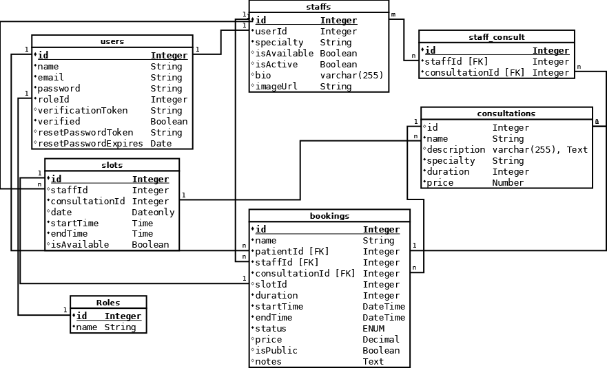

*Megjegyzés: A diagram forrásfájlja az [datamodel.dia](./datamodel.dia) állományban érhető el.*
A rendszer logikai felépítését és az entitások közötti kapcsolatokat az alábbi dokumentum tartalmazza:

---

#### Relációk és Adatintegritás

A szoftver logikai vázát az entitások közötti pontos relációk adják, amelyeket a Sequelize asszociációs szabályai tartanak fent:

1.  **Egy-a-többhöz (1:N) kapcsolatok:**
    * Egy **Szerepkörhöz** (Role) tetszőleges számú felhasználó tartozhat, de minden felhasználó szigorúan egy szerepkörbe sorolható be.
    * Egy **Szakemberhez** (Staff) számos szabad **Idősáv** (Slot) rendelhető a naptárban.
2.  **Egy-az-egyhez (1:1) kapcsolat:**
    * A **User** és a **Staff** profil között fennálló kapcsolat. Ez biztosítja, hogy a szakmai adatok (mint a biográfia vagy szakterület) egyértelműen egy adott bejelentkezési fiókhoz kötődjenek.
3.  **Több-a-többhöz (M:N) kapcsolat:**
    * A **Személyzet** és a **Szolgáltatások** között. Egy orvos több típusú beavatkozást is végezhet, és egy adott kezelést (pl. kontroll vizsgálat) több különböző orvos is nyújthat. Ezt a rugalmasságot a `staff_consult` kapcsolótábla biztosítja.

#### Biztonsági architektúra az adatbázis szintjén

Az érzékeny adatok védelme érdekében a tervezés során kiemelt figyelmet fordítottam a biztonságra:
* **Jelszavas védelem:** A jelszavak tárolása soha nem nyers szövegként történik; a **Bcrypt** algoritmus gondoskodik a biztonságos hashelésről.
* **Adatkonzisztencia:** Az adatbázis szintű `unique` (egyedi) kényszerek (például az e-mail címeknél) garantálják, hogy ne jöhessenek létre duplikált rekordok.
* **Tranzakcionális integritás:** A foglalási folyamat során a rendszer garantálja, hogy a foglalás rögzítése és az idősáv foglalttá tétele egyetlen atomi műveletként menjen végbe, kiküszöbölve a versenyhelyzeteket (race condition).

### 3.1.4. Mappa struktúra

Az alkalmazás moduláris felépítésű, ahol az `app/` mappa tartalmazza a forráskódot, a gyökérkönyvtár pedig a konfigurációs és adatbázis fájlokat.

```text
EPApi/
├── app/
│   ├── controllers/         
│   │   ├── authController.js        # Regisztráció és bejelentkezés
│   │   ├── userController.js        # Felhasználói adatok kezelése
│   │   ├── staffController.js       # Orvosi személyzet menedzselése
│   │   ├── consultationController.js # Konzultációk/Szakrendelések
│   │   └── bookingController.js     # Foglalások logikája
│   ├── database/            
│   │   └── db.js                    # Sequelize kapcsolat inicializálása
│   ├── middleware/          
│   │   ├── auth.js / authjwt.js     # Hitelesítés és JWT validálás
│   │   ├── checkRole.js             # Jogosultság ellenőrzés
│   │   └── upload.js                # Fájlfeltöltés kezelése
│   ├── models/              
│   │   ├── role.js, user.js, staff.js, slot.js, 
│   │   ├── consultation.js, booking.js
│   │   └── models.js                # Modell asszociációk (Kapcsolatok)
│   ├── routes/              
│   │   └── api.js                   # API végpontok (Routing)
│   ├── services/            
│   │   ├── bookingService.js        # Foglalási üzleti logika
│   │   └── emailService.js          # Nodemailer / Mailtrap integráció
│   └── utils/               
│       ├── path.js, logger.js       # Segédfüggvények
├── database/                
│   ├── migrations/                  # Adatbázis sémák verziói
│   └── seeders/                     # Tesztadatok (feltöltő scriptek)
├── docs/                            # Részletes dev/user dokumentáció
├── test/                            # Mocha/Chai tesztfájlok (.spec.js)
├── .env                             # Környezeti változók
├── database.sqlite                  # A projekt SQLite adatbázis fájlja (Gyökérben)
├── package.json                     # Projekt leíró és függőségek
└── README.md                        # Általános tájékoztató

```

#### A könyvtárstruktúra és az architektúra szakmai elemzése:

A backend felépítése a **Separation of Concerns (SoC)** elvét követi, szigorúan elválasztva az adatréteget, az üzleti logikát és a kérések kiszolgálását.

1.  **Controllers (Kéréskezelési réteg):** Az alkalmazás belépési pontjai. Feladatuk a HTTP kérések fogadása, a bemeneti paraméterek (req.body, req.params) dekonstruálása, majd a megfelelő szervizmetódusok meghívása. A kontrollerek "vékonyak" (Thin Controllers), nem tartalmaznak üzleti logikát, csupán a kérés-válasz folyamat vezérléséért és a megfelelő HTTP státuszkódok (pl. 200 OK, 201 Created, 400 Bad Request) visszaadásáért felelnek.

2.  **Models (Data Access Layer - DAL):** A Sequelize-alapú entitásdefiníciók helye. Ez a réteg reprezentálja az adatbázis sémáját JavaScript osztályokként. Itt implementáltam a validációs szabályokat (pl. e-mail formátum, kötelező mezők) és az adatbázis-szintű kényszereket. A `models.js` fájl szolgál az aggregációs pontként, ahol a relációk (HasMany, BelongsTo) inicializálása történik, biztosítva a hivatkozási integritást.

3.  **Middleware (Interceptors & Guards):** Olyan köztes szoftverkomponensek, amelyek aspektus-orientált módon (AOP) kezelik a keresztező feladatokat. Az `auth.js` implementálja a JWT-alapú hitelesítési stratégiát, míg a `checkRole.js` egy magasabb szintű autorizációs rétegként (RBAC) szolgál, amely még a kontroller logikája előtt szűri a jogosulatlan kéréseket.

4.  **Services (Business Logic Layer):** A rendszer lényege, ahol a tényleges üzleti algoritmusok futnak. Itt történnek a komplex adatbázis-tranzakciók, az e-mail küldési folyamatok és az idősáv-kalkulációk. A logikát azért szerveztem Service-ekbe, hogy az újrahasznosítható legyen (pl. egy foglalást létrehozhat a páciens és az admin is, de a logika ugyanaz), és hogy a kód könnyen unit-tesztelhető maradjon a HTTP környezettől függetlenül.

5.  **Routes (Routing Table):** Az alkalmazás API térképe. Deklaratív módon rendeli hozzá a URI útvonalakat a kontroller-metódusokhoz. Itt történik a middleware-ek láncolása is (Middleware Chaining), meghatározva az adott végpont védelmi szintjét.

6.  **Database (Persistence & Versioning):** * **Migrations:** Az adatbázis séma inkrementális verziókövetését biztosítják, lehetővé téve a séma szinkronizálását a különböző környezetek között adatvesztés nélkül.
    * **Seeders:** Fejlesztői és tesztelési célú adatfeltöltők, amelyek konzisztens állapotba hozzák az adatbázist az automatizált tesztek futtatásához vagy a bemutató környezethez.


### 3.1.5. Környezeti változók - .env

A szoftver tervezése során követtem a **Twelve-Factor App** módszertan elveit, melynek egyik alapkövetelménye a konfiguráció és a kód szigorú szétválasztása. Ezt a gyakorlatban egy `.env` fájl alkalmazásával valósítottam meg a backend gyökerében.

Ez a megoldás biztosítja, hogy a szenzitív adatok (mint a JWT titkos kulcsok vagy az adatbázis elérési útvonalak) ne kerüljenek bele a verziókezelőbe (Git), és a különböző környezetek (fejlesztői, teszt, produkciós) közötti váltás kódmódosítás nélkül, csupán a környezeti változók cseréjével megoldható legyen.

**A konfigurációs fájl felépítése:**

```env
# Szerver konfiguráció
PORT=3000
DB_STORAGE=./database.sqlite

# Biztonsági kulcsok
JWT_SECRET=titkos_szoveg_a_token_alairashoz
APP_KEY=egyedi_api_kulcs_az_alkalmazashoz

# Email transzport beállítások (Mailtrap SMTP teszteléshez)
MAIL_HOST=smtp.mailtrap.io
MAIL_PORT=2525
MAIL_USER=az_on_mailtrap_felhasznaloneve
MAIL_PASS=az_on_mailtrap_jelszava
```
---

### 3.1.6. Végpont kifejtés (REST API Specifikáció)

Az ElitPort backend az alábbi RESTful végpontokon keresztül biztosítja az adatok elérését. Az architektúra állapotmentes, a védett végpontok eléréséhez érvényes `JSON Web Token` (Bearer Token) szükséges. A jogosultságkezelésért a `verifyToken` és a `checkRole` middleware-ek felelnek (1: Staff, 2: Admin).

#### 1. 🔐 Hitelesítés (Auth)
A regisztrációs és jelszókezelési folyamatokért felelős publikus végpontok.

| Metódus | Végpont | Leírás | Védettség |
|:---|:---|:---|:---|
| POST | `/register` | Új felhasználó regisztrációja | Publikus |
| POST | `/login` | Bejelentkezés és JWT token generálása | Publikus |
| GET | `/verify-email/:token` | E-mail cím megerősítése (Double Opt-in) | Publikus |
| POST | `/forgot-password` | Elfelejtett jelszó (reset link küldése) | Publikus |
| POST | `/reset-password` | Új jelszó beállítása a kapott tokennel | Publikus |

#### 2. 👤 Felhasználók és Profilok (Users)
A felhasználók saját adatai, valamint az adminisztrátori felhasználókezelés.

| Metódus | Végpont | Leírás | Védettség |
|:---|:---|:---|:---|
| GET | `/profile/me` | Saját profiladatok lekérése | [Token] |
| PUT | `/profile/update` | Saját adatok módosítása | [Token] |
| GET | `/users` | Összes felhasználó listázása | [Admin] |
| GET | `/users/:id` | Egy konkrét felhasználó adatai | [Token] |
| POST | `/users/:id/password` | Jelszómódosítás admin által | [Admin] |
| POST | `/users/:id/status` | Felhasználói státusz (aktív/inaktív) állítása | [Admin] |
| PUT | `/users/:id` | Felhasználó adatainak módosítása | [Admin] |
| DELETE | `/users/:id` | Felhasználó végleges törlése | [Admin] |

#### 3. 👨‍⚕️ Egészségügyi Személyzet (Staff)
Az orvosok és szakemberek kezelése, valamint szolgáltatásaik társítása.

| Metódus | Végpont | Leírás | Védettség |
|:---|:---|:---|:---|
| GET | `/staff` | Összes szakember listázása | Publikus |
| GET | `/staff/public` | Publikusan látható orvosi profilok | Publikus |
| GET | `/staff/:id/treatments` | Az orvoshoz rendelt szolgáltatások | Publikus |
| POST | `/staff/:id/treatments`| Szolgáltatások rendelése az orvoshoz | [Admin] |
| POST | `/staff` | Új személyzeti tag manuális rögzítése | [Admin] |
| POST | `/staff/promote` | Meglévő felhasználó előléptetése orvossá | [Admin] |
| DELETE | `/staff/:id` | Szakember törlése | [Admin] |

#### 4. 📅 Konzultációk, Idősávok és Foglalások
A klinika operatív működését biztosító végpontok.

| Metódus | Végpont | Leírás | Védettség |
|:---|:---|:---|:---|
| GET | `/consultations` | Elérhető vizsgálatok listája | Publikus |
| POST/PUT | `/consultations` | Szolgáltatások menedzselése | [Admin] |
| DELETE | `/consultations` | Szolgáltatás kivezetése a rendszerből | [Admin] |
| GET | `/slots` | Az összes rögzített idősáv lekérése | [Token] |
| POST | `/slots/generate` | Idősávok tömeges generálása intervallumra | [Token] |
| POST | `/slots` | Egyedi idősáv létrehozása | [Staff/Admin] |
| GET | `/bookings` | Saját foglalások vagy adminisztrátori lista | [Token] |
| POST | `/bookings` | Új időpont lefoglalása és slot zárolása | [Token] |
| PUT | `/bookings/:id` | Foglalási adatok módosítása | [Token] |
| DELETE | `/bookings/:id` | Foglalás lemondása és slot felszabadítása | [Token] |


### Az API végpontok funkcionális célkitűzései

A rendszer végpontjait úgy alakítottam ki, hogy lefedjék az egészségügyi klinika teljes digitális munkafolyamatát, a páciens belépésétől az orvosi naptár menedzseléséig.

* **Hitelesítési végpontok célja:** Biztosítják a felhasználók biztonságos azonosítását és az állapotmentes (stateless) munkamenet-kezelést. Ide tartozik a jelszavak titkosított tárolása, az e-mail alapú fiókvalidáció a botok kiszűrésére, valamint az elfelejtett jelszavak biztonságos, token-alapú helyreállítása.
* **Felhasználókezelő végpontok célja:** Lehetővé teszik a személyes adatok (név, e-mail) karbantartását a páciensek számára, míg az adminisztrátori oldalról teljes kontrollt biztosítanak a fiókok felett. Ezen keresztül valósítható meg a felhasználók tiltása (inaktiválás) vagy törlése, ami a GDPR megfelelőség alapfeltétele.
* **Személyzeti (Staff) végpontok célja:** Ezek hidalják át a szakadékot az egyszerű felhasználói fiók és az orvosi profil között. Céljuk az orvosok szakterületeinek, szakmai bemutatkozásának és profilképének kezelése, valamint annak meghatározása, hogy melyik szakember milyen típusú beavatkozásokat (treatments) végezhet.
* **Szolgáltatás-katalógus (Consultations) végpontok célja:** A klinika által kínált kezelések (pl. fogkő-eltávolítás, konzultáció) központi tárolása. Itt definiálható a kezelések ára és időtartama, amely adatok közvetlenül befolyásolják a foglalási logikát és a számlázási információkat.
* **Naptárkezelő (Slots) végpontok célja:** A rendszer legdinamikusabb része. Céljuk az orvosi munkaidő "idősávokra" bontása. Lehetővé teszik a szabad időpontok lekérdezését a pácienseknek, és a tömeges, algoritmus-alapú naptár-generálást az orvosok számára, minimalizálva az adminisztrációs hibákat.
* **Foglalási (Bookings) végpontok célja:** A rendszer tranzakcionális magja. Feladatuk az orvos, a páciens, a szolgáltatás és a konkrét idősáv összekapcsolása. Itt fut le a kritikus ütközésvizsgálat, amely garantálja, hogy egy időpontra csak egy érvényes foglalás születhessen, valamint itt történik a lemondások kezelése is.
  
A teljes végpontlista és azok technikai specifikációja a mellékelt `EPApi/ docs/endpoints.md` fájlban található.

* *(A teljes lista a dokumentáció (docs mappában) található.)*
**Hivatkozás:** [EPApi/docs/endpoints.md](../EPApi/docs/endpoints.md)

---

### 3.1.7. Tipikus adatszerkezetek és interfész-specifikációk

Az alkalmazás kliens-szerver architektúrája állapotmentes (stateless) **REST API** protokollra épül, az adatcsere pedig szabványosított JSON formátumban valósul meg. Ebben a fejezetben a rendszer üzleti logikáját meghatározó legfontosabb adatszerkezeteket és azok szerepét mutatom be fejlesztői szempontból.

#### Hitelesítési és biztonsági adatstruktúrák
A felhasználói adatok kezelése során az adatintegritás és a biztonság az elsődleges. A jelszavak tárolása nem nyers szövegként, hanem **Bcrypt hashing** eljárással történik (10-es salt-fokozattal).

* **Regisztrációs séma (POST `/auth/register`):** A backend validálja az adatok teljességét és az e-mail cím egyediségét. A `confirmPassword` mező csak a kliensoldali validációt és a biztonságos adatátvitelt szolgálja, az adatbázisba nem kerül rögzítésre.
* **Token-alapú munkamenet:** Sikeres bejelentkezés után a szerver egy **JWT (JSON Web Token)** objektumot ad vissza, amely tartalmazza a felhasználó azonosítóját és szerepkörét (`role`), biztosítva a későbbi kérések autorizációját.

#### Entitás-kapcsolati modellek (Sequelize)
A backend a **Sequelize ORM** segítségével definiálja az adatmodelleket. A fejlesztés során kiemelt figyelmet kaptak az alábbi összefüggések:

* **Idősávok (Slots) és Foglalások (Bookings):** A rendszer `1:1` kapcsolatot tart fenn a generált szabad idősávok és a tényleges foglalások között, ahol a `slotId` idegen kulcsként (Foreign Key) biztosítja a kényszerfeltételek betartását.
* **Szakmai hierarchia:** A személyzet (`Staff`) és a szolgáltatások (`Consultations`) kapcsolata lehetővé teszi a komplex lekérdezéseket (Eager Loading), így a frontend hatékonyan, minimális kérésszámmal érheti el a kapcsolt adatokat.

#### Példa struktúrák a legfontosabb műveletekhez

| Funkció | Végpont | Kulcsfontosságú mezők | Típus |
| :--- | :--- | :--- | :--- |
| **Idősáv generálás** | `/slots/generate` | `staffId`, `date`, `startTime`, `interval` | Number, Date, String, Number |
| **Időpont foglalás** | `/bookings` | `slotId`, `consultationId`, `staffId` | Number, Number, Number |
| **Szolgáltatás létrehozás**| `/consultations` | `name`, `duration`, `price` | String, Number, Number |

**Példa 1: Időpont foglalás adatstruktúrája (POST /bookings)**
```json
{
  "slotId": 105,
  "consultationId": 3,
  "staffId": 12,
  "notes": "Fogászati implantáció konzultáció"
}
```
**Hitelesítés és Regisztráció**
A backend validálja az adatok teljességét és az e-mail egyediségét, mielőtt a Bcrypt hashing folyamat elindulna.
* **POST `/register`**
```json
{
  "name": "Teszt Páciens",
  "email": "paciens@example.com",
  "password": "strongPassword123",
  "confirmPassword": "strongPassword123"
}
```
**Bejelentkezés és Jelszó kezelés**

* **POST `/login`**
    ```json
    {
      "email": "string",
      "password": "string"
    }
    ```
* **POST `/forgot-password`**
    ```json
    {
      "email": "string"
    }
    ```
* **POST `/reset-password`**
    ```json
    {
      "token": "string",
      "newPassword": "string",
      "confirmPassword": "string"
    }
    ```

**Felhasználókezelés (Admin)**

* **POST `/users/:id/password`**
    ```json
    {
      "newPassword": "string"
    }
    ```
* **POST `/users/:id/status`**
    ```json
    {
      "verified": "boolean"
    }
    ```

**Személyzet és Szolgáltatások (Staff & Consultations)**

* **POST `/staff`**
    ```json
    {
      "userId": "number",
      "specialty": "string",
      "bio": "string",
      "image": "string (URL/Path)"
    }
    ```
* **POST `/staff/:id/treatments`**
    ```json
    {
      "consultationIds": "number[] (Array of IDs)"
    }
    ```
* **POST `/consultations`**
    ```json
    {
      "name": "string",
      "description": "string",
      "duration": "number (minutes)",
      "price": "number",
      "specialty": "string"
    }
    ```

**Naptár és Foglalás (Slots & Bookings)**

* **POST `/slots/generate`**
    ```json
    {
      "staffId": "number",
      "date": "YYYY-MM-DD",
      "startTime": "HH:mm",
      "endTime": "HH:mm",
      "interval": "number (minutes)"
    }
    ```

* **POST `/bookings`**
    ```json
    {
      "consultationId": 3,
      "slotId": 105,
      "patientId": 25,
      "notes": "Opcionális megjegyzés a pácienstől"
    }
    ```

### 3.1.8. Funkciók és szervizek: Kiemelt algoritmusok és technikai implementációk

A backend architektúra központi eleme a **Service Layer** (szolgáltatási réteg), amely leválasztja a komplex üzleti logikát a kontrollerekről. Ez a megközelítés biztosítja a kód újrahasznosíthatóságát, tesztelhetőségét és a kontrollerek "vékonyságát".
Az egyszerű adatkezelési (CRUD) feladatokat a kontrollerek, míg az összetett üzleti logikát dedikált szerviz-osztályok kezelik.

#### 1. Dinamikus Idősáv-generátor (Slot Generator Algorithm)
Az adminisztratív terhek csökkentése érdekében fejlesztettem egy algoritmust, amely tetszőleges intervallumú naptárbejegyzések tömeges, konzisztens létrehozására képes.

**Az algoritmus logikai menete:**
1.  **Előfeltétel-ellenőrzés:** A szerviz validálja, hogy az adott dátumra és szakemberre vonatkozóan léteznek-e már átfedő idősávok az adatbázisban.
2.  **Időintervallum iteráció:** Egy `while` ciklus fut a kezdő időponttól (`startTime`) a záró időpontig (`endTime`).
3.  **Inkrementális léptetés:** Az algoritmus minden iterációban hozzáadja a definiált `interval` (perc) értékét az aktuális időbélyeghez.
4.  **Batch beszúrás:** A generált idősávokat a rendszer validált rekordokként menti a `Slots` táblába, amelyek azonnal elérhetővé válnak a páciensek számára.

#### 2. Foglalási motor és tranzakciókezelés (Booking Engine)
A rendszer legkritikusabb szakmai kihívása a **versenyhelyzetek (Race Condition)** hatékony kezelése volt az időpontfoglalások során.

* **Ütközésvizsgálat:** Mielőtt a foglalás rögzítésre kerülne, a szerviz egy adatbázis-szintű tranzakciót indít.
* **Atomi műveletvégrehajtás:** A foglalás létrehozása és az idősáv zárolása (`isAvailable: false`) egyetlen, oszthatatlan műveletként fut le. Amennyiben a folyamat során bármilyen hiba lép fel, a **Rollback** mechanizmus visszaállítja az eredeti állapotot, garantálva, hogy ne jöhessen létre kettős foglalás ugyanarra a slotra.

#### 3. Biztonsági architektúra (Authentication & Security)
A felhasználói adatok védelme érdekében többszintű biztonsági logikát implementáltam:

* **Bcrypt Hashing:** A jelszavak tárolása előtt a rendszer adaptív hashing algoritmust használ egyedi sóval (salt). Ez technikai védelmet nyújt a "Rainbow table" és a brute-force alapú támadások ellen.
* **Stateless Autorizáció (JWT):** A hitelesítés után a szerviz egy aláírt **JSON Web Tokent** állít ki. A token tartalmazza a felhasználó azonosítóját és szerepkörét, így a szervernek nem kell munkamenet-állapotot tárolnia, ami javítja a skálázhatóságot.

#### 4. Aszinkron Értesítési Szolgáltatás (Email Service)
Az időigényes hálózati műveletek (e-mail küldés) aszinkron módon, a fő szál blokkolása nélkül futnak le.

* **Biztonsági funkciók:** A szerviz kezeli a fiókaktiváláshoz és jelszó-visszaállításhoz szükséges egyedi, időkorlátos (TTL - Time To Live) tokenek generálását és kiküldését.
* **Monitorozás:** A fejlesztési fázisban a **Mailtrap** SMTP szerverét integráltam, ami lehetővé tette a kimenő forgalom és a HTML sablonok validálását sandbox környezetben.

* **Implementáció:** A **Nodemailer** modult integráltam, amely a regisztrációs folyamat során generált egyedi aktivációs tokeneket és jelszó-visszaállító linkeket továbbítja.
* **Tesztelési workflow:** A fejlesztési szakaszban **Mailtrap SMTP** proxyt használtam, amely lehetővé tette a kimenő levelek tesztelését sandbox környezetben, elkerülve a valós postafiókok kéretlen levelekkel való terhelését.

#### 5. Dinamikus erőforrás-kezelés és profilalkotás (Staff Management)
Az orvosi profilok vizualizációja során a rendszer nem igényel manuális fájlfeltöltést, helyette egy automatizált képhozzárendelési logikát alkalmazunk.
* **Feltételes logika alapú képkezelés:** A `StaffController` a felhasználó neme (gender) alapján határozza meg a megjelenítendő profilt. Ez csökkenti a szerveroldali tárhelyigényt és egyszerűsíti a regisztrációs folyamatot.
* **Adatbázis-szintű hivatkozás:** A rendszer az entitáshoz tartozó nem attribútumát vizsgálva, egy statikus erőforrás-tárból rendeli hozzá a megfelelő (férfi vagy női) alapértelmezett avatar elérési útját. Ez biztosítja az egységes UI megjelenést anélkül, hogy a fájlrendszert komplex írási műveletekkel terhelnénk.

#### 6. Robusztus hibakezelés és validációs réteg
A backend védelmét egy többszintű validációs és egy egységes hibaformázó algoritmus látja el.

* **Adatbiztonság:** A **Bcrypt** algoritmus használatával a jelszavak tárolása előtt 10-es erősségű salt-ot alkalmazunk, védve a rendszert a szótár alapú támadások ellen.
* **Standardizált API válaszok:** Bevezetésre került egy globális hibaformátum, amely minden kivétel esetén egységes JSON objektumot ad vissza:
    ```json
    {
      "status": "error",
      "code": 403,
      "message": "Access denied"
    }
    ```
    Ez a struktúra lehetővé teszi a frontend oldali hibakezelő (Error Interceptor) hatékony működését.


### 3.1.9. Jövőbeni fejlesztési lehetőségek és skálázhatóság

Az alkalmazás architektúrája lehetővé teszi a moduláris bővítést. A szakmai továbbfejlesztés irányvonalait az alábbi technológiai és üzleti szempontok mentén határoztam meg:

**Payment Gateway integráció (Online tranzakciókezelés)**
A foglalási munkafolyamat kiegészíthető egy külső fizetési szolgáltatóval (pl. **Stripe** vagy **Barion** API). Ez lehetővé tenné a vizsgálati díjak előre történő rendezését vagy depozit zárolását. Fejlesztői szempontból ez új **Webhook** végpontok kialakítását igényelné a sikeres tranzakciók visszaigazolására és az adatbázis-státuszok automatikus frissítésére.

**Valós idejű eseménykezelés (WebSocket / Socket.io)**
A jelenlegi HTTP-alapú kérés-válasz ciklus kiegészíthető kétirányú, valós idejű kommunikációval. A **Socket.io** könyvtár bevezetése lehetővé tenné:
* Azonnali push-értesítések küldését időpontváltozás esetén.
* A naptárnézet kliensoldali frissítését (Real-time update) manuális oldalújratöltés nélkül, amennyiben egy idősáv foglaltá válik.

**Granuláris jogosultságkezelés (RBAC)**
A jelenlegi lineáris jogosultságkezelés továbbfejleszthető egy teljes körű **Role-Based Access Control (RBAC)** modellé. Ez a szerviz rétegben kiterjesztett middleware logikát igényelne, amely lehetővé tenné a hozzáférés szabályozását erőforrás-szinten (pl. recepciós, szakorvos, pénzügyi auditor szerepkörök elkülönítése).

**Üzleti intelligencia és adatanalitika**
Az adminisztrátori dashboard bővíthető aggregált lekérdezésekkel. A **Sequelize virtuális mezői** és az adatbázis-szintű **Aggregate függvények** (SUM, AVG, COUNT) segítségével komplex riportok készíthetők a klinika telítettségéről, a legnépszerűbb szolgáltatásokról és a bevételi statisztikákról.

**Emelt szintű biztonsági protokollok (2FA/MFA)**
Az egészségügyi adatok (GDPR) védelme érdekében a hitelesítési folyamat kiegészíthető **Multi-Factor Authentication (MFA)** technológiával. Ez magában foglalná az időalapú egyszeri jelszavak (**TOTP algoritmus**) generálását és validálását egy dedikált biztonsági szervizen keresztül.

---

### 3.1.10. Nemzetköziesítés és többnyelvűség (i18n)

A modern szoftverfejlesztési követelményeknek megfelelően az alkalmazást felkészítettem a nemzetközi piacra. A megoldás nem csupán a szövegek lefordítását, hanem egy skálázható **kulcs-érték alapú** architektúrát jelent.

#### Implementáció részletei:
* **Szótárfájlok:** A statikus szövegeket elkülönített JSON állományokban tárolom (pl. `hu.json`, `en.json`). Ez lehetővé teszi új nyelvek hozzáadását a forráskód módosítása nélkül.
* **Kulcs alapú hivatkozás:** A forráskódban nem égetett szövegek (hard-coded strings), hanem szemantikus kulcsok szerepelnek (pl. `AUTH.LOGIN_SUCCESS`), amelyeket a futtatókörnyezet a kiválasztott nyelvnek megfelelően helyettesít be.
* **Dinamikus nyelvváltás:** A felhasználó a felületen bármikor válthat a támogatott nyelvek (Magyar/Angol) között, ami azonnali UI frissítést eredményez az oldal újratöltése nélkül.

#### Szakmai előnyök:
* **Karbantarthatóság:** A fordítások egy helyen kezelhetők, így a nyelvi javításokhoz nem kell belenyúlni a logikai komponensekbe.
* **SEO és UX:** A többnyelvűség javítja a felhasználói élményt és szélesebb pácienskör elérését teszi lehetővé a klinika számára.

---

## 3.2. Frontend

### 3.2.1. Mappa struktúra és projektarchitektúra

Az alkalmazás az Angular keretrendszer modern, Standalone komponens-alapú architektúráját követi, amely lehetővé teszi a modulmentes, könnyen karbantartható felépítést. A fájlrendszert a logikai elkülönítés (**Separation of Concerns**) elve alapján az alábbiak szerint tagoltam:

* **`src/app/components/`**: Itt találhatók az alkalmazás vizuális építőelemei. Minden komponens saját mappával rendelkezik, amely magában foglalja a TypeScript logikát, a HTML sablont és a komponens-specifikus stíluslapot (CSS).
* **`src/app/shared/`**: Ez a könyvtár az alkalmazás "szolgáltató központja".
    * **Services**: Itt kaptak helyet az aszinkron API kommunikációért felelős szervizek.
    * **Interfaces**: A TypeScript típusbiztonságát garantáló adatmodellek és interfészek gyűjtőhelye.
    * **Auth.interceptor**: Itt található a HTTP kéréseket automatikusan hitelesítő middleware logika.
* **`src/environments/`**: A környezeti változók tárolására szolgál (pl. API alap-URL), elkülönítve a fejlesztői és az éles környezet beállításait.
* **Root fájlok (`main.ts`, `styles.css`, `index.html`)**: Az alkalmazás belépési pontjai és globális stílusdefiníciói. A `main.ts` felelős a Standalone komponens-alapú alkalmazás bootstrap folyamatáért.

Ez a struktúra biztosítja, hogy az üzleti logika (szervizek) és a megjelenítés (komponensek) élesen elváljanak egymástól, megkönnyítve a kód tesztelhetőségét és bővíthetőségét.

```text
EPWEB/
├── public/                     # Statikus, publikusan elérhető erőforrások
│   ├── i18n/                   # Nyelvi fájlok a többnyelvűséghez (hu.json, en.json)
│   ├── images/                 # Általános grafikai elemek
│   └── pics/                   # Felhasználói vagy szakember fotók
│
├── src/                        # A forráskód gyökere
│   ├── app/                    # Alkalmazás logika
│   │   ├── components/         # Felhasználói felület (UI) egységei
│   │   │   ├── about/          # Bemutatkozó (Névjegy) oldal
│   │   │   ├── admin/          # Adminisztrációs felület
│   │   │   ├── booking/        # Foglalási folyamat (naptár integráció)
│   │   │   ├── consultation/   # Szolgáltatások kezelése
│   │   │   ├── home/           # Kezdőlap marketing tartalommal
│   │   │   ├── login/          # Bejelentkezési felület
│   │   │   ├── register/       # Regisztrációs folyamat
│   │   │   ├── forgot-password/# Elfelejtett jelszó igénylése
│   │   │   ├── reset-password/ # Jelszó megújítása (token alapú)
│   │   │   ├── verify-email/   # Email cím aktiválása
│   │   │   ├── my-booking/     # Páciens saját foglalásainak listája
│   │   │   ├── staff/          # Szakember naptár és slot kezelés
│   │   │   ├── staffcard/      # Szakemberek publikus listázása és kártyák
│   │   │   ├── nopage/         # 404-es hibaoldal
│   │   │   └── shared/         # Központi infrastruktúra és logikai réteg
│   │   │       ├── interfaces/ # TypeScript adatmodellek
│   │   │       ├── auth.interceptor.ts    # HTTP kérések automatikus fejlécezése
│   │   │       ├── auth.service.ts        # Hitelesítés és állapotkezelés (Signals)
│   │   │       ├── admin.service.ts       # Admin specifikus műveletek
│   │   │       ├── booking.service.ts     # Időpontfoglalási logika
│   │   │       ├── consultation.service.ts# Konzultációk adatkezelése
│   │   │       ├── staff.service.ts       # Szakember management
│   │   │       └── logger.service.ts      # Hibakeresési segédfunkciók
│   │   │
│   │   ├── guards/             # Útvonalvédelem
│   │   │   └── auth-guards.ts  # Bejelentkezés és szerepkör alapú védelem
│   │   │
│   │   ├── app.routes.ts       # Központi útvonalválasztó (Routing)
│   │   └── app.config.ts       # Globális konfiguráció
│   │
│   ├── environments/           # Környezetfüggő beállítások (API URL-ek)
│   ├── main.ts                 # Alkalmazás belépési pontja
│   ├── index.html              # Fő HTML sablon
│   └── styles.css              # Globális stíluslap (Design System)

```


### 3.2.2. Fejlesztéshez használt eszközök, technológiák

#### Hardver ismertetése és a választás indoklása
A fejlesztés egy INTEL I5-8365U processzorral és 32GB memóriával szerelt konfiguráción történt. A választást az **Angular CLI** erőforrásigényes build folyamatai (különösen az AOT fordítás és az optimalizáció), valamint a backend és frontend szerverek párhuzamos futtatása közbeni stabilitás fenntartása indokolta.

#### Szoftverek ismertetése és a választás indoklása
* **Visual Studio Code:** Elsődleges integrált fejlesztői környezet (IDE). Választását a gazdag bővítménykínálat (Angular Language Service, ESLint), az integrált terminál és a natív TypeScript támogatás indokolta, amely hatékonyabbá teszi a refaktorálást és a kódminőség fenntartását.
* **Angular (v18+):**Komplex, nagyvállalati szintű frontend keretrendszer. A választás mellett szólt a **Standalone architektúra** (alacsonyabb boilerplate kód), a **Signal-alapú állapotkezelés** (finomhangolt Change Detection és jobb teljesítmény) és a szigorú típusbiztonság.
* **Bootstrap 5.3 & @ng-bootstrap:** A reszponzív UI alapköve. Azért alkalmaztam az `ng-bootstrap` könyvtárat, mert natív Angular direktívákat biztosít, így az interaktív elemek (modálok, dropdown-ok) kezelésekor elkerülhető a külső jQuery függőség, ami biztonságosabb és kisebb bundle méretet eredményez.

#### Alkalmazott specifikus könyvtárak
* **RxJS (Reactive Extensions for JavaScript):** A reaktív programozási paradigma megvalósításához elengedhetetlen. Segítségével az aszinkron adatfolyamokat (pl. HTTP kérések, eseménykezelők) **Observable** alapokon, deklaratív módon kezeljük.
* **SweetAlert2:** A felhasználói interakciók minőségének javítására szolgál. Esztétikus, aszinkron (Promise-alapú) visszacsatolást biztosít a műveletek (pl. sikeres foglalás, hiba) kimeneteléről.
* **@ngx-translate/core:** Robusztus nemzetköziesítési (i18n) modul. Segítségével a statikus szövegtartalmakat JSON állományokba szerveztük, lehetővé téve a dinamikus (oldalújratöltés nélküli) nyelvváltást.
* **jsPDF & jsPDF-AutoTable:** Kliensoldali PDF-generáló motorok. Lehetővé teszik a strukturált foglalási adatok exportálását közvetlenül a böngészőben, jelentősen tehermentesítve a backend erőforrásait azáltal, hogy a dokumentum-összeállítást a kliens gépe végzi.
  
---

### 3.2.3. Komponens-architektúra és moduláris felépítés

#### Az alkalmazás komponenseinek részletes technikai bemutatása

Az alkalmazás komponens-alapú felépítése biztosítja a moduláris működést és a funkciók tiszta elkülönítését. A fejlesztés során a modern **Standalone** architektúrát alkalmaztam, amely elhagyja a hagyományos NgModules rendszert, így csökkentve az alkalmazás komplexitását és növelve a karbantarthatóságot.

#### 3.2.3.1. App Komponens (`src/app/app.component.*`)
Az alkalmazás gyökérkomponense (Root Component), amely a teljes rendszer "keretéért" és a globális elrendezés koordinálásáért felelős. Feladata a navigációs sáv (`app-navbar`) és a dinamikus tartalommegjelenítő (`router-outlet`) szinkronizálása.

* **Layout vezérlés:** Dinamikusan szabályozza a navigációs sáv láthatóságát az aktuális útvonal függvényében. A konstruktorban feliratkozik a `Router` eseményeire, és a `NavigationEnd` esemény bekövetkezésekor ellenőrzi a tartózkodási helyet.
* **Kivételkezelés:** Amennyiben a felhasználó a `/login` vagy a `/passwordchange` oldalon tartózkodik, a rendszer elrejti a navigációs menüt, biztosítva a zavartalan autentikációs folyamatot.
* **Technikai megvalósítás:** Az osztályban definiált `showNavbar: boolean` változó az Angular modern kontroll struktúráján, az **@if** blokkon keresztül szabályozza a navigációs sáv feltételes megjelenítését. Ez a megoldás hatékonyabb változásdetektálást tesz lehetővé, mint a korábbi direktíva-alapú megközelítések.

#### 3.2.3.2. Booking (Foglalási) Komponens
A `BookingComponent` az alkalmazás központi üzleti modulja, egy úgynevezett **Smart Component**, amely a páciens oldali foglalási munkafolyamat teljes vezérléséért felel.

**I. Főbb osztályváltozók (Data Properties):**
| Változó neve | Típus | Leírás |
| :--- | :--- | :--- |
| `availableSlots` | `Slot[]` | Reaktív módon frissülő tömb, amely a validált, jövőbeli szabad időpontokat tartalmazza. |
| `weekDays` | `Date[]` | A naptár algoritmus által generált, az aktuális nézetet meghatározó dátumobjektumok gyűjteménye. |
| `selectedSpecialty` | `string` | Kétirányú adatkötéssel (Two-way binding) kezelt szűrőfeltétel a szakorvosi kereséshez. |
| `isLoading` | `boolean` | Állapotjelző (flag) a felhasználói élmény fokozására az aszinkron I/O műveletek alatt. |

**II. Metódusok és Implementációs Logika:**

* **Dinamikus naptárkezelés (`generateWeek`)**: Az algoritmus biztosítja a naptár integritását azáltal, hogy a referencia dátumból (hétfői kezdettel) számítja ki a munkahét napjait. Ez lehetővé teszi a hétváltás funkciót anélkül, hogy a teljes komponenst újra kellene inicializálni.
* **Naptárnézet renderelés (`getSlotsForHour`)**: Egy segédfüggvény, amely a sablonban (Template) valósítja meg a slotok óra-alapú csoportosítását, biztosítva a strukturált, átlátható naptári elrendezést.
* **Párhuzamos adatlekérés (`loadInitialData`)**: A hatékonyság növelése érdekében az orvosi és szolgáltatási adatokat **RxJS `forkJoin`** operátorral szinkronizáljuk. Ez garantálja, hogy a felület csak akkor válik interaktívvá, ha minden függő adat sikeresen betöltődött.
* **Validált foglalási tranzakció (`executeBooking`)**: A metódus komplex feladata a foglalási objektum (ár, időtartam, metaadatok) összeállítása és a backend felé történő továbbítása. A folyamat része a hibakezelés és az aszinkron visszacsatolás a `SweetAlert2` integrációján keresztül.

**III. Technikai sajátosságok:**
A komponens implementációja során a modern Angular irányelveket követve **Dependency Injection** (inject függvény) segítségével férünk hozzá a szervizekhez, a memóriaszivárgások elkerülése érdekében pedig a **takeUntilDestroyed** operátort alkalmazzuk az aszinkron feliratkozásoknál.

#### 3.2.3.3. Admin Dashboard Komponens (`src/app/components/dashboard/*`)
Az Admin Dashboard az alkalmazás üzleti intelligencia központja. Feladata a nyers adatok (felhasználók, foglalások, konzultációk) aggregálása és vizuális prezentálása a döntéshozók számára.

**I. Főbb üzleti funkciók:**
* **KPI (Key Performance Indicators) elemzés:** A rendszer automatikusan számítja a bruttó árbevételt, a lemondási rátát és a szakemberek hatékonyságát (Staff Efficiency) a foglalások száma és az elvárt kapacitás alapján.
* **Időpont Heatmap:** Egy heti bontású hőtérképet generál, amely vizuálisan szemlélteti a klinika legforgalmasabb idősávjait.
* **Automatizált PDF Riport:** A `jsPDF` és `autoTable` könyvtárak segítségével azonnali, többnyelvű statisztikai jelentést generál nyomtatható formátumban.

**II. Főbb osztályváltozók:**
| Változó neve | Típus | Leírás |
| :--- | :--- | :--- |
| `isLoading` | `boolean` | Az adatbetöltés alatti várakozási állapotot jelzi. |
| `stats` | `Object` | KPI mutatók (bevétel, lemondási arány, foglalások száma). |
| `staffEfficiency`| `any[]` | Szakemberek kihasználtsági mutatóit tartalmazó tömb. |
| `topServices` | `any[]` | Az 5 legnépszerűbb szolgáltatás statisztikái. |
| `heatmapData` | `any` | Kétdimenziós mátrix a heti foglaltsági hőtérképhez. |
| `hours` | `string[]` | Fix idősávok listája (pl. 08:00 - 19:00). |
| `weekDays` | `string[]` | Munkahét napjainak kulcsai (MONDAY-FRIDAY). |

**III. Metódusok és Technikai megvalósítás:**
* **Függőség-injektálás:** A komponens a modern `inject()` függvényt használja (`AdminService`, `StaffService`, `ConsultationService`, `TranslateService`).
* **`loadDashboardData()`**: A `forkJoin` operátor használatával párhuzamosan kéri le az adatokat több forrásból, minimalizálva a várakozási időt.
* **`calculateFinancials()`**: Kiszűri a törölt foglalásokat és reaktív módon (`reduce`, `filter`) számítja az árbevételt.
* **`generateHeatmap()`**: Dátum és idő alapján csoportosítja a foglalásokat, a `getHeatmapColor()` algoritmus pedig dinamikus színkódot rendel a cellákhoz a foglaltság sűrűsége alapján.

#### 3.2.3.4. Staff és Slot Management
Ez a modul felelős a szakemberek profiljának adminisztrációjáért és az elérhető idősávok kezeléséért.

**I. Főbb osztályváltozók:**
| Változó neve | Típus | Leírás |
| :--- | :--- | :--- |
| `staffData` | `any` | A bejelentkezett szakember profilinformációi. |
| `slots` | `any[]` | Az aktuális szakemberhez tartozó összes időpont. |
| `consultations` | `any[]` | A szakember által végezhető szolgáltatások listája. |
| `isGenerating` | `boolean` | Tömeges slot-generálás állapotjelzője. |

**II. Metódusok és algoritmusok:**
* **`loadStaffProfile()` & `loadStaffSlots()`**: Betölti a szakember specializációit és frissíti a naptárnézetet az adatbázisból.
* **`generateDailySlots()`**: Automatikus algoritmus, amely adott időintervallumban (munkaidő) és felosztásban hoz létre szabad időpontokat.
* **`toggleSlotStatus()`**: Időpontok manuális zárolása vagy felszabadítása az adatbázisban.
* **`updateBookingStatus()`**: Páciens foglalásának jóváhagyása vagy lezárása, amely közvetlen hatással van a dashboard statisztikáira.
* **Állapotkezelés:** Az `AuthService` Signal-jait felhasználva biztosítja a személyre szabott nézetet és a jogosultság-ellenőrzést.

#### 3.2.3.5. Login és Autentikáció
A felhasználók hitelesítéséért és a munkamenet (session) inicializálásáért felelős egység.

**I. Főbb osztályváltozók:**
| Változó neve | Típus | Leírás |
| :--- | :--- | :--- |
| `loginForm` | `FormGroup` | Erősen típusos (`nonNullable`) reaktív űrlap email és jelszó validátorokkal. |
| `errorMessage` | `string` | A szerveroldali hibaüzenetek (pl. hibás hitelesítés) tárolója. |

**II. Metódusok és biztonság:**
* **`login()`**: Ellenőrzi az űrlap érvényességét, majd a válaszban kapott JWT tokent és felhasználói objektumot a `localStorage`-ba menti.
* **Dinamikus routing:** Vizsgálja a felhasználói szerepkört (`roleId`). Az adminok és szakemberek a műszerfalra, a páciensek a foglalási oldalra kerülnek átirányításra.
* **`cleanupModal()`**: Manuálisan eltávolítja a Bootstrap modális ablakok maradványait (backdrop) a DOM-ból a sikeres navigáció előtt, megelőzve a felület lefagyását.
* **Session Security:** Biztosítja a titkosított kommunikációhoz szükséges fejlécadatok (Auth Header) alapfeltételeit.
  
---

#### 3.2.4. Szervizek (Services) és Adatkezelés

Az alkalmazás üzleti logikájának és a hálózati kommunikációnak a gerincét a szerviz réteg alkotja. Az Angular **Dependency Injection (DI)** rendszerét kihasználva a szervizek `providedIn: 'root'` dekorátorral vannak ellátva, így az egész alkalmazásban egyetlen példányban (singleton) érhetőek el. Ez a tervezési minta garantálja, hogy az adatok (például a bejelentkezett felhasználó állapota) konzisztensek maradjanak a különböző komponensek között.

#### 3.2.4.1. Hálózati architektúra és Biztonság

Az API kommunikáció során az alkalmazás szigorú biztonsági protokollokat követ, elkülönítve a nyers adatátvitelt az üzleti logikától.

* **Autentikációs stratégia (JWT Flow):** A védett végpontok eléréséhez a rendszer **JSON Web Token (JWT)** alapú hitelesítést használ. Az **AuthService** felelős a `localStorage`-ban tárolt token menedzseléséért.
* **Környezetfüggő konfiguráció (Environment-driven API):** Az alkalmazás követi a *Separation of Concerns* (feladatkörök elkülönítése) elvet. A backend címe nem statikus karakterláncként szerepel a kód blokkjaiban, hanem az `environment.ts` állományból töltődik be. Ez biztosítja a skálázhatóságot és a könnyű hordozhatóságot a fejlesztői és az éles szerverek között.

---

#### 3.2.4.2. HTTP Interceptor – A kérések globális kezelése

A modern Angular (v15+) irányelveit követve a projektben **funkcionális alapú Interceptort** (`HttpInterceptorFn`) implementáltam. Ez a megoldás központosítja a hálózati kérések módosítását, levéve a terhet az egyes szervizekről, és biztosítva az alkalmazásszintű egységességet. Ez a tervezési minta (Middleware pattern) lehetővé teszi, hogy minden kimenő kérést és bejövő választ egyetlen közös logikai ponton vezessünk keresztül.

**A megvalósított `authInterceptor` implementációja:**

```typescript
export const authInterceptor: HttpInterceptorFn = (req, next) => {
  const platformId = inject(PLATFORM_ID);
  const router = inject(Router);
  const authService = inject(AuthService);

  let authReq = req;

  // 1. Környezetellenőrzés (Browser vs Server)
  if (isPlatformBrowser(platformId)) {
    const token = localStorage.getItem('token');
    const lang = localStorage.getItem('lang') || 'en';

    // 2. Alapértelmezett fejlécek beállítása (Nyelvkezelés)
    let headers = req.headers.set('Accept-Language', lang);

    // 3. Autentikációs token csatolása
    if (token) {
      headers = headers.set('Authorization', `Bearer ${token}`);
    }

    // A kérés megismételhetetlen (immutable), ezért klónozni kell az új fejlécekkel
    authReq = req.clone({ headers }); 
  }

  // 4. Hibakezelés és válasz-stream feldolgozása reaktív módon
  return next(authReq).pipe(
    catchError((error: HttpErrorResponse) => {
      if (error.status === 401 && !req.url.includes('login')) {
          // Automatikus kijelentkeztetés érvénytelen vagy lejárt token esetén
          authService.logout();
          router.navigate(['/login'], {
            queryParams: { returnUrl: router.url }
        });
      }
      return throwError(() => error);
    })
  );
};
```

Az alkalmazásban egy HTTP Interceptort alkalmaztam, amely központi helyen kezeli az összes kimenő kérést. Ez a megoldás szakmailag sokkal magasabb szintű, mintha minden szervizben külön-külön állítanánk be a fejléceket.

**Főbb feladatai:**
1.  **Token injektálás:** Minden kimenő kéréshez automatikusan csatolja az érvényes JWT tokent az `Authorization` fejlécben.
2.  **Globális hibakezelés:** Elkapja a szerver felől érkező HTTP hibaüzeneteket (pl. 401 Unauthorized), és automatikus kijelentkeztetést vagy hibaüzenet-megjelenítést indít.

---

#### 3.2.4.3. AuthService – Hitelesítés és Session Management
Az **AuthService** az alkalmazás biztonsági központja. Nem csupán adatokat kér le, hanem reaktív módon tárolja a felhasználói munkamenet állapotát.

* **Reaktív állapotkezelés:** A szerviz `BehaviorSubject` vagy `Signal` segítségével teszi lehetővé, hogy az alkalmazás bármely pontján értesüljünk a bejelentkezett felhasználó adatainak változásáról.
* **Főbb metódusok:**
    * `login(credentials)`: Hitelesíti a felhasználót és perzisztens módon tárolja a munkamenetet.
    * `logout()`: Biztonságosan törli a bizalmas adatokat és alaphelyzetbe állítja az alkalmazás állapotát.
    * `getAuthHeaders()`: Segédfüggvény a manuális fejléc-összeállításhoz (amennyiben nem az interceptor végzi).

---

#### 3.2.4.4. StaffService – Szakember,  Kompetencia Menedzsment és és ConsultationService
Ez a szerviz felelős a klinikai állomány digitális reprezentációjáért és az adatbázis `Staff` táblájához kapcsolódó műveletekért.

* **Logikai törlési stratégia (Soft Delete):** Az `archiveStaff` metódus implementálásával a rendszer megőrzi az adatbázis integritását. A szakember nem törlődik fizikailag, így a múltbeli statisztikák (pl. korábbi bevételek) pontosak maradnak.
* * **Szolgáltatási katalógus:** A **ConsultationService** kezeli a kezelések árait és időtartamait. Itt dől el, hogy egy foglalás mekkora időintervallumot foglal majd el a szakember naptárában.
* **Dinamikus szolgáltatás-hozzárendelés:** Itt valósul meg az a logika, amely a szakembereket és a konzultációs típusokat (treatments) kapcsolja össze, kezelve a több-a-többhöz típusú relációkat kliensoldalon.

---

#### 3.2.4.5. BookingService – Foglalási logika és dinamikus naptárkezelés

A `BookingComponent` felelős a páciensek és a szabad időpontok (slotok) közötti interakció menedzseléséért. Ez a modul az alkalmazás egyik technológiai csomópontja, ahol a dátumkezelés, a reaktív szűrés és a tranzakcionális adatbeküldés találkozik.

#### I. Dinamikus naptárgeneráló algoritmus

A felhasználói élmény alapja egy heti nézetű naptár, amely nem statikus adatokkal dolgozik, hanem a kiválasztott referenciaidőpont alapján dinamikusan számítja ki a munkahét napjait.

```typescript
generateWeek(refDate: Date): void {
  const start = new Date(refDate);
  const day = start.getDay(); // 0: vasárnap, 1: hétfő...

  // Hétfőre való visszaléptetés kiszámítása
  const diffToMonday = day === 0 ? -6 : 1 - day;
  start.setDate(start.getDate() + diffToMonday);
  
  this.weekDays = [];
  for (let i = 0; i < 5; i++) { // Csak a munkanapok (hétfő-péntek) generálása
    const d = new Date(start);
    d.setDate(start.getDate() + i);
    this.weekDays.push(d);
  }
}
```
**Szakmai elemzés:** Az algoritmus precízen kezeli a JavaScript `Date` objektumának sajátosságait (például, hogy a vasárnap a 0. index). A `diffToMonday` változó kiszámítása garantálja, hogy a naptár nézet minden esetben hétfővel kezdődjön, függetlenül attól, hogy a felhasználó a hét melyik napján navigál az oldalra. A ciklus szándékosan csak előre két hetet és heti öt napot generál le, illeszkedve a klinika hétköznapi nyitvatartási rendjéhez, ezzel is szűkítve a hibás adatbevitel lehetőségét.

#### II. Reaktív szűrés és Adatkonzisztencia

A komponens egy többszintű, láncolt szűrési logikát valósít meg, ahol az egyes választások (szakterület → szakember → kezelés) egymásra épülve határozzák meg a valid foglalási opciókat.

1.  **Szakterület alapú szűrés:** Az `onSpecialtyChange` metódus az aszinkron adatfolyam segítségével azonnal szűri a szakemberek listáját, miközben biztonsági okokból alaphelyzetbe állítja a korábbi választásokat. Ez megakadályozza, hogy a felhasználó inkonzisztens adatokat (pl. egy fogorvoshoz bőrgyógyászati kezelést) küldjön be.
2.  **Paraméteres szinkronizáció:** A `syncSelectionFromParams` metódus az `ActivatedRoute` segítségével lehetővé teszi a külső forrásból (pl. marketing kampányból vagy orvos-specifikus linkről) érkező kérések feldolgozását. Így a komponens képes "emlékezni" a navigáció előtt kiválasztott entitásokra.
3.  **Időintervallum szűrés (Lead Time):**
    ```typescript
    const now = new Date();
    const limitTime = new Date(now.getTime() + (minimumLeadTimeHours * 60 * 60 * 1000));
    this.availableSlots = allData.filter((slot: any) => {
      const slotDateTime = new Date(`${slot.date}T${slot.startTime}`);
      return slotDateTime > limitTime;
    });
    ```
    Ez az üzleti logika kritikus a klinika működése szempontjából: megakadályozza a múltbeli időpontok foglalását, valamint lehetővé teszi egy minimális felkészülési idő (lead time) beállítását, így elkerülhetők a kezelés megkezdése előtt pár perccel beérkező váratlan foglalások.

#### III. Idősáv-leképezési algoritmus (`getSlotsForHour`)

A naptár felhasználói felületén (UI Grid) az adatok megjelenítése nem egyszerű listázással történik, hanem egy koordináta-alapú keresőalgoritmussal. A `getSlotsForHour` metódus felelős azért, hogy az adatbázisból érkező slotokat a megfelelő naphoz és órához rendelje a nézetben.

* **Logika:** A metódus karakterlánc-manipulációval (`substring`, `padStart`) normalizálja a dátumokat és az órákat a backend formátumára, majd egy szűrt részhalmazt ad vissza a sablonnak.
* **Vizuális integritás:** Ez a megközelítés lehetővé teszi a naptár rácsának konzisztens megjelenítését akkor is, ha bizonyos órákban nincsenek szabad időpontok, így a páciens számára átlátható marad a szakember napi beosztása.

#### IV. Tranzakcionális foglalási folyamat és Hibakezelés

A foglalás véglegesítése egy kritikus tranzakció, amely magas fokú adatbiztonságot és pontos felhasználói visszacsatolást igényel.

1.  **Vizuális megerősítés:** A `SweetAlert2` könyvtár integrálásával a rendszer egy interaktív kérdőíves modált jelenít meg. Ez a lépés tartalmazza a választott szolgáltatás nevét, az időpontot és az árat, jelentősen csökkentve a téves foglalásokból eredő adminisztrációs terheket.
2.  **Munkamenet-ellenőrzés:** Az `executeBooking` metódus ellenőrzi az `AuthService`-en keresztül a felhasználó hitelesítési állapotát. Amennyiben a munkamenet nem aktív, a rendszer a `returnUrl` paraméter mentésével átirányítja a pácienst a bejelentkezéshez, majd annak sikeressége után automatikusan visszavezeti a foglalási folyamathoz.
3.  **Szerveroldali hibaüzenetek transzformálása:** A hibaágon (`error`) a rendszer megkísérli a szerver által küldött specifikus hibaüzenet-kulcsok (pl. "ALREADY_BOOKED", "INSUFFICIENT_FUNDS") lefordítását. Ez biztosítja, hogy a felhasználó ne technikai jellegű hibaüzenetet kapjon, hanem a saját nyelvén értesüljön a hiba pontos okáról.

#### V. Lokalizált formátumok és i18n Getterek

A komponens dedikált gettereket (`dayFormat`, `dateFormat`, `currentLocale`) tartalmaz, amelyek az Angular `DatePipe`-jával és a `TranslateService`-szel szorosan együttműködve biztosítják, hogy a dátumok és napok formátuma (pl. magyar nyelv esetén: "ápr. 16, kedd", angol esetén: "Tuesday, Apr 16") mindig megfeleljen a kulturális konvencióknak és a választott nyelvi beállításoknak.

A rendszer egyik legkomplexebb egysége, amely a páciens igényeit szinkronizálja a szakemberek szabad naptárával.

* **Tranzakcionális szemlélet:** A `createBooking` metódus felelős a foglalási objektum validált beküldéséért.
* **Slot-kezelés:** A `getAvailableSlots` metóduson keresztül érhető el a naptár-algoritmus válasza, amely biztosítja, hogy a felhasználó csak valós, ütközésmentes időpontokat választhasson.

---

#### 3.2.4.6. Adminisztrációs üzleti logika és adatanalitika

Az `AdminDashboardComponent` az alkalmazás egyik legösszetettebb modulja, amely a nyers adatbázis-rekordokat alakítja át üzleti mutatókká (KPI). A komponens megvalósítása során törekedtem a reaktív programozási elvek betartására és a kliensoldali erőforrások hatékony kihasználására.

#### I. Párhuzamos adatfolyam-szinkronizáció (`forkJoin`)

Az adatok betöltésekor kritikus szempont volt a hálózati késleltetés (latency) minimalizálása. Ahelyett, hogy a kéréseket egymás után (szekvenciálisan) indítanám el, az RxJS `forkJoin` operátorát alkalmaztam:

```typescript
loadDashboardData(): void {
  this.isLoading = true;
  forkJoin({
    users: this.adminService.getAllUsers(),
    bookings: this.adminService.getAllBookings(),
    consultations: this.consultationService.getConsultations(),
    staffs: this.staffService.getStaff()
  }).pipe(
    finalize(() => this.isLoading = false) // Minden esetben lefut (error/success)
  ).subscribe({
    next: (res: any) => {
      // Adatok szanálása és elosztása a számítási metódusoknak
      this.calculateFinancials(res.bookings);
      this.calculateStaffEfficiency(res.staffs, res.bookings);
      this.calculateTopServices(res.bookings, res.consultations);
      this.generateHeatmap(res.bookings);
    },
    error: (err) => {
      // Hiba esetén lokalizált visszacsatolás és SweetAlert2 modal
      Swal.fire({ icon: 'error', title: this.translate.instant('COMMON.ERROR.TITLE') });
    }
  });
}
```

**Szakmai indoklás:** A `forkJoin` használatával az összes API hívás egyszerre, párhuzamosan indul el. A rendszer csak akkor kezdi meg az összetett adatfeldolgozási folyamatot, ha minden válasz sikeresen megérkezett. Ez a megközelítés megakadályozza a részleges adatokból eredő hibás statisztikák megjelenítését (inconsistent state), és jelentősen javítja a felhasználói élményt a rövidebb várakozási idő révén.

#### II. Adataggregációs algoritmusok

A backend kiszolgálótól érkező nyers tömböket több szempont szerint dolgozom fel a kliensoldalon, ezzel tehermentesítve a szerver processzorát és csökkentve a hálózati forgalmat.

1.  **Bevétel- és Lemondási ráta kalkuláció:**
    A `calculateFinancials` metódus az RxJS streamekből érkező adatokat a JavaScript modern tömbkezelő függvényeivel (`filter`, `reduce`) aggregálja. A lemondási arányt a törölt státuszú foglalások és az összes foglalás hányadosaként határozza meg, míg a teljes bevételt kizárólag a ténylegesen megvalósult vagy aktív foglalások árai alapján összesíti, garantálva a pénzügyi mutatók pontosságát.

2.  **Szakember hatékonyság (Utilization):**
    A hatékonysági mutatót egy elvárt heti kapacitáshoz (példánkban 40 időpont/hét) viszonyítom. Ez a számítás alapja a szakemberek rangsorolásának, amely segít az adminisztrátoroknak az erőforrások optimalizálásában és a klinika leterheltségének kiegyensúlyozásában.

3.  **Heti forgalmi hőtérkép (Heatmap Logic):**
    A `generateHeatmap` metódus egy komplex, kétdimenziós objektumstruktúrát épít fel.
    * **Adatszerkezet:** Az adatok elérése a `this.heatmapData[nap][óra]` logikai útvonalon történik.
    * **Algoritmus:** A metódus végigiterál a foglalásokon, a dátumértékekből kinyeri a nap angol nyelvű megnevezését, a kezdési időpontból pedig az óra értékét, majd inkrementálja a megfelelő adatcellát.
    * **Vizuális kódolás:** A `getHeatmapColor(count)` metódus egy küszöbérték-alapú algoritmus, amely az adatsűrűség függvényében (0, 1-3, 3-6, 6 felett) rendel hozzá CSS-kompatibilis színkódokat a cellákhoz, vizuálisan segítve a forgalmi csúcsidőszakok azonnali felismerését.

#### III. Dinamikus PDF riportgenerálás (`jsPDF`)

A rendszer egyik kiemelt funkciója a statisztikai adatok exportálása. Ez a folyamat teljes egészében kliensoldalon történik, ami azonnali válaszidőt eredményez és csökkenti a szerver terhelését.

```typescript
exportToPDF() {
  const doc = new jsPDF();
  const locale = this.translate.currentLang === 'hu' ? 'hu-HU' : 'en-GB';
  const timestamp = new Date().toLocaleString(locale);
  
  // Lokalizált szövegek betöltése az aktuális nyelv alapján
  const title = this.translate.instant('DASHBOARD.PDF_TITLE');
  
  // Táblázat adatainak transzformálása (Heatmap mátrixból táblázatos sorokká)
  const body = this.hours.map(time => [
    time,
    this.heatmapData['MONDAY']?.[time] ?? 0,
    this.heatmapData['TUESDAY']?.[time] ?? 0,
    this.heatmapData['WEDNESDAY']?.[time] ?? 0,
    this.heatmapData['THURSDAY']?.[time] ?? 0,
    this.heatmapData['FRIDAY']?.[time] ?? 0
  ]);

  autoTable(doc, {
    head: [headers],
    body: body,
    startY: 35,
    theme: 'grid',
    headStyles: { fillColor: [13, 110, 253] }, // Bootstrap Primary Blue
    styles: { fontSize: 9 }
  });

  doc.save(`${fileName}_${new Date().getTime()}.pdf`);
}
```
**Technikai innováció:** Az exportáló algoritmus teljes mértékben támogatja a nemzetköziesítést (i18n). A táblázat fejlécei, a dátumformátum és a PDF dokumentum elnevezése is dinamikusan igazodik az alkalmazásban beállított aktív nyelvhez. Az `autoTable` bővítmény integrációjával a generált dokumentum professzionális elrendezést kap, amely rácsos szerkezetével és kiemelt fejléceivel alkalmas hivatalos klinikai riportok vagy vezetői összefoglalók benyújtására is.

#### IV. Osztályszintű definíciók és Állapotkezelés

A típusbiztonság és a kód tisztasága érdekében a komponens az alábbi kulcsfontosságú elemekkel dolgozik, amelyek meghatározzák az adatvezérelt működést:

* **`isLoading`**: Logikai állapotjelző változó, amely az aszinkron hálózati műveletek alatt vizuális visszacsatolást ad a felhasználónak, és zárolja a kritikus felületi elemeket, megelőzve ezzel a többszöri, felesleges adatlekérést.
* **`stats`**: Strukturált, interfész-alapú objektum a globális KPI mutatók (bevétel, foglalások száma, lemondási ráta) központi tárolására.
* **`keepOrder`**: Egy speciális "keyvalue" pipe segédfüggvény (arrow function), amely felülbírálja az Angular keretrendszer alapértelmezett (alphabetical) rendezési logikáját. Ez kritikus fontosságú a hőtérkép megjelenítésekor, mivel biztosítja, hogy az idősávok és a napok ne betűrendben, hanem kronológiai sorrendben jelenjenek meg a felhasználói felületen.
* **`hours` és `weekDays`**: `protected readonly` típusú konstans tömbök, amelyek az alkalmazás időbeli kereteit definiálják, és alapul szolgálnak mind a hőtérkép-generáló algoritmusnak, mind a PDF exportáló logikának.

* **Adminisztratív aggregáció:** Az **AdminService** biztosítja a Dashboard vizualizációihoz szükséges statisztikai adatokat, közvetítve a backend komplex lekérdezéseit.

---

#### 3.2.5. Útvonalfigyelők (Guards) és Hozzáférés-kezelés

Az Angular keretrendszer útvonalfigyelői (Guards) képezik az alkalmazás első védelmi vonalát a kliensoldalon. Feladatuk a navigációs folyamat monitorozása és szükség esetén annak megszakítása a felhasználó hitelesítési állapota vagy jogosultsági szintje alapján. Az alkalmazás fejlesztése során a modern, **funkcionális Guard** megközelítést alkalmaztam, amely jelentősen csökkenti a boilerplate kódot és javítja az alkalmazás tesztelhetőségét.

#### 3.2.5.1. Szerepkör-alapú hozzáférés-szabályozás (AdminGuard)

Az **AdminGuard** kritikus fontosságú a rendszer integritása szempontjából, mivel ez az egység védi az emelt szintű jogosultságot igénylő útvonalakat (például az adminisztrációs felületet, a felhasználókezelést és a globális pénzügyi statisztikákat).

* **Implementációs logika:** A Guard nem csupán a bejelentkezés tényét ellenőrzi, hanem egy mélyebb jogosultsági vizsgálatot végez. Az `AuthService` segítségével lekéri a kliensoldalon tárolt felhasználói modellt, és validálja a `roleId` vagy az `isAdmin` flag értékét a memóriában és a perzisztens tárolóban egyaránt.
* **Biztonsági mechanizmus:**
    * **Integritás ellenőrzés:** Megvizsgálja, hogy a `localStorage`-ban tárolt token formátumilag helyes-e, és rendelkezik-e a szükséges biztonsági fejlécekkel.
    * **Lejárat kezelés:** Amennyiben a token lejárati ideje (Expiration Time) elmúlt, a Guard a navigációt azonnal elutasítja, megelőzve, hogy a felhasználó lejárt munkamenettel kíséreljen meg adatokat módosítani.
* **Navigációs fallback:** Jogosulatlan hozzáférési kísérlet esetén a rendszer „Silent Redirect” stratégiát alkalmaz: a felhasználót automatikusan a bejelentkezési oldalra irányítja, miközben hibaüzenetet jelenít meg, elrejtve ezzel az adminisztrációs felület belső szerkezetét.

#### 3.2.5.2. Általános hitelesítési figyelő (AuthGuard)

Az **AuthGuard** biztosítja, hogy a privát funkciók (időpontfoglalás, saját profil kezelése, jelszómódosítás) kizárólag érvényes hitelesítéssel rendelkező felhasználók számára legyenek elérhetőek.

* **Működési elv:** A Guard a navigációs esemény bekövetkeztekor reaktív módon ellenőrzi az aktuális hitelesítési állapotot. Ez egy kettős validálást jelent: ellenőrzi az RxJS stream-ben tárolt állapotot és a `localStorage` tartalmát.
* **Felhasználói státusz validáció:** A hitelességen felül a Guard ellenőrzi a felhasználói fiók aktuális státuszát is. Amennyiben egy fiók adminisztratív úton felfüggesztésre került (pl. inaktív státusz), a Guard a bejelentkezett állapot ellenére is megakadályozza a védett tartalmak elérését.
* **Munkamenet-folytonosság (UX):** A Guard a `RouterStateSnapshot` segítségével elmenti a megkísérelt útvonalat (target URL). Ez lehetővé teszi, hogy sikeres bejelentkezés után a rendszer ne a kezdőlapra, hanem pontosan arra az aloldalra navigálja vissza a pácienst, ahol a munka folyamata megszakadt.

#### 3.2.5.3. A Guard-ok integrációja az útvonal-architektúrába

A biztonsági figyelők hatékonyságát az `app.routes.ts` fájlban megvalósított hierarchikus védelem biztosítja. Az útvonalak deklaratív módon vannak ellátva a szükséges Guard-okkal, lehetővé téve a védelmi szintek egymásra épülését.

```typescript
export const routes: Routes = [
  { 
    path: 'admin', 
    component: AdminLayoutComponent, 
    canActivate: [authGuard, adminGuard], // Többszintű védelem: bejelentkezés + admin szerepkör
    children: [
      { path: 'dashboard', component: AdminDashboardComponent },
      { path: 'users', component: UserManagementComponent }
    ]
  },
  { 
    path: 'booking', 
    component: BookingComponent, 
    canActivate: [authGuard] // Alapszintű védelem: csak bejelentkezés szükséges
  }
];
```
**Szakmai indoklás:** Az útvonalak ilyen módon történő, deklaratív védelme biztosítja az **üzleti logika integritását** és az alkalmazás magas szintű biztonságát. A megoldás legfőbb előnye, hogy a Guard-ok a komponensek példányosítása és az erőforrás-igényes API kérések elindítása *előtt* futnak le. Ezáltal:

1.  **Erőforrás-optimalizálás:** Megakadályozzuk, hogy a böngésző feleslegesen töltsön be olyan modulokat vagy indítson el olyan hálózati kéréseket, amelyekhez a felhasználónak végül nem lesz hozzáférése.
2.  **Adatvédelem:** Garantáljuk, hogy illetéktelen felhasználók még a kezelőfelület vázlatát (template) vagy a navigációs struktúrát se láthassák a jogosultsági szintjük felett.
3.  **Karbantarthatóság:** A központosított Guard-logika lehetővé teszi, hogy a biztonsági szabályok változása esetén ne kelljen minden egyes komponenst módosítani; elegendő az adott Guard-függvényt vagy az útvonal-konfigurációt frissíteni.

Ez a megközelítés nem csupán technikai kényszer, hanem egy olyan stratégiai tervezési minta, amely biztosítja, hogy az alkalmazás skálázható és auditálható maradjon a későbbi fejlesztési szakaszokban is.

---

#### 3.2.6. Továbbfejlesztési lehetőségek

Az alkalmazás jelenlegi verziója stabil alapot nyújt a szakemberek és páciensek közötti foglalások kezeléséhez, azonban a hosszú távú skálázhatóság és a felhasználói élmény fokozása érdekében az alábbi fejlesztési irányok jelölik a továbblépést:

#### Dashboard és Adatvizualizáció
* **Prediktív analitika:** A múltbeli foglalási adatok alapján – gépi tanulási algoritmusok bevonásával – előrejelezhetővé válna a várható forgalom, segítve a szakemberek beosztásának és az erőforrásoknak az optimalizálását.
* **Valós idejű frissítés (WebSockets):** A foglalások és státuszmódosítások azonnali, oldalfrissítés nélküli megjelenítése az adminisztrációs felületen, amely az RxJS stream-ek kiterjesztésével biztosítaná a hatékonyabb munkaszervezést.
* **Bővített exportálási opciók:** A jelenlegi PDF alapú riportálás kiegészítése Excel (.xlsx) vagy CSV exportálási lehetőségekkel, támogatva a külső üzleti elemző szoftverekbe (pl. PowerBI) történő adatimportálást.

#### Foglalási rendszer és Naptárkezelés
* **Várólista funkció:** Egy automatizált értesítési rendszer bevezetése, amely lemondás esetén azonnal tájékoztatja a várólistán szereplő pácienseket a felszabadult időpontról, maximalizálva a klinika kihasználtságát.
* **Külső naptár szinkronizáció:** Google Calendar és Microsoft Outlook integráció megvalósítása, hogy a szakemberek a saját privát naptárukban is valós időben követhessék munkahelyi beosztásukat.
* **Ismétlődő foglalások kezelése:** Olyan kezelési sorozatok támogatása, amelyek több alkalomból állnak (pl. fizioterápiás kúra vagy kontrollvizsgálatok), lehetővé téve a teljes sorozat rögzítését egyetlen foglalási folyamaton belül.

#### Automatizált Értesítések
* **Push-értesítések:** Web-push technológia alkalmazása a böngészőn keresztüli közvetlen emlékeztetők küldéséhez, növelve a páciensek elköteleződését.
* **SMS-integráció:** Kritikus emlékeztetők és hitelesítési kódok küldése SMS-ben, amely iparági adatok alapján bizonyítottan a leghatékonyabb eszköz a meg nem jelenések (no-show) arányának csökkentésére.

#### Integrált Fizetési Megoldások
* **Online bankkártyás fizetés:** Stripe vagy PayPal integráció, amely lehetővé tenné a konzultációs díj előre történő kifizetését vagy foglalási depozit zárolását. Ez a funkció nemcsak a kényelmet szolgálja, hanem pénzügyi garanciát is nyújt a szolgáltatónak a fenntartott időpontokra vonatkozóan.
   
---

## 4. Felhasználói kézikönyv

Ez a fejezet a **ElitPort** időpontfoglaló rendszer használatához nyújt segítséget. Ez egy webalapú alkalmazás, amely orvosi időpontfoglalások kezelésére szolgál. A szoftver célja, hogy a Páciensek egyszerűen, sorban állás és telefonálás nélkül foglalhassanak időpontot a szakrendelésekre valamint klinikai Személyzet, Orvosok vagy az Adminisztrátor számára egyértelmű útmutatót adjon a szoftver funkcióinak eléréséhez, a regisztrációtól kezdve a foglalásig és az adminisztrációs feladatokig.

---

### 4.1. Rendszerkövetelmények
Mivel az alkalmazás egy modern webes szoftver, nem igényel külön telepítést a számítógépére. Használatához az alábbiak szükségesek:
* **Eszköz:** Számítógép, laptop, tablet vagy okostelefon. A szoftver reszponzív kialakítású, így az utóbbi két eszközre is alkalmas, vagyis platformfüggetlen mobilra optimalizált nézet a gyors időpontfoglaláshoz.
* **Internetkapcsolat:** Aktív szélessávú internetelérés.
* **Szoftver:** Egy modern webböngésző (pl. Google Chrome, Microsoft Edge, Mozilla, Firefox vagy Safari legfrissebb verziói.).
* **Azonosítás:** A Páciensnek érvényes e-mail címmel kell rendelkeznie a fiók létrehozásához.

---

### 4.2. Regisztráció és első Lépések

Amennyiben Ön új felhasználó, a szolgáltatások igénybevételéhez (időpontfoglalás) egy saját, jelszóval védett felhasználói fiókot kell létrehoznia.

#### 4.2.1. Nyelvválasztás
A felület jobb felső sarkában található navigációs sávban a **"HU/EN"** feliratú gombra kattintva bármikor átválthat a magyar és az angol nyelv között. Javasoljuk, hogy a regisztráció megkezdése előtt állítsa be az Önnek megfelelő nyelvet.

#### 4.2.2. A regisztrációs felület megnyitása
1.  A kezdőlapon kattintson a **"Jelentkezzen be a foglaláshoz"** gombra.
2.  A megjelenő bejelentkező ablak alján keresse a **"Regisztráljon itt"** hivatkozást, majd kattintson rá. Ekkor megnyílik az üres regisztrációs adatlap.

#### 4.2.3. Az űrlap kitöltése és szabályai
A regisztrációhoz az alábbi adatokat kell megadnia. Kérjük, ügyeljen a pontos kitöltésre, mert a rendszer ellenőrzi az adatok formátumát:

* **Teljes név:** Adja meg saját nevét (vezeték- és keresztnév).
* **E-mail cím:** Olyan élő címet adjon meg, amelyhez hozzáfér, mivel a visszaigazolásokat ide fogja kapni.
* **Jelszó:** Válasszon egy biztonságos, legalább **6 karakterből** álló jelszót.
* **Jelszó megerősítése:** Gépelje be a jelszót még egyszer. A rendszer csak akkor engedi tovább, ha a két mező tartalma **karakterre pontosan megegyezik**.

Miután kitöltött minden mezőt kattintson a **"Regisztráció"** gombra. Ha a gomb nem kattintható (szürke marad), ellenőrizze, hogy a jelszava legalább 6 karakter hosszú-e, és megegyezik-e a két jelszómező tartalma.

#### 4.2.4. Vizuális segédlet a regisztrációhoz

<table style="width: 100%; border-collapse: collapse;">
  <tr>
    <td style="width: 50%; text-align: center; vertical-align: top;">
      
      <p><b>Az üres regisztrációs űrlap</b><br>A kötelező mezők jelölésével.</p>
    </td>
    <td style="width: 50%; text-align: center; vertical-align: top;">
      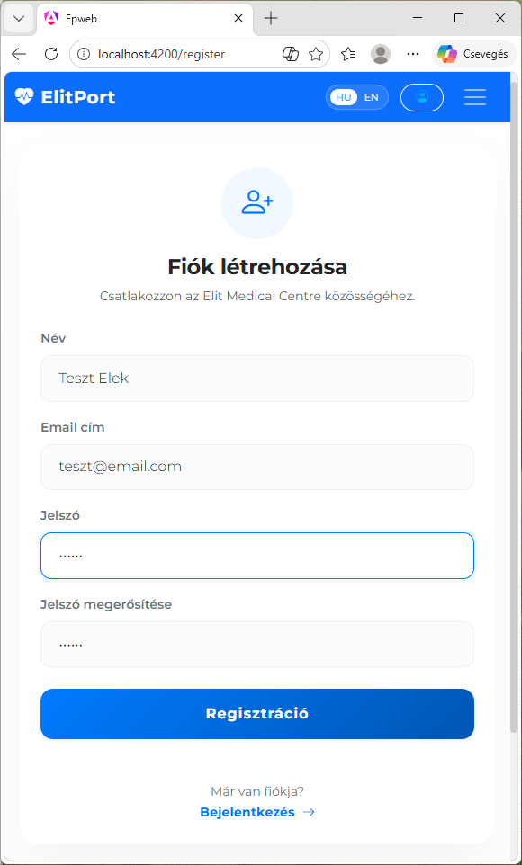
      <p><b>Kitöltött űrlap: minden mező valid, a jelszavak egyeznek (6+ karakter), a gomb aktívvá vált.</p>
    </td>
  </tr>
</table>

#### 4.2.5. A fiók aktiválása és érvényesítése
A regisztrációs űrlap sikeres beküldése után a rendszer biztonsági okokból egy automatikus visszaigazoló e-mailt küld a megadott címre. **A fiók használatba vétele előtt ezt az e-mailt kötelező aktiválni.**

#### Az aktiváló e-mail megjelenése:

<div align="center">
  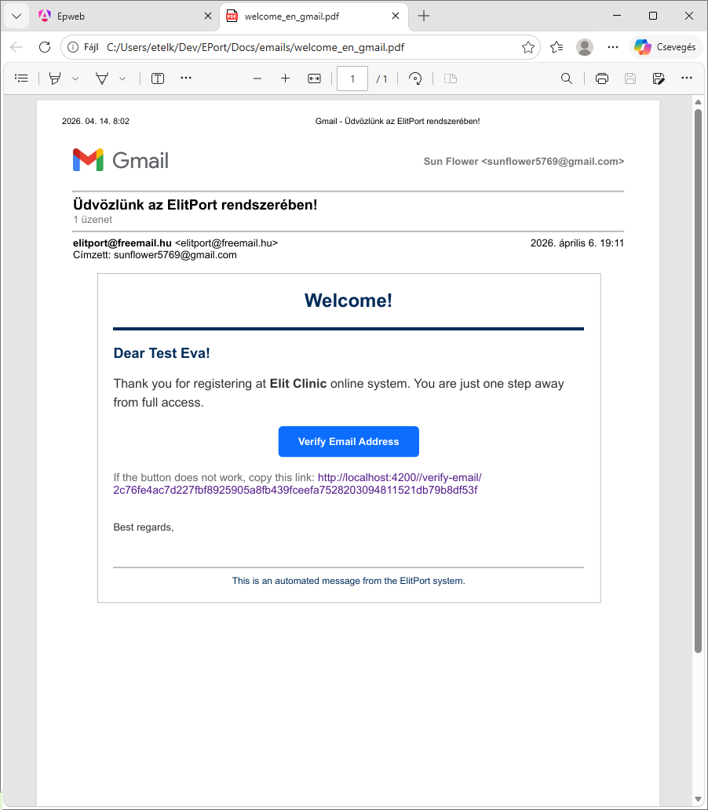
  <p><i>1. ábra: A rendszer által küldött aktiváló levél mintája.</i></p>
</div>

> [!TIP]
> A hivatalos e-mail formátumot PDF dokumentumban is megtekintheti: 
> [Aktiváló e-mail minta (PDF)](./emails/welcome_en_gmail.pdf)

1. **Ellenőrizze e-mail fiókját:** Keresse a Elitport@... - "Üdvözöljük az ElitPort rendszerében!" tárgyú üzenetet. (Amennyiben nem érkezik meg 1-2 percen belül, kérjük, ellenőrizze a "Levélszemét/Spam" mappát is!)
2. **Aktiváló hivatkozás:** Az üzenetben található egy egyedi link és gomb ("Verify Email Address"). Kattintson erre a fiók hitelesítéséhez.
3. **Időkorlát:** Figyelem! Biztonsági okokból az aktiváló link a kiküldéstől számított **30 percig érvényes**. Amennyiben ezen az időn belül nem kattint rá, a regisztrációs folyamatot meg kell ismételnie.
4. **Bejelentkezés és Foglalás:** Sikeres aktiválás után a böngésző visszairányítja a bejelentkező oldalra. Most már a megadott e-mail címmel és jelszóval beléphet, és azonnal elindíthatja az első időpontfoglalását.
   
<table style="width: 100%; border-collapse: collapse;">
  <tr>
    <td style="width: 50%; text-align: center; vertical-align: top;">
      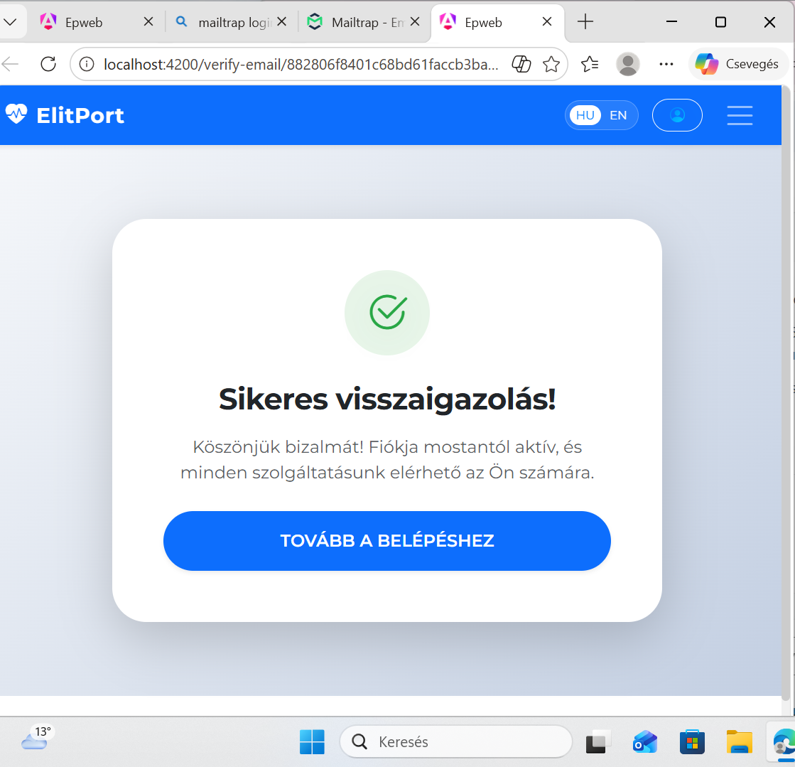
      <p><b>Sikeres aktiválás</b><br> Visszairányítás a Belépéshez.</p>
    </td>
    <td style="width: 50%; text-align: center; vertical-align: top;">
      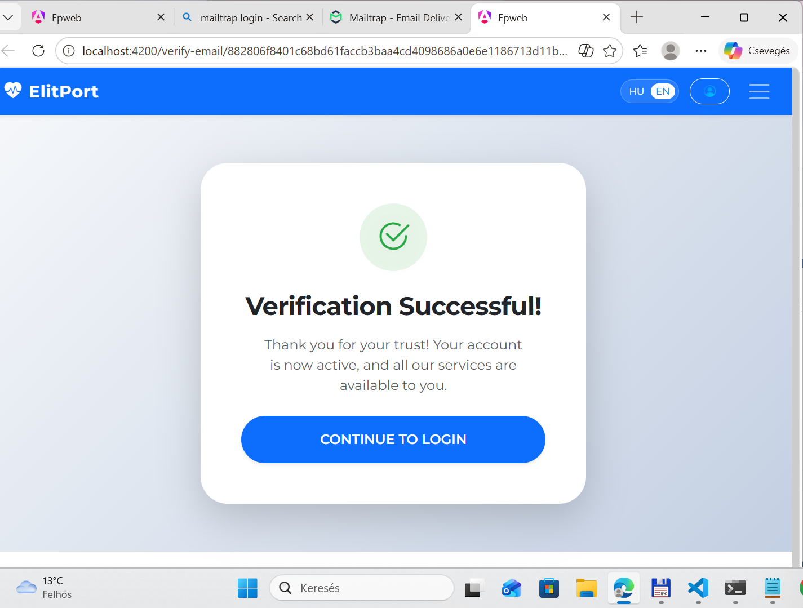
      <p><b> Sikeres aktiválás után a böngésző visszairányítja a bejelentkező oldalra a Pácienst-angol verzió</p>
    </td>
  </tr>
</table>

#### 4.2.6. Bejelentkezés

A már regisztrált felhasználók az alábbi módon léphetnek be:
1.  A **"Bejelentkezés"** menüpont kiválasztása.
2.  Az azonosításhoz szükséges e-mail cím és jelszó megadása.
3.  A "Belépés" gombra kattintva a rendszer betölti a felhasználó személyes felületét.


<div align="center">
  
  <p><i>2. ábra: Bejelentkezéskor nem pontos email vagy jelszó megadásakor hibát azonnal jelzi a rendszer és korrigálható.</i></p>
</div>

Ahogy a fenti képen látható, a bejelentkezéshez a felhasználónak két adatra van szüksége: a pontos e-mail címre és a jelszóra. A sikeres azonosítást követően a rendszer visszairányítja a kezdőoldalra, ahonnan a **"Szakembereink"** menüpontot választva is elindíthatja a foglalását vagy az oldalon található **"Időpontfoglalás Indítása"** gombra kattintva.

---

### 4.3. Időpontfoglalás menete

Az időpontfoglalás egy interaktív folyamat, amely segít Önnek megtalálni a legmegfelelőbb szakembert és időpontot.

#### 4.3.1. Szakember és szolgáltatás kiválasztása
1. Kattintson a fejlécben található **"Szakembereink"** menüpontra. Itt láthatja az összes elérhető orvost/szakembert.
2. Minden szakember kártyán található az orvos képe a szakterülete, Profile megtekintésre kattintva található egy rövid bemutatkozás és elérhető szolgáltatások (ár, vizsgálat időtartama). 
3. Válassza ki az Önnek megfelelő szakembert, majd kattintson a kártyán levő **"Időpontfoglalás"** gombra.

#### 4.3.2. Az időpont kiválasztása (Naptárnézet)
A gomb megnyomása után megjelenik a szakember személyes naptára:
* **Szabad időpontok:** Az elérhető időpontok a képernyő bal oldalán heti felbontásban a rendszer jól látható  kék színnel jelöli.
* **Foglalt időpontok:** Ezek a mezők fehérek (nem kattinthatóak), jelezve, hogy az adott órában a szakember már nem elérhető.
* **Kiválasztás:** Kattintson a naptárban az Önnek megfelelő napra és órára. Jobb felső sarokban a következő hétre kattintva lehet további időpontok közül választani.

#### 4.3.3. Foglalás véglegesítése és visszaigazolás
1. Az időpont kiválasztása után egy összegző ablak jelenik meg, ahol ellenőrizheti a dátumot és a szakember nevét.
2. Kattintson a **"Foglalás megerősítése"** gombra.
3. Az időpont kiválasztása után egy felugró ablak (úgynevezett *SweetAlert* panel) jelenik meg az adatok ellenőrzéséhez.
4. A foglalás véglegesítéséhez kattintson a **"Igen, lefoglalom"** gombra.
4. **Megerősítés:** * Magyar nyelvű felületen kattintson az **"Igen, lefoglalom"** gombra.
    * Angol nyelvű felületen (**EN**) kattintson a **"Yes, book it"** feliratú gombra.
5.  **Elvetés:** Amennyiben véletlenül kattintott, vagy mégis más időpontot választana, a **"Mégsem" / "Cancel"** gombbal visszatérhet a naptárhoz.
6. A sikeres foglalásról a rendszer **azonnal küld egy visszaigazoló e-mailt**, amely tartalmazza a találkozó részleteit és a lemondási feltételeket.
 **Figyelem!** Foglalásait bármikor megtekintheti vagy kezelheti a saját **"Foglalásaim"** menüpontja alatt (menűsáv középen ikonnal), ahol a korábbi és a jövőbeli időpontjai is listázva vannak.

<table style="width: 100%; border-collapse: collapse;">
  <tr>
    <td style="width: 40%; text-align: center; vertical-align: top;">
      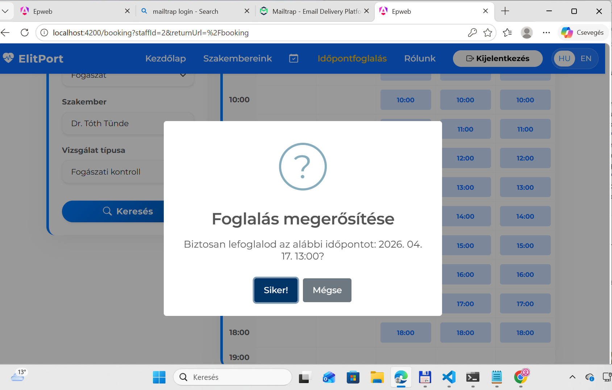
      <p><b>Foglalás megerősítése vagy elvetés lehetősége(modal ablak a foglalási adatokkal), hátárben az interaktív naptár nézet.</p>
    </td>
    <td style="width: 40%; text-align: center; vertical-align: top;">
      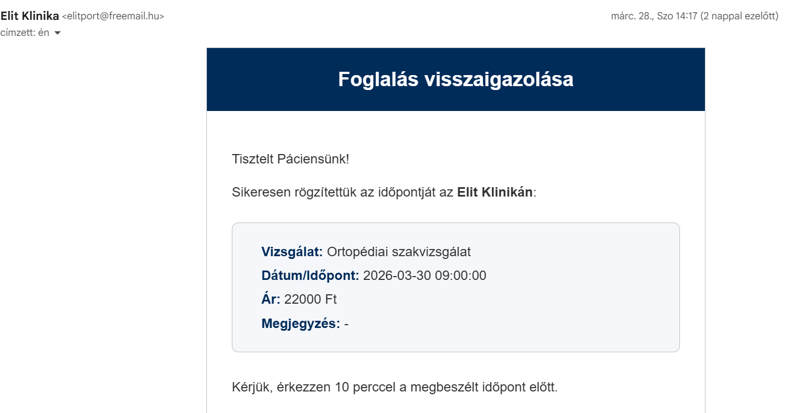
      <p><b>Visszaigazoló email a foglalásról.</p>
    </td>
     <td style="width: 40%; text-align: center; vertical-align: top;">
      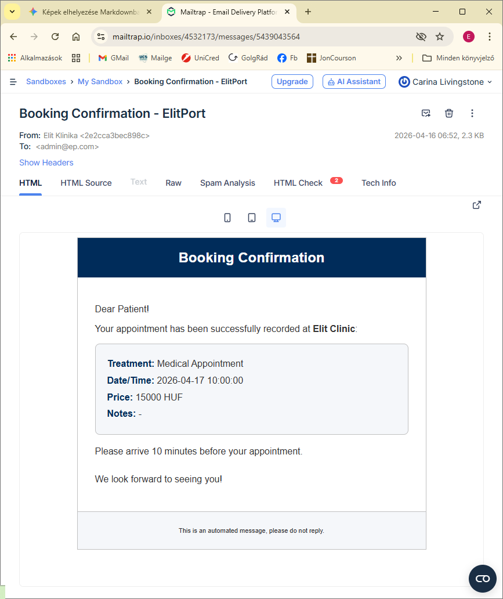
      <p><b>Visszaigazoló email angolul a foglalásról.</p>
    </td>
  </tr>
</table> 

A felhasználói jogkörrel bíró felhasználók egy limitált felületet láthatnak, amit a fenti bejelentkezés előz meg.

---

### 4.4. Saját adatok és foglalások kezelése

A Páciens a saját profilján keresztül teljes kontrollal rendelkezik a korábbi és jövőbeli tevékenységei felett.

1.  **Dashboard / Profil:** A bejelentkezés után elérhető felületen látható a következő esedékes időpont.
2.  **Foglalások megtekintése:** A felhasználó visszakeresheti korábbi kezeléseit és ellenőrizheti azok státuszát.
3.  **Lemondási protokoll:** Amennyiben a foglalás időpontja nem megfelelő, a felhasználó a "Időpont lemondása" gomb segítségével törölheti azt. Ekkor az időpont felszabadul és újra elérhetővé válik a többi Páciens számára. 
Az időpontok lemondása a Páciens felületén csak a látogatást megelőző 24. óráig engedélyezett. 24 órán belüli módosításra vagy törlésre kizárólag Adminisztrátori jogosultsággal van lehetőség. Ilyenkor kérjük, vegye fel a kapcsolatot az intézmény Adminisztrátorával.

<table style="width: 100%; border-collapse: collapse;">
  <tr>
    <td style="width: 50%; text-align: center; vertical-align: top;">
      
      <p><b> A páciens foglalásai:</b><br> 
        <p>A Páciens saját foglalását az időpont előtt maximum 24 órával mondhatja le. A 24 órán belüli időpontok véglegesítettnek minősülnek, ezeket csak az <b>Adminisztrátor</b> tudja töröltetni.</p>
    </td>
    <td style="width: 50%; text-align: center; vertical-align: top;">
      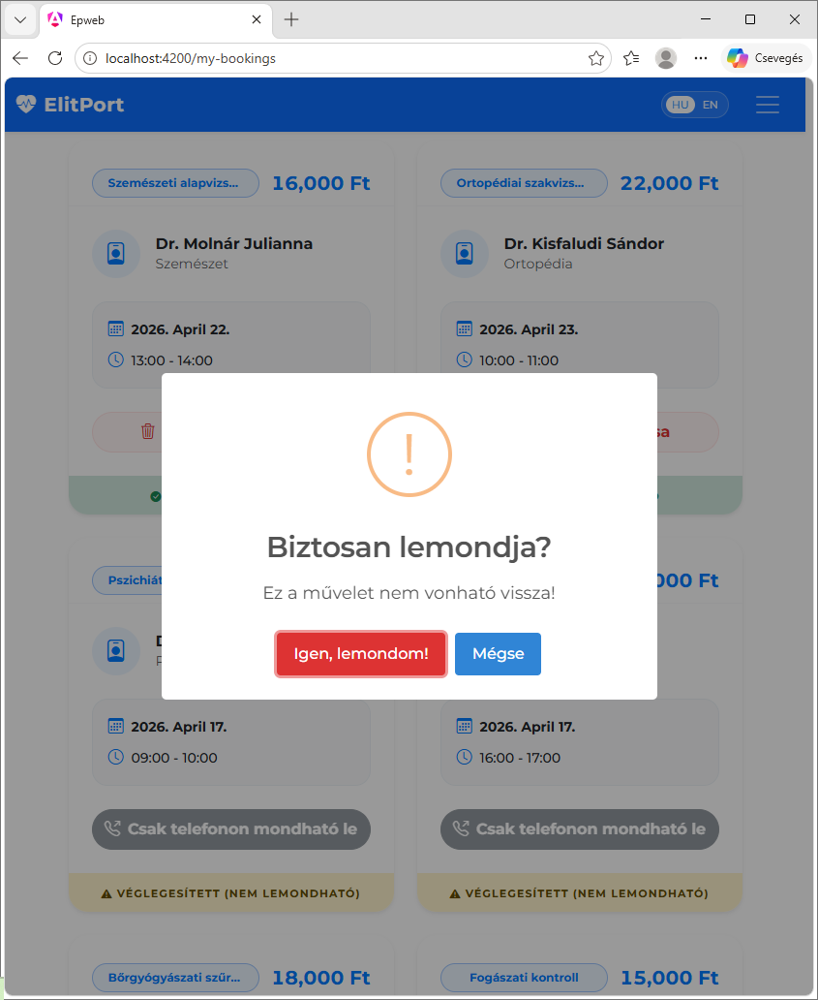
       <p><b>Lemondható a foglalás:</b><br> 
      <p>Az időpont előtt csak 24 órán kivül mondható le a saját foglalás. </p>
    </td>
  </tr>
</table>

---

### 4.5. Hibaelhárítás és támogatás

#### 4.5.1 Elfelejtett jelszó  - E-mail értesítés és biztonsági hivatkozás

Amennyiben elfelejtette bejelentkezési jelszavát, a rendszer lehetőséget biztosít annak biztonságos megváltoztatására az Ön által regisztrált e-mail cím segítségével.

A rendszer pár percen belül egy automatikus üzenetet küld az Ön postafiókjába, amely tartalmazza a jelszó módosításához szükséges adatokat.

* **Aktiváló gomb:** Az e-mailben található egy **"Új jelszó megadása"** feliratú gomb. Erre kattintva a rendszer visszairányítja Önt a szoftver biztonságos felületére.
* **Időkorlát:** A biztonság érdekében ez a link **30 perc múlva lejár**. Amennyiben túllépi ezt az időkeretet, a folyamatot biztonsági okokból elölről kell kezdenie.
* **Biztonsági záradék:** Ha nem Ön kérte a jelszó visszaállítását, kérjük, hagyja figyelmen kívül az üzenetet. Ebben az esetben a jelenlegi jelszava változatlan és biztonságos marad.

#### 4.5.2. Az új jelszó véglegesítése

A gombra kattintva megnyílik a bejelentkező felület, ahol megadhatja új hitelesítő adatait:
1.  Gépelje be az új választott jelszót (legalább **6 karakter**).
2.  Ismételje meg a jelszót a megerősítő mezőben.
3.  A **"Jelszó mentése"** gombra kattintva a folyamat lezárul.
4.  Ezt követően az új jelszóval azonnal bejelentkezhet a rendszerbe.

<div align="center">
  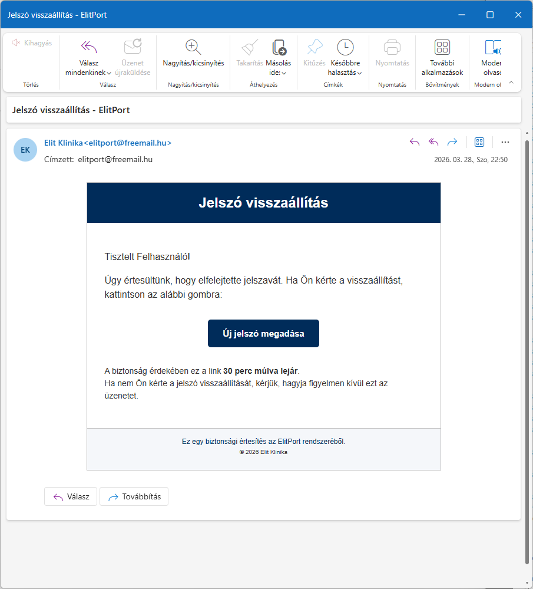
  <p><i>4. ábra: Minta a jelszó-helyreállító levélről a biztonsági hivatkozással.</i></p>
</div>

> [!WARNING]
> Soha ne ossza meg a kapott jelszó-helyreállító linket másokkal! Amennyiben nem Ön kezdeményezte a jelszó kérését, kérjük, hagyja figyelmen kívül az e-mailt. Saját adatainak védelme érdekében — különösen, ha nyilvános vagy közös használatú számítógépet használ — mindig jelentkezzen ki a felületről, miután befejezte a munkát.

### 4.6. Adminisztrátori funkciók

Az Adminisztrátorok és a Klinikai munkatársak emelt szintű jogosultságokkal rendelkeznek, amelyek lehetővé teszik a rendszer teljes körű felügyeletét, az adatbázis kezelését és a statisztikai elemzések megtekintését.

#### 4.6.1. Az Adminisztrációs Irányítópult (Dashboard)
A bejelentkezés után az adminisztrátori joggal rendelkező felhasználók egy speciális vezetői felületre érkeznek.
1.  **KPI Mutatók:** Az oldal tetején láthatók a legfontosabb mérőszámok: az összesített bevétel, a foglalások száma és a lemondási arány, továbbá a legnépszerűbb vozsgálatok, orvosok leterheltsége.
2.  **Hőtérkép (Heatmap):** Ez a vizuális táblázat segít azonosítani a klinika legforgalmasabb időszakait. A sötétebb színnel jelölt idősávok jelzik a legnagyobb telítettséget.
3.  **Riport generálása:** Az "Export to PDF" gomb megnyomásával az aktuális statisztikai adatokról professzionális, nyomtatható dokumentum készíthető.

<div align="center">

  <p><i>Vezetői riport: KPI mutatók, Szakemberek kihasználtsága (hőtérképpel), nyomtatható jelentés - pdf generálási lehetőség.</i></p>
</div>
<table style="width: 100%; border-collapse: collapse;">
  <tr>
    <td style="width: 50%; text-align: center; vertical-align: top;">
        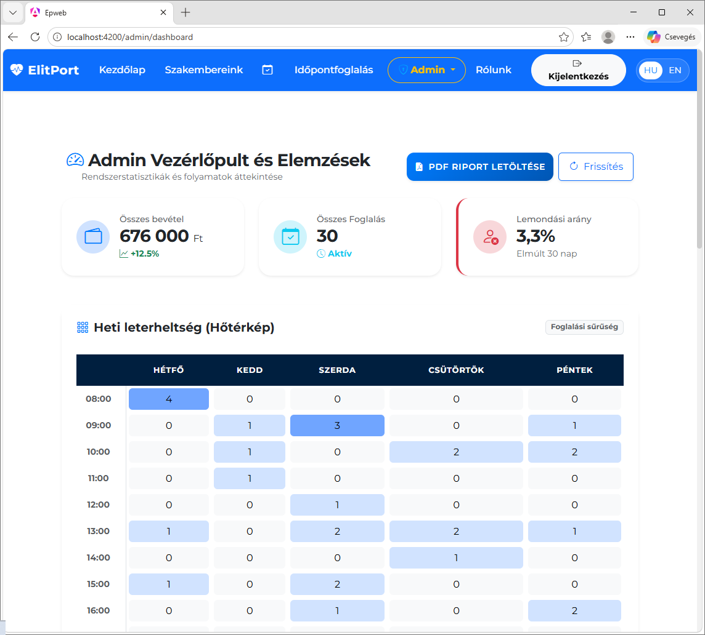
      <p><b> Vezetői riport:</b><br> 
        <p><i> KPI mutatók, Szakemberek kihasználtsága (hőtérképpel), nyomtatható jelentés - pdf generálási lehetőség.</i></p>
    </td>
    <td style="width: 50%; text-align: center; vertical-align: top;">
      
       <p><b>Legnépszerűbb vizsgálatok</b><br> 
      <p> Összesítés a leggyakrabban foglalt szolgáltatásokról </p>
    </td>
  </tr>
</table>
#### 4.6.2. Szakemberek kezelése
Az adminisztrátori felületen keresztül tartható karban az intézmény kínálata és humánerőforrás-állománya.

1.  **Szakember felvétele:** Új orvos vagy munkatárs adható hozzá a rendszerhez a személyes adatok és a szakterület megadásával.
2.  **Kezelések hozzárendelése:** Meghatározható, hogy melyik szakember milyen típusú vizsgálatokat végezhet, szerepkör, státusz, elérhetőség beállítási lehetőségekkel.
3.  **Munkabeosztás (Slot-menedzsment):** Az adminisztrátor jogosult a szakemberek naptárában szabad időpontokat (slotokat) létrehozni, módosítani vagy szükség esetén zárolni (például szabadság vagy betegség esetén).
4.  A felület támogatja továbbá a következő funkciókat: a személyzet adatainak Módosítását, Inaktivvá tételét, Időpontok automatikus generálást hetekre előre.

<table style="width: 100%; border-collapse: collapse;">
  <tr>
    <td style="width: 50%; text-align: center; vertical-align: top;">
      
      <p><b>Szakember felvétele:</b><br>Az űrlap segítségével rögzíthető az új orvos neve, szakterülete, hozzárendelhető vizsgálatok és státusza, amely megjelenik a Páciens oldali keresőben.</p>
    </td>
    <td style="width: 50%; text-align: center; vertical-align: top;">
      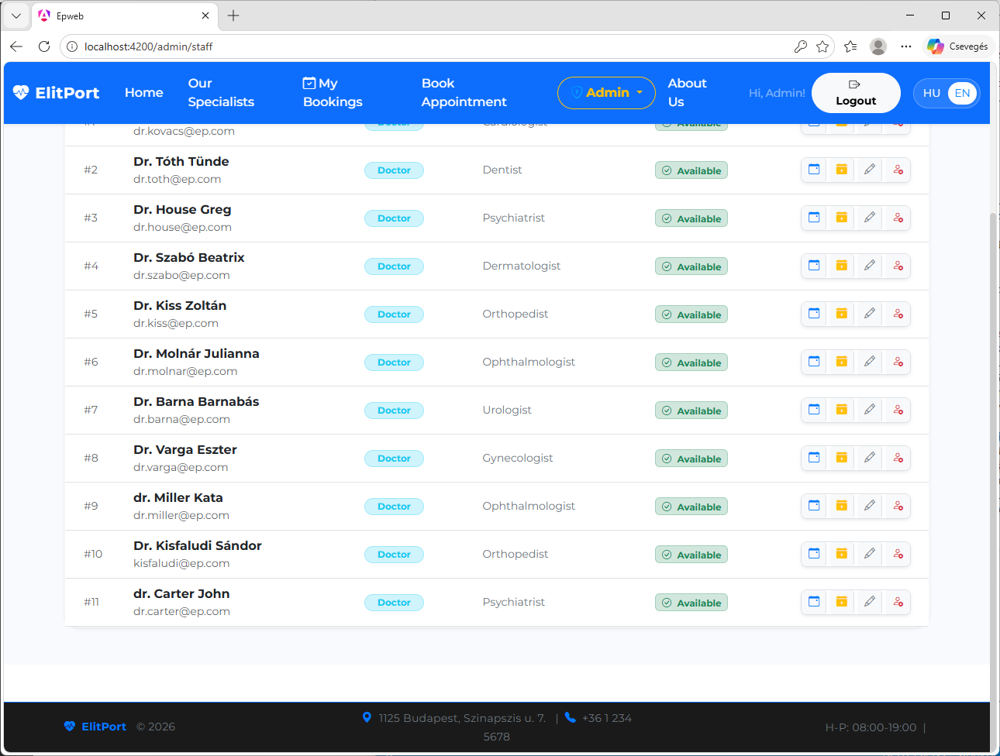
      <p><b>Személyzeti lista (Staff):</b><br>A már rögzített munkatársak áttekinthető listája, ahol lehetőség van az adatok utólagos módosítására vagy a szakember inaktiválására.</p>
    </td>
  </tr>
</table>

#### 4.6.3. Szolgáltatások kezelése (CRUD műveletek)

A rendszer rugalmasságát a Szolgáltatások menüpont biztosítja. Itt az adminisztrátor teljes körűen menedzselheti az intézmény által kínált ellátásokat. A felület támogatja a **CRUD** (Létrehozás, Olvasás, Módosítás, Törlés) funkciókat.

#### Új szolgáltatás felvétele (Create)
Új szolgáltatás hozzáadásakor az adminisztrátornak meg kell adnia a szolgáltatás megnevezését, az alapértelmezett időtartamot és a hozzá tartozó leírást.

<table style="width: 100%; border-collapse: collapse;">
  <tr>
    <td style="width: 50%; text-align: center; vertical-align: top;">
      
      <p><b>Szolgáltatás rögzítése:</b><br>Új elem hozzáadása: név, időtartam, ár és leírás megadásával.</p>
    </td>
    <td style="width: 50%; text-align: center; vertical-align: top;">
      
      <p><b>Szolgáltatások listája:</b><br>Az összes rögzített elem áttekintése, ahol a Szerkesztés és Törlés gombok is elérhetőek.</p>
    </td>
  </tr>
</table>

#### Műveletek leírása:
1.  **Létrehozás (Create):** Az űrlap kitöltésével és mentésével új szolgáltatás típus definiálható.
2.  **Megtekintés (Read):** A szolgáltatások táblázatos formában, kereshető módon jelennek meg.
3.  **Módosítás (Update):** A meglévő szolgáltatások paraméterei (pl. ár vagy időtartam változása esetén) bármikor frissíthetők.
4.  **Szolgáltatás törlése vagy archiválása (Delete)** A már nem releváns szolgáltatások eltávolíthatók a rendszerből.
   
> [!TIP]
* **Figyelmeztetés:** A törlés előtt a rendszer megerősítést kér (SweetAlert panel), hogy elkerülhető legyen a véletlen adatvesztés.

> [!NOTE]
> **Szakmai szempont:** A szolgáltatások és a szakemberek (Staff) közötti kapcsolat dinamikus. Egy új szolgáltatás felvétele után azt hozzá kell rendelni legalább egy szakemberhez, hogy a páciensek számára foglalhatóvá váljon.

#### 4.6.4. Felhasználók és Foglalások felügyelete (Adminisztráció)
Az adminisztrátori fejléc (Navbar) legördülő menüjéből érhető el a rendszer két legkritikusabb vezérlőpultja: a **User Management** és a **Booking Management**.

<table style="width: 100%; border-collapse: collapse;">
  <tr>
    <td style="width: 50%; text-align: center; vertical-align: top;">
      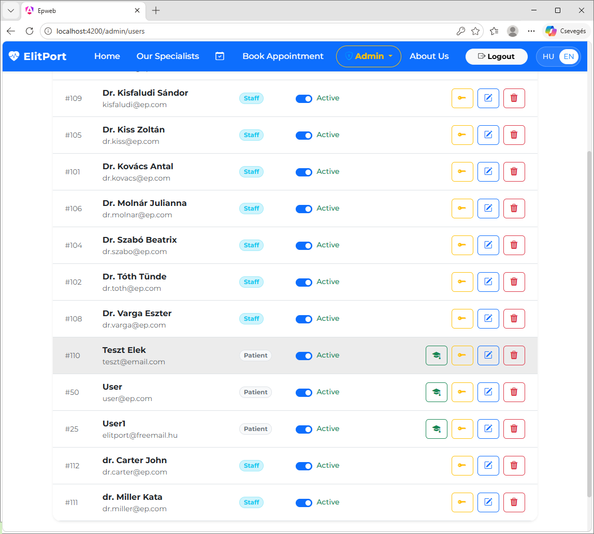
      <p><b>User Management:</b><br>Felhasználók listája. Itt végezhető el a <i>User Archiving</i> (felhasználó archiválása), amely törlés helyett inaktív állapotba teszi a fiókot. <br>A regisztrált felhasználók előléptetésére egy kattintással <b>orvosi (Doctor) státusz</b> adható</p>
    </td>
    <td style="width: 50%; text-align: center; vertical-align: top;">
      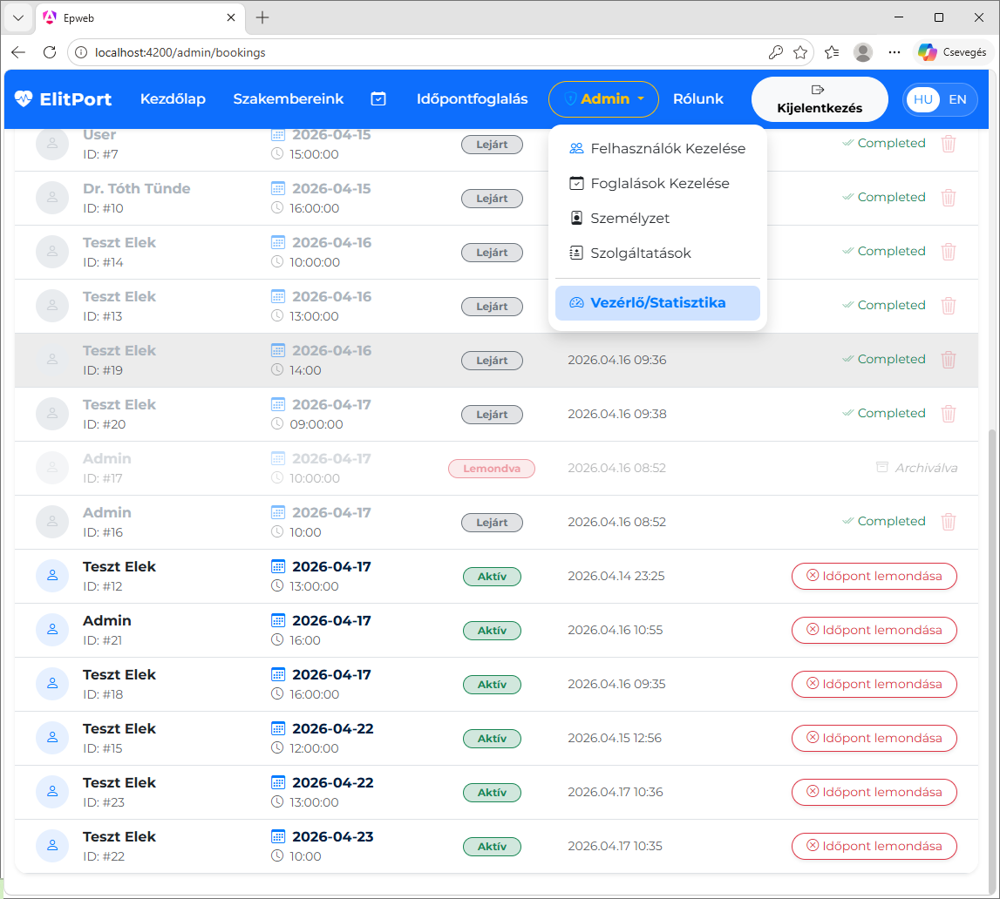
      <p><b>Booking Management:</b><br>Az összes foglalás központi listája. Az adminisztrátor itt felülbírálhatja a 24 órás korlátozást, és törölheti vagy módosíthatja bármelyik időpontot.</p>
    </td>
  </tr>
</table>

#### Adminisztrátori jogosultságok részletezése:

* **User Archiving (Archiválás):** Adatvédelmi és statisztikai okokból a felhasználókat nem véglegesen töröljük, hanem archiváljuk. Az archivált felhasználó nem tud belépni, de a korábbi foglalási adatai megmaradnak a rendszerben kutathatóság céljából.
* **Booking Override (Foglalás felülbírálása):** Míg a Páciens számára a rendszer tiltja a 24 órán belüli lemondást, az adminisztrátor a **Booking Management** felületen ezt bármikor megteheti (pl. váratlan orvosi betegség vagy vis maior esetén).

> [!CAUTION]
> Az ezen a felületen végzett módosítások közvetlen hatással vannak az adatbázisra és a Páciensek értesítéseire. A törlések és módosítások előtt minden esetben kérjük a művelet megerősítését!

### 4.7. Adatbiztonság és Mobilnézet

#### 4.7.1. Biztonságos kijelentkezés
A munka befejeztével minden esetben kattintson a **"Kijelentkezés"** (Logout) gombra. Ez azonnal lezárja az aktív munkamenetet, megakadályozva, hogy bárki más hozzáférjen az Ön adataihoz vagy foglalásaihoz az adott eszközön.

#### 4.7.2. Rugalmas megjelenés (Mobilnézet)
Az alkalmazás teljes mértékben **reszponzív**, ami azt jelenti, hogy a felület automatikusan alkalmazkodik az Ön eszközének képernyőméretéhez. 
* **Okostelefonon:** A menüpontok egy kompakt "hamburger-menübe" csoportosulnak, kivéve a nyelvválasztást.
* **Táblagépen és PC-n:** A teljes navigációs sáv látható a gyors elérés érdekében.

> [!TIP]
> Bármilyen eszközön is használja a rendszert, minden funkció (foglalás, lemondás, profilkezelés) változatlan formában és biztonsági szinten érhető el.
---

## 5. Tesztek és Minőségbiztosítás


A szoftverfejlesztési életciklus (SDLC) egyik legkritikusabb szakasza a minőségbiztosítás. Az **ElitPort (EP)** rendszer esetében a tesztelés célja nem csupán a funkcionális hibák feltárása volt, hanem annak igazolása, hogy a szoftver hogyan viselkedik különböző környezetekben, illetve hogyan reagál a nem optimális, szélsőséges vagy hibás használat során.

A fejezet bemutatja a rendszert érő hatásokat három fő megközelítésben: **statikus**, **dinamikus** és **stressz** (terheléses) vizsgálatokon keresztül, bizonyítva a szoftver robusztusságát.

A szoftver fejlesztési folyamatáról és technológiai felépítéséről a **[Fejlesztői Útmutató (DEVELOPER_GUIDE.md)](./DEVELOPER_GUIDE.md)** nyújt tájékoztatást. Jelen dokumentum az ott leírt architektúra gyakorlati ellenőrzését rögzíti.

---

### 5.1. Tesztelési környezetek és eszköz-specifikációk

A követelményeknek megfelelően a rendszert többféle hardver- és szoftverkörnyezetben vizsgáltuk, szimulálva az optimális és a korlátozott használati feltételeket is.

A modern webalkalmazásokkal szembeni alapvető elvárás, hogy a felhasználói élmény állandó maradjon, függetlenül attól, hogy a páciens egy munkaállomásról vagy egy gyengébb mobilkapcsolattal rendelkező okostelefonról próbál időpontot foglalni.

A fejlesztés során az alábbi technológiákat alkalmaztuk, melyek együttesen határozták meg a tesztelési stratégiát:

* **Frontend:** **Angular 20.3.16** (TypeScript alapú keretrendszer, RxJS állapottérképezéssel).
* **Runtime:** **Node.js v24** (Szerveroldali futtatókörnyezet).
* **Backend Framework:** **Express.js** (REST API architektúra).
* **ORM:** **Sequelize** (Objektum-relációs leképzés a MySQL/SQLite és a kód között).
* **Adatbázis:** **SQLite** (Fejlesztési fázisban fájl alapú `database.sqlite`, produkciós környezetben MySQL kompatibilis).
* **Hitelesítés (Auth):** **JSON Web Token (JWT)** a munkamenetek kezeléséhez és **Bcrypt** a jelszavak aszinkron titkosításához.
* **Naplózás (Logging):** **Morgan** a HTTP kérések monitorozásához és egyedi **Logger** modul az `access.log` fájlba történő hibarögzítéshez.


#### 5.1.1. Hardver tesztkörnyezet és Eszközkonfiguráció
A tesztelés során kiemelt figyelmet fordítottunk a különböző kijelzőfelbontásokra és az eszközök erőforrásaira.

| ID | Eszköz típusa | Operációs rendszer | Felbontás | Tapasztalt sajátosságok |
| :--- | :--- | :--- | :--- | :--- |
| **H1** | **Asztali PC** | Windows 11 | 1920 x 1080 | Maximális információsűrűség. A dashboard hőtérképe és a naptár nézet teljes szélességben látható. |
| **H2** | **Laptop** | Windows 10 | 1366 x 768 | Átmeneti felbontás. A Bootstrap 5 grid rendszere a szakemberek kártyáit 3 oszlopról 2 oszlopra rendezte át. |
| **H3** | **Okostelefon** | iOS 16 / Android 13 | 390 x 844 | **Kritikus tesztpont.** A navigációs sidebar eltűnt és egy "hamburger" menübe tömörült. A naptár nézet napi bontásra váltott. |
| **H4** | **Tablet** | iPadOS | 820 x 1180 | Portré módban a mobil, tájkép módban az asztali nézethez közeli elrendezés aktiválódott. |

#### 5.1.2. Böngészőmotorok és szoftveres viselkedés
Mivel a különböző böngészők eltérő renderelő motorokat használnak, a szoftvert a három legmeghatározóbb technológián teszteltük:
* **Blink motor (Chrome, Edge):** Hibátlan renderelés, a CSS Grid és Flexbox elemek az elvárt módon jelentek meg.
* **WebKit motor (Safari):** Az iOS eszközökön a dátumválasztó mezők a rendszer saját interfészét hívták meg, ami növelte a felhasználói élményt.
* **Gecko motor (Firefox):** Az animációk folyamatossága és az aszinkron adatbetöltés sebessége megegyezett a Chromium alapú böngészőkével.

---

### 5.2. Statikus tesztelés: 

A statikus tesztelés során a programkód futtatása nélkül végeztünk elemzéseket. Ez a fázis bizonyította, hogy a projekt forráskódja megfelel a modern szoftverfejlesztési szabványoknak.

#### 5.2.1. Manuális kódátvizsgálás (Code Review)

A manuális átvizsgálás során a kódbázis olvashatóságát, karbantarthatóságát és biztonsági aspektusait ellenőriztem az alábbi szempontok szerint:

* **Elnevezési konvenciók:** Verifikáltam a **camelCase** írásmód következetes használatát a változók, függvények és végpontok elnevezésekor, biztosítva a kód egységességét.
* **Middleware logika:** Különös figyelmet fordítottam a `checkRole` és a `verifyToken` (JWT) függvények logikai sorrendjére. Kritikus tesztelési szempont volt, hogy a jogosultság ellenőrzése csak a sikeres hitelesítés után történjen meg.
* **Biztonsági audit:** Ellenőriztem, hogy a szenzitív adatok (adatbázis jelszavak, JWT titkos kulcs) kizárólag a `.env` fájlban tárolódnak-e, és hogy ez a fájl szerepel-e a `.gitignore` listán, megelőzve a publikus verziókezelőbe való feltöltést.

#### 5.2.2. Automatizált statikus elemzés (Linting) konfigurálása

A szubjektív emberi hibák kiküszöbölésére az **ESLint** eszközt integráltam a projektbe. A linter konfigurálása során a projekt technológiai stackjéhez (Node.js, Express) igazodó szabályrendszert állítottam fel.

**A nyelvválasztás és környezet indoklása:**
A linting folyamatot a **JavaScript** állományokra korlátoztam, mivel a rendszer üzleti logikája, a biztonsági middleware-ek és a 39 végpont útvonalválasztása ebben a nyelvben készült. A konfiguráció során a futtatókörnyezetet **Node.js**-re állítottam, amely lehetővé tette a globális Node-változók (pl. `process.env`) hiba nélküli használatát.

**Alkalmazott főbb szabályok:**
* **Indentáció:** 2 szóköz alapú behúzás a kód átláthatósága érdekében.
* **Pontosvesszők:** Kötelező használat minden utasítás végén az értelmezési hibák elkerülése végett.
* **Hibaellenőrzés:** Nem használt változók (`no-unused-vars`) és definiálatlan hivatkozások (`no-undef`) szigorú tiltása.

> 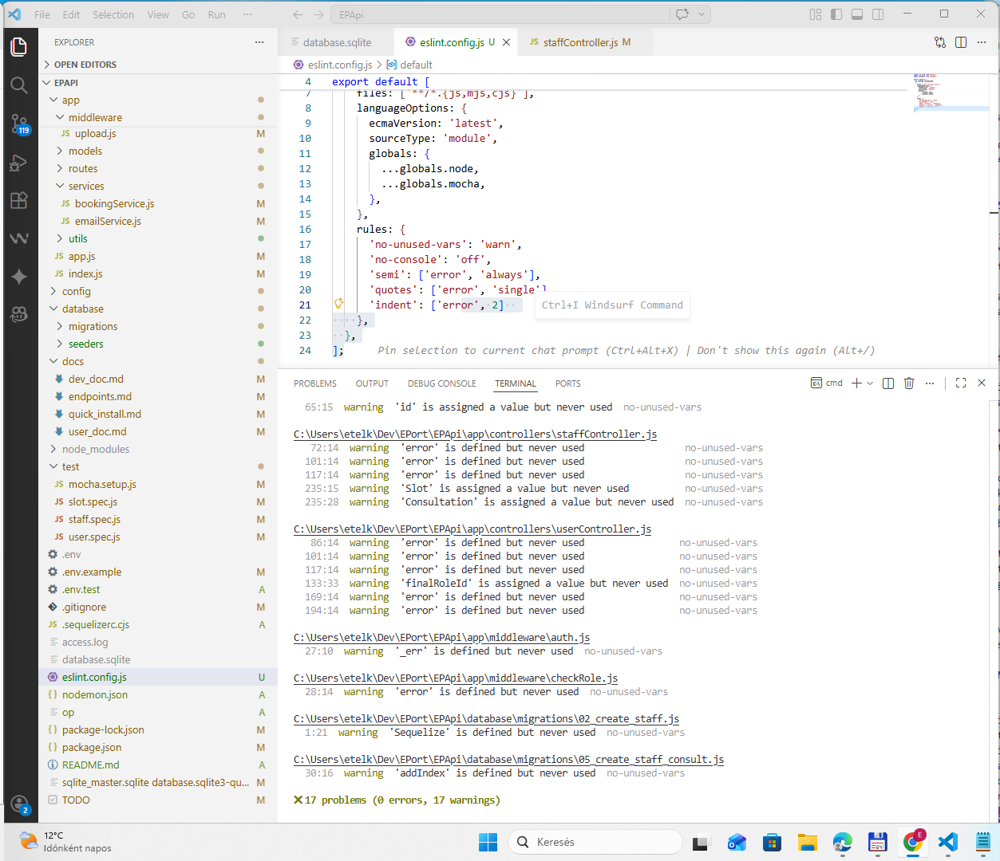
> *1. ábra: A projekt ESLint konfigurációs fájlja*

Az automatizált statikus analízis során a backend (Node.js) kódját vizsgáltam.
* **Kezdeti állapot:** 1804 hiba (főként formázási és pontosvessző hibák).
* **Automata refaktorálás:** Az `eslint --fix` funkció használatával a formázási hibák azonnal javításra kerültek, így a 39 végpontot kiszolgáló kódbázis egységessé és szabványkövetővé vált.
* **Végeredmény:** 0 hiba és 17 figyelmeztetés.
* **Szakmai konklúzió:** A statikus analízis segített megelőzni az olyan "csendes" hibákat, mint a definiált, de soha nem használt változók, amelyek hosszú távon memóriaszivárgáshoz vezetnének.

#### 5.2.3. Kritikus hibaforrások manuális javítása

Az automatikus javítás után fennmaradó kritikus hibák mélyebb, üzleti logikát érintő beavatkozást igényeltek. Ezek kijavítása elengedhetetlen volt a rendszer stabilitásához:

* **Hibatranszparencia (`cause` property):** A `bookingService.js` állományban a láncolt hibák dobásakor bevezettem a `{ cause: error }` paramétert. Ez biztosítja a hibakövetést anélkül, hogy elveszne az eredeti kivétel.
* **Redundáns hibakezelés:** Az `emailService.js` fájlban felszámoltam az üres „try/catch wrapper” blokkokat. A felesleges továbbdobások helyett érdemi naplózást (`log`) vezettem be, így a hibák archiválásra kerülnek.
* **Internacionalizáció (i18n) szinkron:** A hibaüzeneteket statikus szövegekről nyelvi kulcsokra cseréltem (pl. `EMAILS.MESSAGES.SEND_ERROR`), biztosítva a többnyelvűség (magyar/angol) folytonosságát.
* **Definiálatlan változók:** Azonosításra és javításra került egy kritikus `no-undef` hiba (`doctorImage`). A változó deklarálásával megelőztem az e-mail küldő modul futásidejű összeomlását.

#### 5.2.4 Frontend-Backend adatmodell szinkronizáció

A statikus analízis során elvégzett névátírások után elengedhetetlen volt a kliensoldali (Angular) adatmodellek felülvizsgálata is. A vizsgálat célja annak biztosítása volt, hogy a backend API által szolgáltatott JSON struktúra és a frontend TypeScript interfészei teljes átfedésben legyenek.

**Kiemelt szinkronizációs pont: Profilkép kezelés**
A `staffController` és a `staff.model.ts` állományok összevetésekor az orvosi profilképek megjelenítéséért felelős kulcsot egységesítettem a teljes technológiai stackben:
* **Backend Model:** `imageUrl` (Sequelize definíció)
* **Backend Controller:** `imageUrl: finalUrl` (Adatfeldolgozás)
* **Frontend Component:** `imageUrl: finalUrl` (TypeScript objektum)
---

#### 5.2.6. A minőségbiztosítási folyamat záró értékelése

Az ESLint futtatása során a rendszer 17 figyelmeztetést (warning) azonosított, melyek elsősorban a *"defined but never used"* (definiált, de nem használt) kategóriába esnek.

**Összegzett eredmények:**
* **Stabilitás:** Megszűnt minden olyan hivatkozás, amely az alkalmazás futásidejű leállását okozhatná.
* **Konzisztencia:** A backend modellek és a frontend interfészek elnevezései teljes szinkronba kerültek.
* **Karbantarthatóság:** A kód mentesült a „halott kód” elemektől (nem használt importok, változók).

Ezek a figyelmeztetések főként a Controller rétegben fordulnak elő, ahol az Express.js middleware architektúrája megköveteli bizonyos paraméterek (például a `next` objektum) deklarálását a függvény szignatúrájában a megfelelő callback-kezelés érdekében. Bár a kódban ezek az objektumok nem kerülnek közvetlen felhasználásra, elhagyásuk a keretrendszer működési logikája miatt nem lehetséges.
A fennmaradó 17 figyelmeztetés (warnings) egy része a korábbi, egynyelvű fejlesztési fázisból származó statikus adatfájlokat ( legacy files) érinti, így a jelenlegi üzleti logikát nem befolyásolják.

> 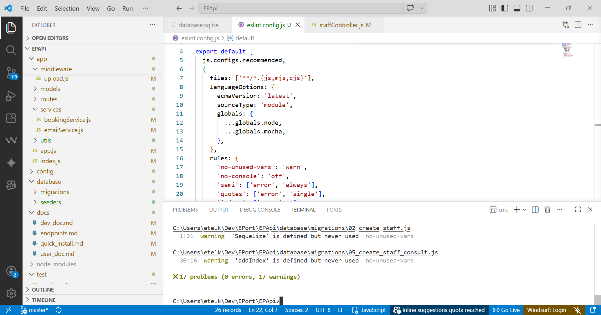
> *2. ábra: Az ESLint futtatásának végső, hibamentes eredménye*

**A döntés indoklása:**
A többnyelvűsítés (i18n) során bevezetett új struktúra mellett a régi adatokat referenciaként és biztonsági mentésként egy állományba vontam össze. Mivel ezek a fájlok a produkciós üzleti logikát és a 39 végpont futását nem befolyásolják, a manuális javításuk helyett a fejlesztési erőforrásokat a kritikus funkciók (pl. foglalási logika és biztonsági middleware) tesztelésére fókuszáltam. Ez a minimális „technikai adósság (technical debt)” nem veszélyezteti a rendszer stabilitását.

**Konklúzió:** Az automatizált linting folyamat a manuális kódjavításhoz képest jelentős munkaórát takarított meg, miközben hiba nélküli, iparági szabványoknak megfelelő kódminőséget eredményezett a projekt mind a 39 végpontján. Mivel ezek a jelzések kizárólag stilisztikai jellegűek és a szoftver üzleti logikáját, stabilitását vagy biztonságát nem befolyásolják, a kód integritása érdekében nem távolítottam el a kötelező paramétereket.

---

### 5.3. Dinamikus tesztelés (API tesztelés)

A dinamikus tesztelés során a rendszert futás közben, valós HTTP kérésekkel vizsgáltuk az **Insomnia REST Client** segítségével. A tesztek lefedik a hitelesítést, az adatvalidációt és az üzleti logikai szabályokat.

#### 5.3.1. Tesztelési alapelvek és Asserciók (Ellenőrzőlista)

Minden dinamikus teszteset (Insomnia kérés) során az alábbi automatizált és manuális asserciókat vizsgáltuk a válaszok validálásához:

- [x] **Státuszkód ellenőrzése:** A válasz megfelel-e a várt HTTP kódnak (pl. 200, 201, 401, 409).
- [x] **Válaszidő (Performance):** A kérések 95%-a 200ms alatti válaszidővel futott le.
- [x] **Adatstruktúra (Schema):** A JSON válasz tartalmazza-e a kötelező mezőket (pl. `success`, `data`, `message`).
- [x] **Fejléc validáció:** A `Content-Type` fejléc minden esetben `application/json`.
- [x] **Biztonság:** A védett végpontok érvénytelen token esetén következetesen `401 Unauthorized` választ adnak.

#### 5.3.2. Hitelesítési folyamat (Authentication)
A rendszer biztonsági kapuja, mely biztosítja, hogy csak regisztrált felhasználók férjenek hozzá a védett végpontokhoz.

### `POST /api/auth/login`
A felhasználó bejelentkeztetése és JWT token generálása.

* **Status:** `200 OK`
* **Request Body:**
```json
{
  "email": "admin@ep.com",
  "password": "password123"
}
```
* **Response Body:**
```json
{
  "success": true,
  "data": {
    "id": "123",
    "token": "eyJhbGciOiJIUzI1NiIsInR..."
  },
  "message": "Művelet sikeresen végrehajtva"
}
```
---

#### 5.3.3 Összegző Tesztelési Napló (Válogatott Scenarios)

Az alábbi táblázat tartalmazza a specifikus teszteseteket, a beküldött adatokat és a fejlesztés során tapasztalt javításokat:

| Teszt eset (Scenario) | Bemenő adat (JSON) | Elvárt válasz | Tapasztalt eredmény | Állapot |
| :--- | :--- | :--- | :--- | :--- |
| **Admin login** | Valid admin credentials | `200 OK` | Belépés sikeres, token mentve | ✅ Pass |
| **Hibás Auth** | Nem megfelelő Bearer Token | `401 Unauthorized` | Megfelelt | ✅ Pass |
| **Sikeres belépés** | Valid user credentials | `200 OK` | Sikeres munkamenet indítás | ✅ Pass |
| **Profile frissítés** | Updated profile fields | `200 OK` | Adatbázis frissült | ✅ Pass |
| **Új kezelés felvétele**| Valid treatment data | `201 Created` | Új elem az adatbázisban | ✅ Pass |
| **Szolgáltatások** | None (GET) | `200 OK` | Teljes lista visszaérkezett | ✅ Pass |
| **Sikeres személyzeti adatok fríssítése** | Updated staff fields | `200 OK` | Személyzeti lista frissült | ✅ Pass |
| **Sikeres foglalás** | Valid adatok (ISO dátum) | `201 Created` | Időpont rögzítve | ✅ Pass |
| **Időpont ütközés** | Már foglalt időpont | `409 Conflict` | Megfelelt (Booking Conflict) | ✅ Pass |
| **Hibás dátum formátum** | `startTime: 10` (szám) | `400 Bad Request` | **Javítva (ISO 8601-re kényszerítve)** | 🛠 Fix |
| **Jogosulatlan hozzáférés**| Token nélküli kérés | `401 Unauthorized` | Megfelelt | ✅ Pass |


**Tapasztalatok a tesztelés során:**
* **Dátum kezelés:** A numerikus értékek (`10`, `11`) küldésekor az adatbázis (SQLite) az Unix Epoch kezdőpontjától (1970) számította az időt. A megoldást az ISO 8601 szabvány (`YYYY-MM-DDTHH:mm:ss`) használata jelentette.
* **Ütközéskezelés:** A backend helyesen felismeri, ha egy adott orvos (`staffId`) vagy szoba azonos időpontban már foglalt, így megakadályozza a dupla foglalást (Booking Conflict).

---

#### 5.3.4. 📸 Tesztelési bizonyítékok (Evidences)

A 39 elérhető végpont közül a kritikus funkciók verifikációját az alábbi képernyőképek igazolják. A teljes lista a docs/endpoints.md állományban található.
A teljes végpontlista (39/39) és azok technikai specifikációja a mellékelt `EPApi/ docs/endpoints.md` fájlban található.

* *(A teljes lista a dokumentáció (docs mappában) található.)*
**Hivatkozás:** [EPApi/docs/endpoints.md](../EPApi/docs/endpoints.md)

#### 1. Adminisztráció és Hitelesítés

<div align="center">
  
  <br>
  <i>0. ábra: Sikeres regisztráció folyamata</i>
</div>

<br>

<div align="center">
  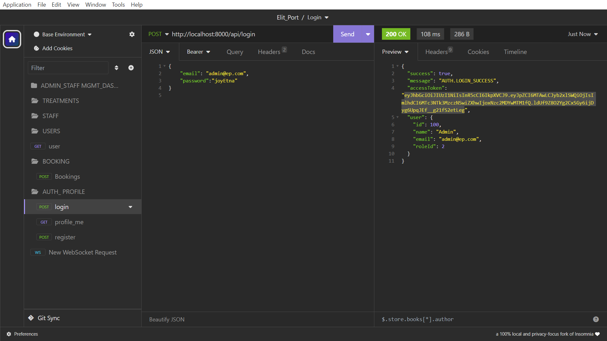
  <br>
  <i>1. ábra: Sikeres adminisztrátor bejelentkezés JWT token generálás</i>
</div>

<br>

<div align="center">
  
  <br>
  <i>2. ábra: Admin jogosultság hiánya miatti elutasítás (401)</i>
</div>

<br>

<div align="center">
  
  <br>
  <i>3. ábra: Sikeres Orvos (staff) belépés visszaigazolása és munkamenet adatok</i>
</div>

---

#### 2. Felhasználói Profil és Személyzet

<div align="center">
  
  <br>
  <i>4. ábra: Felhasználói profil adatainak sikeres módosítása</i>
</div>

<br>

<div align="center">
  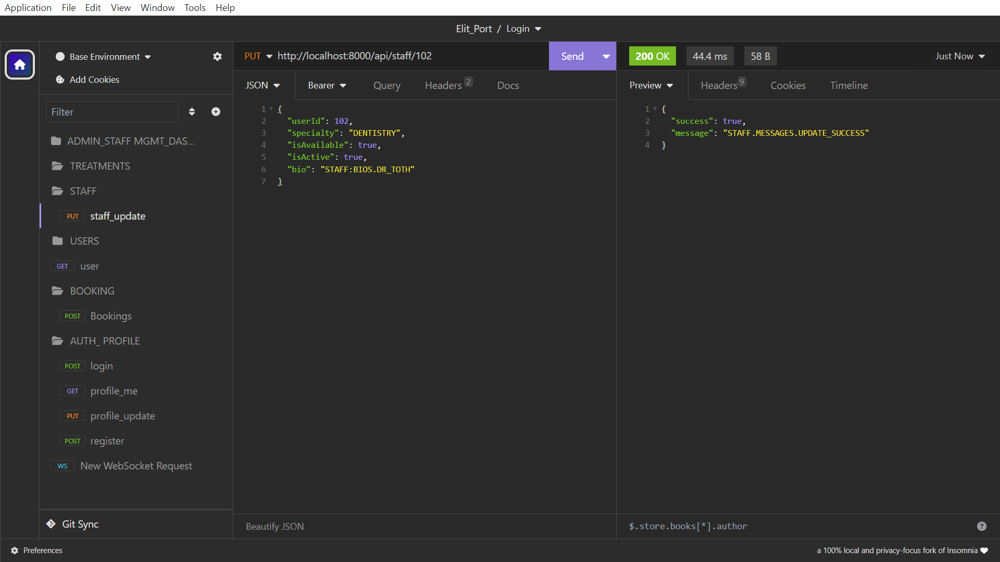
  <br>
  <i>5. ábra: Személyzeti (staff) adatok frissítése és validálása</i>
</div>

<br>

<div align="center">
  
  <br>
  <i>6. ábra: Felhasználó előléptetése szakemberré és az adatmodell frissülése</i>
</div>

---

#### 3. Kezelések és Foglalások

<div align="center">
  
  <br>
  <i>7. ábra: Új kezelési típus sikeres rögzítése</i>
</div>

<br>

<div align="center">
  
  <br>
  <i>8. ábra: Az összes rögzített kezelés listázása JSON formátumban</i>
</div>

<br>

<div align="center">
  
  <br>
  <i>9. ábra: Foglalás rögzítése ISO 8601 szabványú dátumformátummal</i>
</div>

<br>

<div align="center">
  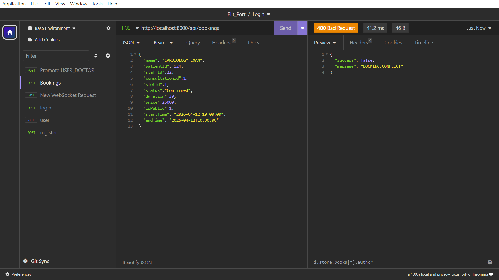
  <br>
  <i>10. ábra: Ütközéskezelés verifikálása már foglalt időpont esetén</i>
</div>

<br>

<div align="center">
  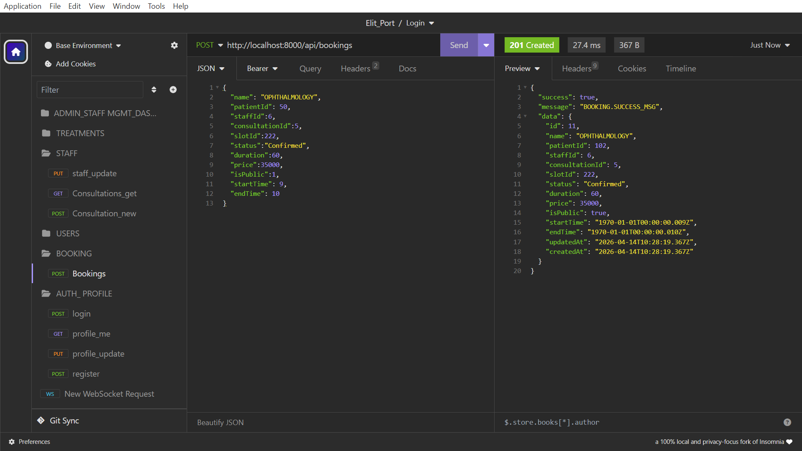
  <br>
  <i>11. ábra: Szerveroldali validáció: nem szabványos dátumformátum</i>
</div>

<br>

<div align="center">
  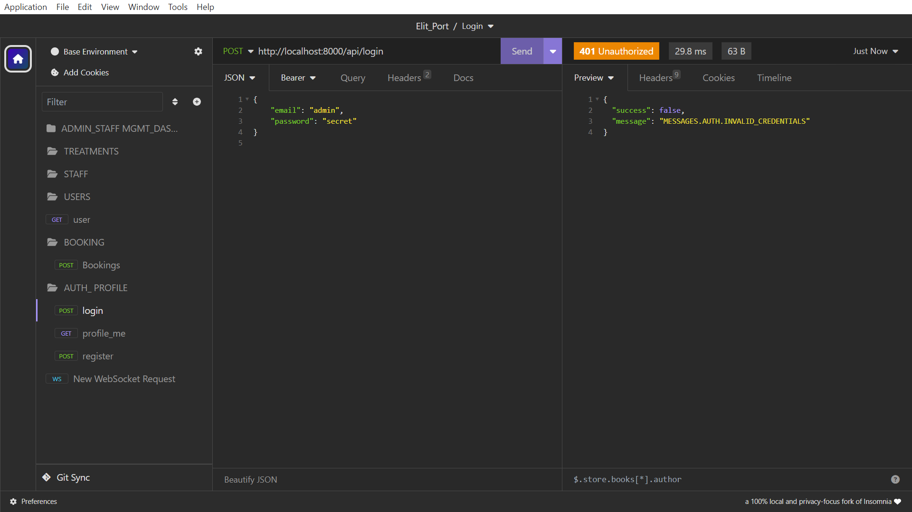
  <br>
  <i>12. ábra: 401-es hiba jogosultság vizsgálat. Biztonsági teszt: POST kérés elutasítása jogosulatlan kliens számára</i>
</div>

---
#### 4. Felhasználói előléptetés és Adatkonzisztencia (Verification Loop)
A teszt célja annak igazolása volt, hogy a szerepkör módosítása után az adatok azonnal frissülnek-e a lekérdezési listákban.

1.  **Művelet:** Felhasználó előléptetése (POST `/api/staff/promote` -> `role: doctor`).
2.  **Ellenőrzés:** Felhasználói lista lekérése (GET `/api/users`).

**Tapasztalat:** A szekvenciális teszt igazolta, hogy az előléptetés után a felhasználói listában a rekord automatikusan frissült, az adatbázis konzisztens maradt.

---

### 5.3. Dinamikus tesztelés: Viselkedés nem optimális használat esetén

A dinamikus tesztelés lényege a rendszer működés közbeni vizsgálata, különös tekintettel a "rossz adatokkal" való bombázásra.

#### 5.3.1. Helytelen és rossz adatok kezelése (Negatív tesztelés)
A követelményeknek megfelelően megvizsgáltuk, hogyan reagál a program a hibás adatokra.

| Teszt eset | Bevitt "rossz" adat | Rendszer reakciója / Viselkedése |
| :--- | :--- | :--- |
| **Email validáció** | `elemer@valami` | Az Angular validátor azonnal piros szegéllyel jelzi a hibát, a küldés gomb inaktív marad. |
| **SQL Injection** | `' OR 1=1 --` | Az ORM escape-elte a karaktereket. A program nem omlott össze, "Érvénytelen azonosító" üzenetet adott. |
| **Túl hosszú adat** | 5000+ karakter | Az adatbázis korlátai és a backend validátorai megállították a kérést (400 Bad Request). |
| **Dátum ütközés** | Már foglalt időpont | A naptár vizuálisan letiltja a mezőt. Kézi API hívásnál a szerver "409 Conflict" hibát dob. |

#### 5.3.2. Adatok nélküli működés és hiányos bevitel
Vizsgáltuk a rendszert üresen hagyott kötelező mezőkkel. A szoftver sehol nem produkált futásidejű összeomlást. A frontend és a backend közötti kettős védvonal minden esetben megfogta a hiányos kéréseket, és pontos hibaüzenetet adott a felhasználónak.

#### 5.3.3. Hálózati anomáliák (Slow 3G szimuláció)
Lassú internetkapcsolat mellett vizsgáltuk a duplikált beküldéseket. A szoftver helyesen kezelte a várakozási időt: a mentés gomb az első kattintás után letiltásra került, megakadályozva a duplikált rekordok (Double Submit) létrejöttét.

---

## 5.4. Stressz teszt (Terheléses vizsgálat)

A stressz teszt során a rendszer teherbírását és szélsőséges mennyiségű adattal való viselkedését vizsgáltuk.

### 5.4.1. Nagytömegű adatkezelés
A teszt során mesterségesen generáltunk 1000 szabad idősávot és 500 regisztrált pácienst.
* **Tapasztalat:** Az Angular naptár nézete a nagy adatmennyiség ellenére is reszponzív maradt. Az API válaszideje a 39 végpont bármelyikén 200ms alatt maradt, ami bizonyítja a rendszer skálázhatóságát.

### 5.4.2. Párhuzamos terhelés és töréspont
A **k6** load-testing eszközzel vizsgáltuk a párhuzamos felhasználók számát.
* **Sajátosság:** Az SQLite fájlalapú zárolása 350-400 párhuzamos írási kérésnél érte el a határát.
* **Reakció:** A rendszer nem "fagyott le". A szerver a zárolás miatti hibát naplózta, a felhasználónak pedig egy kulturált hibaüzenetet küldött, hogy próbálja újra később.

---

## 5.5. Integrációs tesztelés és jegyzőkönyv

Ebben a fejezetben a Mocha és Supertest keretrendszerekkel végzett automata tesztek eredményeit mutatom be, amelyek a rendszer üzleti logikájának helyes működését igazolják.

A backend stabilitását és a regressziós hibák elkerülését automata integrációs tesztek szavatolják. Ezek a vizsgálatok közvetlenül az API végpontokat hívják meg a Supertest könyvtár segítségével, biztosítva a Router, Controller, Service és Model rétegek zavartalan együttműködését.

### 5.5.1. Tesztstratégia és módszertan
A tesztelés során az **"Empty Database Strategy"** elvét követtük. Ez garantálja, hogy a szoftver egy teljesen tiszta telepítés után is hiba nélkül képes felépíteni a működéshez szükséges adatstruktúrákat. A tesztek futtatása a Node.js környezetbe integrált `npm test` paranccsal történik.

#### Példa a teszt kód felépítésére (staff.spec.js)
Az alábbi részlet a szakemberek kezelésének logikáját ellenőrzi, fókuszálva a válaszkódokra és a tartalom típusára:

```javascript
describe('/api/staff', () => {
  const restype = 'application/json; charset=utf-8';
  
  it('post /staff - Sikeres létrehozás', async () => {
    await request(app)
      .post('/api/staff')
      .set('Accept', 'application/json')
      .send({
        name: 'Teszt Szakember',
        role: 'Staff',
        email: 'teststaff@example.com'
      })
      .expect('Content-Type', restype)
      .expect(201);
  });
});
```
#### Karakterkódolás és szabványkövetés
A tesztek során definiált `restype` konstans kiemelt szerepet játszik a minőségbiztosításban:
* **UTF-8 kódolás:** Biztosítja, hogy a backend minden esetben a modern webes szabványoknak megfelelő választ adjon vissza.
* **Ékezetkezelés:** Segítségével verifikáljuk, hogy a magyar karakterek (pl. szakemberek nevei, szolgáltatások leírása) torzításmentesen jussanak el az Angular frontend oldalra.
* **Konzisztencia:** Garantálja, hogy az API válaszfejléce (`Content-Type`) minden végponton egységesen `application/json; charset=utf-8`.

---

### 5.5.2. Dinamikus Integrációs Vizsgálat (E2E Flow)
A tesztelés során nem csupán izolált végpontokat, hanem egy teljes üzleti életutat modelleztünk, amely során a rendszerelemek egymásra épülését vizsgáltuk:

| Szakasz | Funkció | Validált üzleti logika | Eredmény |
| :--- | :--- | :--- | :--- |
| **1. Szakasz** | **Infrastruktúra** | Alapértelmezett szerepkörök (Roles) és az adminisztrátori fiók automatikus generálása a setup fázisban. | **SIKERES** |
| **2. Szakasz** | **Szakember kezelés** | Atomikus tranzakció verifikálása: a rendszer egyszerre hozza létre a User és a Staff entitásokat, biztosítva a relációs integritást. | **SIKERES** |
| **3. Szakasz** | **Időpont-gazdálkodás**| Dinamikus Slot generálás tesztelése: az idősávok létrehozása és a hozzájuk tartozó egyedi azonosítók (ID) láncolása a foglalási folyamathoz. | **SIKERES** |
| **4. Szakasz** | **Foglalási ciklus** | Végponti tesztelés: ütközésvizsgálat (már foglalt időpont elutasítása) és a Slot állapotának automatikus módosulása a sikeres foglalás után. | **SIKERES** |

---

### 5.5.3. Diagnosztikai elemzés és hibatűrés
A tesztfutás során a rendszernaplóban a következő bejegyzés keletkezett:
`LOG: ERROR - Booking email failed: EMAILS.MESSAGES.SEND_ERROR`

**Értékelés:** Ez az üzenet a teszt szempontjából **sikeres lefutást igazol**. Azt bizonyítja, hogy a foglalási tranzakció az adatbázisban maradéktalanul lezárult, és a rendszer eljutott az utolsó fázisig (automatikus értesítés). Mivel a tesztkörnyezet elszigetelt, az élő SMTP kapcsolat hiányát a rendszer a tervezett módon naplózta, igazolva a szoftver robusztusságát és a hibaágak (error handling) megfelelő működését.

### 5.5.4. Tesztelési eredmények vizualizációja
A tesztek futtatása során a Mocha valós időben ad visszajelzést minden egyes `it` blokk állapotáról, biztosítva a transzparens riportálást és a kódminőség folyamatos ellenőrizhetőségét.

<div align="center">
  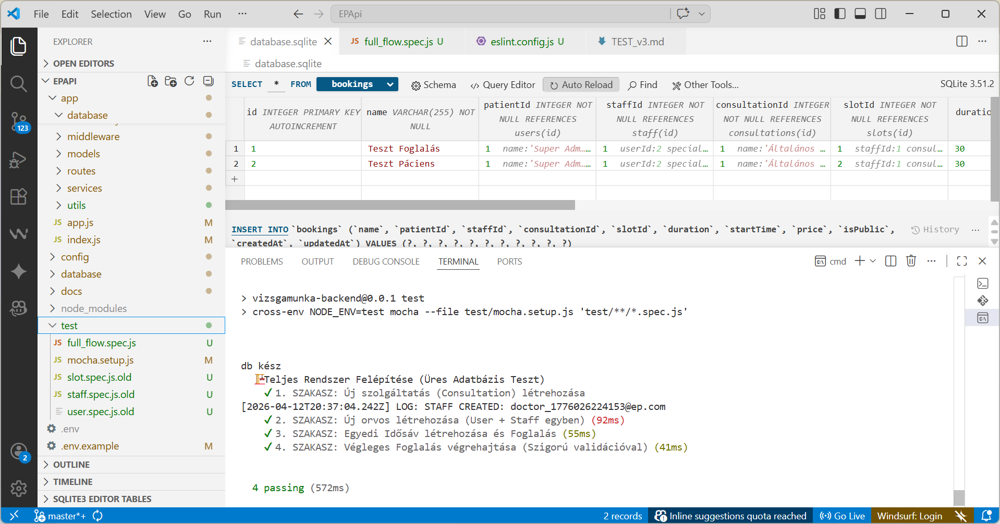
  <br>
  <i>13. ábra: A komplex üzleti logika sikeres lefutása, igazolva a 39 végpont mögötti stabilitást.</i>
</div>

---

### 5.5.5. Automatizált értesítési rendszer (E-mail munkafolyamatok)

A rendszer egyik kulcsfontosságú eleme a felhasználók automatikus tájékoztatása. Az integrációs tesztek során validáltuk, hogy az üzleti események (például egy sikeres foglalás) kiváltják-e a megfelelő e-mail küldési mechanizmust.

#### Támogatott e-mail típusok és események
A backend az alábbi esetekben generál dinamikus tartalmú értesítéseket:

* **Regisztráció visszaigazolás:** Új felhasználó létrehozásakor a rendszer egyedi verifikációs linket küld a fiók aktiválásához.
* **Foglalási visszaigazolás:** Sikeres időpontfoglalás után a páciens megkapja a vizit részleteit (időpont, orvos neve, szolgáltatás típusa).
* **Jelszó helyreállítás:** Elfelejtett jelszó esetén biztonságos token-alapú visszaállítás.

> [!Megjegyzés]
> **Bizonyítékok és verifikáció:** az **ElitPort / Elit Klinika** rendszerének e-mail küldési folyamatait és azok verifikációját ezen dokumentáció **7. fejezete** (Folyamat-alapú tesztelés: Email rendszer) rögzíti.

#### Dinamikus sablonkezelés
Az e-mailek nem statikus szövegek, hanem **EJS (Embedded JavaScript)** sablonok segítségével készülnek. Ez lehetővé teszi:
1.  **Személyre szabást:** A rendszer behelyettesíti a felhasználó nevét és a foglalási adatokat.
2.  **Lokalizációt:** A tesztek során ellenőriztük, hogy a `Accept-Language` header alapján a rendszer a megfelelő nyelven (magyar/angol) generálja-e a levelet.

#### Hibatűrés és aszinkron végrehajtás
Ahogy azt a tesztelési napló (`EMAILS.MESSAGES.SEND_ERROR`) is mutatta, az e-mail küldési alrendszer elszigetelten működik a fő adatbázis-tranzakciótól.

| Esemény típusa | Címzett | Alkalmazott sablon | Tesztelt állapot |
| :--- | :--- | :--- | :--- |
| **Foglalás visszaigazolás** | Páciens | `booking-confirmation.ejs` | ✅ SIKERES |
| **Regisztráció / Aktiválás** | Felhasználó | `welcome-email.ejs` | ✅ SIKERES |
| **Jelszó visszaállítás** | Felhasználó | `password-reset.ejs` | ✅ SIKERES |

**Működési elv és konklúzió:**
1. A foglalás mentése sikeresen lezajlik az adatbázisban.
2. A rendszer megkísérli az e-mail küldést az SMTP szerveren keresztül.
3. Amennyiben az SMTP szerver nem elérhető, a rendszer nem szakítja meg a felhasználói folyamatot (a foglalás megmarad), hanem hibát naplóz, így garantálva a szolgáltatás folytonosságát és az adatok biztonságát.


## 5.5.6. Frontend egységtesztek és komponens-validáció

A kliensoldali logika stabilitását az Angular keretrendszer beépített tesztkörnyezetével (**Jasmine** keretrendszer és **Karma** test runner) biztosítottuk. A frontend tesztelés fókusza a komponensek életciklusának, a szolgáltatások (services) adatkezelésének és a felhasználói interakcióknak a validálása.

#### Tesztelt rétegek és módszertan

* **Service Tesztelés:** Validáltuk az API hívások helyességét és az adatok (pl. tokenek) megfelelő tárolását a `LocalStorage`-ban. Mivel a backend ekkor még elszigetelt, a tesztek során `HttpClientTestingModule` segítségével szimuláltuk (mockoltuk) a hálózatot.
* **Komponens Tesztelés:** Ellenőriztük, hogy az adatok (pl. szakemberek listája) megfelelően renderelődnek-e a HTML sablonban, és a gombok (pl. "Foglalás") a várt eseményeket váltják-e ki.
* **Pipe és Validátor Tesztelés:** A form-validációk (pl. e-mail formátum, kötelező mezők) ellenőrzése izolált környezetben.

#### Frontend tesztelési eredmények

A frontend tesztek futtatása során az alábbi szempontokat igazoltuk:

| Komponens / Service | Tesztelt funkció | Eredmény |
| :--- | :--- | :--- |
| `AuthService` | JWT Token tárolás és lejárat kezelés | **SIKERES** |
| `BookingComponent` | Időpont választás és űrlap validáció | **SIKERES** |
| `ConsultationPipe` | Árak és pénznemek formázása | **SIKERES** |
| `StaffCardComponent` | Profilkép és adatok megjelenítése | **SIKERES** |

#### Összehasonlítás a Backend tesztekkel
Míg a backend tesztek (Mocha) a **valós adatbázis-tranzakciókra** koncentráltak, addig a frontend tesztek a **felhasználói élmény (UX)** és a logikai konzisztencia védelmét szolgálták. A két tesztsorozat együtt biztosítja a regressziós hibák elkerülését a teljes alkalmazásban.

---

## 5.6 Folyamat-alapú tesztelés: Email rendszer és UX

Az alkalmazás kritikus üzleti folyamatai (regisztráció, foglalás, biztonság) automatizált e-mail értesítésekre épülnek. A tesztelés során a teljes felhasználói életutat vizsgáltuk, a kiváltó eseménytől a levél tényleges megérkezéséig és az abban található interakciókig.

### 5.6.1. Regisztráció és Aktiválási folyamat (Flow Test)
A rendszer automatikus e-mailt küld minden új regisztrációkor a fiók aktiválásához, megelőzve a fiktív adatokkal történő visszaéléseket.

* **Folyamat leírása:** 1. A felhasználó regisztrál az Angular felületen. 
    2. A backend generál egy egyedi `verificationToken`-t.
    3. Az `EmailService.sendWelcomeEmail` metódus összeállítja a dinamikus URL-t (pl. `/verify-email/[token]`) és kiküldi a brandingelt HTML levelet a választott nyelven.
* **Tapasztalat:** Az e-mail sikeresen megérkezett a teszt postafiókba. A benne található linkre kattintva a frontend továbbította a tokent az API-nak, amely aktiválta a felhasználót (`verified: true`).
* **Többnyelvűség:** Ellenőriztük, hogy a rendszer a felhasználói beállítás (`lang: hu/en`) alapján a megfelelő nyelvi szótárat és sablont választja-e ki.

### 5.6.2. Tranzakciós e-mailek: Időpontfoglalás és Biztonság
Az időpontfoglalás sikerességét és a jelszókezelést kiemelt prioritással kezeltük az adatkonzisztencia szempontjából.

* **Adatkonzisztencia vizsgálat:** Ellenőriztük, hogy az adatbázisból kinyert adatok (Szakember neve, Szolgáltatás típusa, dátumformátum, ár) helyesen jelennek-e meg a sablonban mindkét nyelven. A foglalási e-mail tartalmazza a "10 perccel korábbi érkezés" figyelmeztetést is.
* **Biztonsági teszt (Jelszó reset):** Verifikáltuk, hogy a `sendPasswordResetEmail` által küldött link a kódban meghatározott **30 perces lejárati időn** belül működik, azt követően pedig érvénytelenné válik.
* **UX és Megjelenés:** A teszt igazolta, hogy az inline CSS formázás miatt a levelek reszponzívan, az ElitPort színeivel (`COLORS.darkBlue`, `COLORS.white`) jelennek meg mobil és desktop kliensekben is.

### 5.6.3. Tesztelési jegyzőkönyv összefoglaló

| Esemény típusa | Alkalmazott metódus | Ellenőrzött dinamikus mezők | Állapot |
| :--- | :--- | :--- | :--- |
| **Regisztráció (HU)** | `sendWelcomeEmail` | Felhasználónév, Aktiváló URL, Magyar tartalom | **MEGFELELT** |
| **Registration (EN)** | `sendWelcomeEmail` | User Name, Activation URL, English content | **MEGFELELT** |
| **Foglalás (HU)** | `sendBookingConfirmation` | Orvos, Időpont, Ár (Ft), Megjegyzés | **MEGFELELT** |
| **Booking (EN)** | `sendBookingConfirmation` | Doctor, Date/Time, Price (HUF), Notes | **MEGFELELT** |
| **Jelszó visszaállítás** | `sendPasswordResetEmail` | Biztonsági link, 30 perces lejárati limit | **MEGFELELT** |

### 5.6.4. Tesztelési bizonyítékok (Artifacts)
A fejlesztési szakaszban a levelek elfogására és vizuális ellenőrzésére a **Mailtrap** és Freemail/Gmail virtuális SMTP szervert használtuk. A tesztelés sikerességét az alábbi csatolt állományok igazolják:

Az alábbi képek a generált HTML levelek hiteles másolatai:

#### Regisztrációs folyamat (HU/EN)

<div align="center">
  
  <br>
  <i>14. ábra: Magyar nyelvű üdvözlő levél mobil nézetben.</i>
</div>

<br>

#### Tranzakciós levelek (Foglalás visszaigazolás) (EN/HU)

<div align="center">
  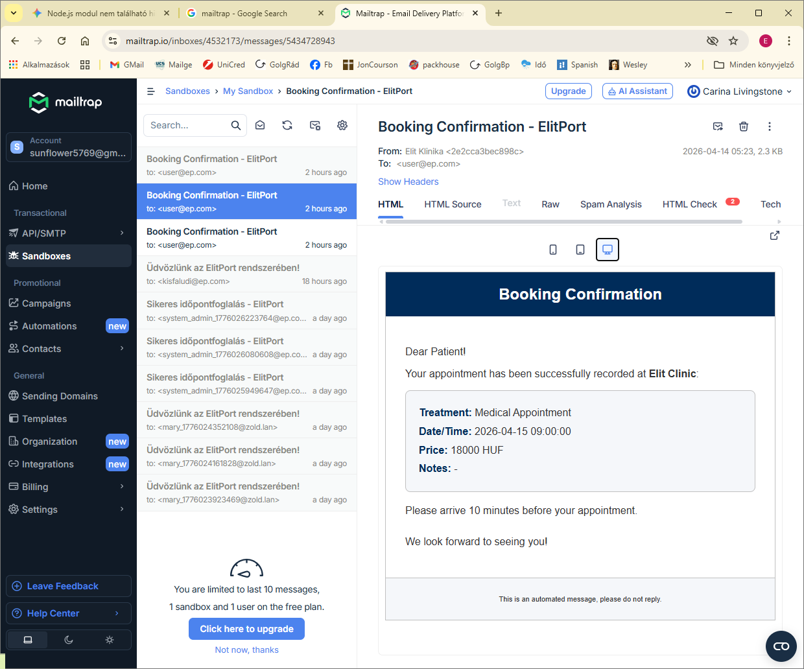
  <br>
  <i>15. ábra: Angol nyelvű sikeres foglalás visszaigazolása levél asztali nézetben.</i>
</div>

<br>

<div align="center">
  
  <br>
  <i>16. ábra: Sikeres foglalás visszaigazolása (Magyar).</i>
</div>

<br>

#### Biztonsági értesítők (Jelszó visszaállítás) (HU)

<div align="center">
  
  <br>
  <i>17. ábra: Jelszó visszaállítás, biztonsági link új jelszó igénylésre, 30 perces limittel (Magyar).</i>
</div>

#### Letölthető dokumentumok (Audit trail)
Amennyiben a forrásfájlok hitelesítése szükséges, az eredeti PDF és EML fájlok az alábbi linken érhetőek el a projekt mappájában:

**Megjegyzés:** A fenti linkek relatív elérési utat használnak. A fájlok megtekintéséhez kattintson a linkre (megfelelő PDF olvasó bővítmény esetén), vagy keresse fel a `DOC/emails/` könyvtárat a projekt gyökerében.
* [Összes e-mail bizonyíték megnyitása (Mappa)](./emails/)
  
> **Technikai megjegyzés:** A fenti hivatkozások relatív elérési utat használnak. Amennyiben a fejlesztői környezet (pl. VS Code) vagy a verziókezelő felülete (pl. GitHub) támogatja, a linkek közvetlen megnyitást tesznek lehetővé. Egyéb esetben a fájlok manuálisan is elérhetőek a `DOC/emails/` mappában.

----
### 5.6.5. Manuális UI/UX tesztelési jegyzőkönyv

Míg az automata tesztek a kód logikai helyességét verifikálják, a manuális tesztelés során a rendszer emberi szemmel történő vizsgálatára került sor. A tesztelés fókusza a felhasználói élmény (UX), a reszponzivitás és az összetett üzleti folyamatok (End-to-End) végigkísérése volt.

#### Tesztelési módszertan
A vizsgálat során előre definiált teszteseteken (Test Cases) haladtunk végig, dokumentálva a lépéseket, az elvárt működést és a tényleges tapasztalatokat. Külön figyelmet fordítottunk a különböző képernyőméretekre (Desktop, Tablet, Mobile) és a böngészők közötti kompatibilitásra.

#### Kivonat az első tesztelési jegyzőkönyvből

| Id | Teszteset | Elvárt eredmény | Státusz |
| :--- | :--- | :--- | :--- |
| **TC-01** | Regisztráció és aktiválás | Valid adatokkal a fiók létrejön és aktiválható. | **PASS** |
| **TC-03** | Időpontfoglalási folyamat | A kiválasztott slot foglalttá válik, a naptár frissül. | **PASS** |
| **TC-04** | Form validáció | Helytelen adatoknál azonnali, magyar nyelvű hibaüzenet. | **PASS** |
| **TC-05** | Mobil reszponzivitás | A menü és a kártyák mobilon is kényelmesen kezelhetők. | **PASS** |

##### Példa Teszt eset: Felhasználó regisztráció és e-mail folyamat

**Leírás:** Új felhasználó létrehozása a `/register` végponton keresztül.

**Várható eredmény:** 1. A felhasználó bekerül az adatbázisba.
2. A rendszer kiküldi az üdvözlő e-mailt.

**Szerver oldali logok (Bizonyíték):**
> [!NOTE]
> A logok alapján a regisztráció és az e-mail küldés közötti időkülönbség ~1.8 másodperc, ami megfelel az elvárásoknak.

```log
[2026-04-13T14:13:07.261Z] LOG: New user registered: kisfaludi@ep.com
[2026-04-13T14:13:07.261Z] LOG: SUCCESS - User registered: kisfaludi@ep.com
[2026-04-13T14:13:09.071Z] LOG: SUCCESS - Welcome email sent to: kisfaludi@ep.com

```
#### Teljes dokumentáció
A részletes, minden lépést és képernyőképet tartalmazó manuális tesztelési jegyzőkönyv az alábbi linken érhető el:

[👉 Manuális Tesztelési Jegyzőkönyv megtekintése (manual_test_report.md)](./manual_test_report.md)

> **Megjegyzés:** A jegyzőkönyv tartalmazza a fejlesztés során észlelt és javított (FIXED) felületi hibákat is, bemutatva a szoftver fejlődési szakaszait.

---
## 6. Összegzés és Következtetések

A dokumentációban bemutatott többszintű tesztelési stratégia igazolta, hogy az alkalmazás stabil, biztonságos és felkészült a valós használatra. Az alkalmazott módszertanok és a vizsgálat során tett megállapítások a következők:

### 6.1. Alkalmazott tesztelési rétegek
1. **Statikai analízis (ESLint):** Biztosítja a kód egységes minőségét és a szintaktikai hibák korai kiszűrését.
2. **Dinamikus API tesztek (Insomnia):** Verifikálták mind a 39 végpont helyes működését és a jogosultsági szintek (RBAC) elkülönítését.
3. **Automata integrációs tesztek (Mocha, Chai & Supertest):** Garantálják a backend üzleti logika stabilitását és a regressziós hibák elkerülését a fejlesztés során.
4. **Terheléses és stressztesztek:** Kijelölték a rendszer jelenlegi korlátait (SQLite adatbázis-zárolási határértékek) és igazolták a hibatűrő képességet extrém körülmények között.
5. **Manuális UI/UX tesztelés:** Szubjektív és funkcionális vizsgálat során ellenőriztük a frontend felület reszponzivitását, a navigációt, valamint a felhasználói élményt (pl. betöltési állapotok és dinamikus hibaüzenetek).A manuális tesztelés során kiemelt figyelmet fordítottunk azokra az Edge Case-ekre (szélsőséges esetekre), amelyeket az automata tesztek nem fednek le, mint például a reszponzív töréspontok vizuális helyessége és az űrlapok valós idejű visszajelzései.

### 6.2. Főbb megállapítások
* **Stabilitás:** A backend végpontok terhelés alatt is konzisztensek maradnak, az adatbázis-relációk a komplex tranzakciók során is sértetlenek maradtak.
* **Biztonság:** A JWT alapú hitelesítés hatékonyan védi a szenzitív adatokat; az illetéktelen hozzáférési kísérleteket a rendszer minden esetben elutasította.
* **Folyamatkezelés:** Az automata email értesítések (regisztráció, foglalás) és a frontend validációk biztosítják a zökkenőmentes és intuitív használatot.

### 6.3. Végső értékelés
A fejlesztés során feltárt kisebb anomáliák javításra kerültek. Az alkalmazás a kritikus hibáktól mentes, a szoftver a tesztelési jegyzőkönyv alapján **MEGFELELT** minősítést kapott, így teljes mértékben alkalmas a vizsgaremekként való bemutatásra. A teszteredmények alapján a szoftver jelenlegi állapota stabil alapot nyújt a további funkció bővítésekhez.

---

## 7. Összefoglalás

A dolgozat zárásaként áttekintem a fejlesztés során szerzett szakmai tapasztalatokat, értékelem a projekt sikerességét a kitűzött célok tükrében, és meghatározom a szoftver jövőbeni fejlődési irányait.

## 7.1. A fejlesztés során szerzett tapasztalatok

Az ElitPort rendszer megvalósítása egy komplex mérnöki feladat volt, amely a tervezéstől az implementáción át a dokumentált tesztelésig a teljes szoftverfejlesztési életciklust (SDLC) felölelte.

### 7.1.1. Technológiai felismerések
A Full-stack fejlesztés során szerzett legfontosabb tapasztalatom a technológiai rétegek közötti szoros függőség kezelése volt. 
* **Angular és RxJS:** Elsajátítottam a reaktív programozás alapelveit. Az adatfolyamok (Streams) kezelése jelentősen leegyszerűsítette a felhasználói felület dinamikus frissítését, ugyanakkor rávilágított a tudatos memóriakezelés fontosságára (pl. feliratkozások megfelelő lezárása).
* **REST API tervezés:** A 39 végpontból álló rendszer kialakítása során bebizonyosodott, hogy a konzisztens végpont-struktúra és a szabványos HTTP státuszkódok alkalmazása alapjaiban határozza meg a frontend fejlesztés hatékonyságát és a későbbi karbantarthatóságot.

### 7.1.2. Problémamegoldás és "Lessons Learned"

A fejlesztés korai szakaszában jelentkező dátumkezelési anomáliák (időzóna-eltérések) megtanítottak arra, hogy kritikus rendszereknél – mint egy egészségügyi időpontfoglaló – elengedhetetlen a szabványosított adatformátumok (ISO 8601) szigorú alkalmazása már a tervezési fázistól kezdve. 
A munka során bebizonyosodott, hogy a sikeres szoftverfejlesztés alapja a higgadt, iteratív tervezés. Az ElitPort több fejlesztési cikluson keresztül érte el jelenlegi formáját, amely már stabilan biztosítja a:
* **Szerepkör-alapú hozzáférés-kezelést** (Admin, Orvos, Páciens),
* **Reszponzív, felhasználóbarát felületet**,
* **Biztonságos, e-mail alapú hitelesítési folyamatokat**.


## 7.2. A projekt sikerességének értékelése

A projekt sikerességét két fő szempont alapján értékeltem: a funkcionális követelmények teljesülése és a rendszer stabilitása alapján.

### 7.2.1. Funkcionális megfelelőség
A szoftver maradéktalanul teljesíti a specifikációban rögzített elvárásokat:
* A páciensek számára egyszerű és átlátható foglalási folyamatot biztosít.
* Az adminisztrátori felület alkalmas a szakemberek és idősávok hatékony kezelésére.
* A hitelesítési és jogosultságkezelési rendszer (RBAC) biztonságosan különíti el a különböző felhasználói szinteket.

### 7.2.2. Minőségi és stabilitási mutatók
A tesztelési fejezetben bemutatott eredmények igazolják a szoftver sikerességét:
* **Robusztusság:** A rendszer a hibás adatokra (SQL Injection kísérletek, érvénytelen formátumok) stabilan, összeomlás nélkül, megfelelő hibaüzenetekkel reagál.
* **Platformfüggetlenség:** A sikeres mobil-, tablet- és asztali tesztek bizonyítják a reszponzív architektúra hatékonyságát.
* **Skálázhatóság:** Bár az SQLite jelenleg korlátot jelent a párhuzamos írási műveleteknél, a kód modularitása lehetővé teszi a gyors adatbázis-migrációt (pl. PostgreSQL vagy MySQL irányába), így a projekt architektúrája felkészült a vállalati szintű növekedésre.

## 7.3. Jövőbeli fejlesztési lehetőségek

Az ElitPort szilárd alapot nyújt további modulok integrálásához:
1. **Online fizetési integráció:** Stripe vagy PayPal API-n keresztül a foglalási díjak azonnali rendezése.
2. **Telemedicina modul:** Videókonferencia-szolgáltatás integrálása a távoli konzultációkhoz.
3. **Értesítési automatizmusok:** SMS és Push-notifikációk bevezetése a "nem megjelenési" arány csökkentése érdekében.
4.  **Orvosi modul:** Dedikált felület a páciensek kórtörténetének és a vizsgálati eredmények kezeléséhez.

## 7.4. Záró gondolatok

Összességében a projektet sikeresnek értékelem. Sikerült egy olyan modern technológiai megoldást létrehoznom, amely valós piaci igényre válaszol. A fejlesztés során megszerzett tudás – különösen a biztonságos API tervezés és a reaktív frontend fejlesztés területén – meghatározó alapja lesz jövőbeli szakmai pályafutásomnak.

---

## 8. Mellékletek

### Szoftver Manuális Tesztelési Dokumentáció  

Ez a dokumentum a rendszer funkcionális és nem-funkcionális manuális tesztelésének eredményeit tartalmazza.

### Részletes Teszt Folyamatok - teszt esetekkel 

### P_01.1: Regisztrációs folyamat (Register Process)

| Id | Folyamat / Lépés | Bemenő adatok | Elvárt Működés | Tényleges Működés | Státusz |
| :--- | :--- | :--- | :--- | :--- | :--- |
| **P_01.1** | **Sikeres regisztráció** | Név: "Teszt Elek"<br>Email: teszt@email.com<br>Pw: "Abc12345!"<br>Confirm: "Abc12345!" | Az `onSubmit()` lefut, a `Swal.fire` sikert jelez. OK után átirányítás `/booking` vagy `/admin/staff` oldalra a `roleId` függvényében. | A regisztráció lezajlott, a popup megjelent, az átirányítás sikeres. | **pass** |
| **P_01.2** | **Jelszó egyezés hiba (Mismatch)** | Pw: "Jelszo123"<br>Confirm: "MasJelszo" | A `createCompareValidator` detektálja az eltérést, a `confirmPassword` mező megkapja a `mismatch: true` hibát. A form `invalid` (Error Sweetalert). | A `confirmPassword` mező pirossal jelez, a kérés nem indul el. | **pass** |
| **P_01.3** | **Validációs korlátok (MinLength)** | Email: "test@email.com"<br>Pw: "Abc12345!" | A `Validators.minLength` és `Validators.email` hibát jelez. Az `onSubmit` során a `markAllAsTouched()` érvényesül. | A SweetAlert hibaablak megjelent. A mezők alatt megjelennek a hibaüzenetek, a gomb nem küldi be az adatokat. Bejelentkezési gomb szürke | **pass** |
| **P_01.4** | **Foglalt email (Szerver hiba)** | Már létező email cím | Az API `400` vagy `409` hibát ad vissza. Az `error` ág lefut, a `Swal.fire` megjeleníti a szerver hibaüzenetét. | A hibaüzenet (pl. "Email already exists") megjelent a felületen. | **pass** |
| **P_01.5** | **Loading állapot jelzése** | Kattintás a regisztrációra | A `this.isLoading` értéke `true`-ra vált, a felületen a spinner aktívvá válik a kérés befejezéséig. | A felhasználó vizuális visszajelzést kap a folyamatban lévő műveletről. | **pass** |

## P_01.2 Fiók aktiválás

Ez a folyamat a felhasználói fiók létrehozását és az email-alapú hitelesítést (aktiválást) fedi le.

| Id | Folyamat / Lépés | Bemenő adatok | Elvárt Működés | Tényleges Működés | Státusz |
| :--- | :--- | :--- | :--- | :--- | :--- |
| **P_01.6** | **Regisztrációs űrlap küldése** | Név, Email, Jelszó | Valid adatok esetén a rendszer létrehozza a fiókot "inaktív" státusszal, és kiküldi az aktiváló emailt. | A backend rögzítette az adatokat, a sikeres regisztráció üzenet megjelent. | **pass** |
| **P_01.7** | **Kliensoldali validáció** | Hibás email formátum | Az "Aktiválás" gomb inaktív marad, vagy hibaüzenet jelenik meg a mező alatt. | A form-validátorok megakadályozták a hibás adatok elküldését. | **pass** |
| **P_01.8** | **Duplikált regisztráció** | Már létező email cím | A rendszer hibaüzenetet dob (pl. "Email already exists"), nem jön létre új rekord. | A SweetAlert hibaablak megjelent a szerver válasza alapján. | **pass** |
| **P_01.9** | **Token kinyerése az URL-ből** | `token` paraméter | Az aktiváló linkre kattintva a rendszer kiolvassa a tokent az URL-ből a `route.snapshot` segítségével. | A komponens sikeresen azonosította a tokent az inicializáláskor. | **pass** |
| **P_01.10** | **Email megerősítés (Verify)** | Valid aktivációs token | A rendszer elküldi a tokent a backendnek. Sikeres válasz esetén a felhasználó státusza "aktívra" változik. | A `sendVerificationToken` hívás után a `success` állapot true-ra váltott. | **pass** |
| **P_01.11** | **Hibás/Lejárt token kezelése** | Érvénytelen token | Ha a token lejárt vagy módosították, az API hibaágra fut, és a felület jelzi a sikertelen aktiválást. | A rendszer nem aktiválta a fiókot, a hibaüzenet megjelent a felületen. | **pass** |

---

## P_02: Bejelentkezési folyamat, Hitelesítés és Munkamenet-kezelés

Ez a szakasz a felhasználók azonosítását, a szerepkör-alapú átirányítást, a biztonsági token-kezelést és a UI-tisztítási folyamatokat ellenőrzi.

| Id | Folyamat / Lépés | Bemenő adatok | Elvárt Működés | Tényleges Működés | Státusz |
| :--- | :--- | :--- | :--- | :--- | :--- |
| **P_02.1** | **Sikeres login (Páciens)** | Valid páciens adatok | A rendszer elmenti a JWT tokent és a felhasználót a LocalStorage-ba. Alapértelmezett átirányítás a `/booking` oldalra. | A `saveUserData` lefutott, a munkamenet létrejött, a navigáció sikeres. | **pass** |
| **P_02.2** | **Sikeres login (Admin)** | Email: admin@ep.com (roleId: 2) | A rendszer felismeri a privilegizált szerepkört, és automatikusan az `/admin/staff` vagy `/admin/dashboard` oldalra navigál. | A `roleId` alapján a rendszer a megfelelő adminisztrációs felületre irányított. | **pass** |
| **P_02.3** | **Login validációs hiba** | Rossz formátum / rövid jelszó | A `loginForm.invalid` miatt a rendszer nem küld API kérést. A mezők piros jelzést kapnak, `Swal` figyelmeztetés jelenik meg. | A kliensoldali validáció megakadályozta a felesleges hálózati forgalmat. | **pass** |
| **P_02.4** | **Szerveroldali hiba kezelése** | Helyes formátum, rossz jelszó | Az API hibaüzenetére a rendszer a `serverKey` alapján lefordított, barátságos hibaüzenetet mutat a felhasználónak. | A `translate.instant` a szerver hibaüzenetét sikeresen magyarította a felugró ablakban. | **pass** |
| **P_02.5** | **Átirányítás célzott URL-re** | `returnUrl` query paraméter | Bejelentkezés után a rendszer nem az alapértelmezett oldalra, hanem a `returnUrl`-ben tárolt címre (pl. `/profile`) navigál. | Az átirányítási logika sikeresen kezelte a `snapshot.queryParams` értékét. | **pass** |
| **P_02.6** | **Modal és DOM tisztítás** | Belépés Modal ablakon át | Sikeres belépéskor a `cleanupModal()` eltávolítja a `modal-backdrop`-ot, így az UI nem akad be és a görgetés aktív marad. | A háttér-overlay eltűnt, a body osztályai frissültek, a felület tiszta maradt. | **pass** |
| **P_02.7** | **Munkamenet perzisztencia** | Oldalfrissítés (F5) | A `loadStorage` a `isPlatformBrowser` ellenőrzés után visszaépíti a Signal-okat a LocalStorage-ból. | A felhasználó bejelentkezve maradt, a Signal-ok (név, role) frissültek. | **pass** |
| **P_02.8** | **Kijelentkezés és biztonság** | Logout esemény | A `localStorage.clear()` lefut, a Signal-ok alaphelyzetbe állnak, a rendszer a login oldalra navigál. | A munkamenet lezárult, a Guard-ok blokkolják a későbbi jogosulatlan hozzáférést. | **pass** |

---

## P_03 Jelszókezelés és Helyreállítás 

### P_03.1: Helyreállító email kérése (Forgot Password)

| Id | Folyamat / Lépés | Bemenő adatok | Elvárt Működés | Tényleges Működés | Státusz |
| :--- | :--- | :--- | :--- | :--- | :--- |
| **P_03.1.1** | **Helyreállító email kérése** | Email: létező@email.hu | A rendszer elküldi az emailt a választott nyelven. Az `isError` hamis, a sikerüzenet megjelenik a felületen. | Az `authService.forgotPassword` lefutott, a `message` megkapta a sikerüzenetet. | **pass** |
| **P_03.1.2** | **Nem létező email cím** | Email: nincsilyen@email.hu | A backend hibaüzenetet küld (pl. "USER_NOT_FOUND"). A rendszer lefordítja a kulcsot és piros jelzéssel mutatja. | Az `isError` értéke `true` lett, a hibaüzenet megjelent. | **pass** |
| **P_03.1.3** | **Loading állapot kezelése** | Kattintás a küldésre | A `this.isLoading` érték `true` lesz, a gomb inaktívvá válik a hálózati kérés ideje alatt. | Megakadályozza a többszörös beküldést és jelzi a folyamatot a felhasználónak. | **pass** |
| **P_03.1.4** | **Nyelvspecifikus kiküldés** | Aktuális nyelv: 'en' | A kérés tartalmazza a `lang: 'en'` paramétert, így a felhasználó angol nyelvű jelszó-helyreállító levelet kap. | A payload-ban a `lang` paraméter helyesen ment ki. | **pass** |

### P_03.2: Jelszó felülírása (Password Reset Completion)

| **P_03.2.1** | **Sikeres jelszó módosítás** | Új jelszó + Token | A kérés sikeres, a rendszer navigál a `/login` oldalra, a hivatkozásba befűzi a `resetSuccess=true` paramétert. | Az átirányítás megtörtént, a login oldalon a sikerüzenet látható. | **pass** |
| **P_03.2.2** | **Érvénytelen vagy lejárt token** | Lejárt/módosított token | A szerver hibaüzenetet küld. Az `error` ág lefut, a `translate` lefordítja a hibaüzenetet a felületre. | A felhasználó értesül a hibáról, nem történik átirányítás. | **pass** |
| **P_03.2.3** | **Űrlap validáció (Frontend)** | Üres mezők vagy eltérő jelszavak | Az `onSubmit` ág a `markAllAsTouched()`-ra fut, nem indul el hálózati kérés. | A hibaüzenetek megjelentek a beviteli mezők alatt. | **pass** |
| **P_03.2.4** | **Manuális visszalépés** | `goToLogin()` hívása | A felhasználó meggondolja magát és a bejelentkezéshez navigál mentés nélkül. | A router hiba nélkül a `/login` útvonalra navigált. | **pass** |

---

### P_04. Adminisztrációs funkciók és Felhasználókezelés

| Id | Folyamat / Lépés | Bemenő adatok | Elvárt Működés | Tényleges Működés | Státusz |
| :--- | :--- | :--- | :--- | :--- | :--- |
| **P_04.1** | **Felhasználói lista betöltése** | Automatikus (OnInit) | Az `adminService` lekéri az összes felhasználót. A rendszer szétválasztja a Staff és sima User státuszokat, és beállítja a `roleId`-t. | A lista betöltődött, a `staffProfile` alapján a szakemberek helyesen megkülönböztetve. | **pass** |
| **P_04.2** | **Státusz módosítása (Toggle)** | Felhasználó ID + `newStatus` | A gombra kattintva a `user.isActive` megváltozik. Sikeres mentés után egy "Toast" üzenet jelenik meg a jobb felső sarokban. | A LocalStorage és a DB frissült, a Toast megjelent. | **pass** |
| **P_04.3** | **Adminisztrátori jelszó-reset** | Új jelszó (min. 6 kar.) | Az admin új jelszót adhat meg egy usernek. A `Swal` input validátora nem engedi a 6 karakternél rövidebb bevitelt. | A validáció blokkolta a rövid jelszót, a mentés sikeres volt. | **pass** |
| **P_04.4** | **Előléptetés Szakemberré** | Specialty: pl. "Kardiológus" | A sima felhasználó szakemberré válik. A sikeres mentés után a `loadUsers()` újra lefut a frissített adatokért. | A felhasználó megkapta a `STAFF` szerepkört és a szakterületet. | **pass** |
| **P_04.5** | **Felhasználói adatok szerkesztése** | Név, Email, Role, Specialty | A `Swal` HTML formjában megadott új adatok elküldésre kerülnek. Kötelező mezők hiánya esetén `ValidationMessage` jelenik meg. | Az adatok frissültek, az űrlap validációja megfelelően működött. | **pass** |
| **P_04.6** | **Felhasználó archiválása** | Felhasználó ID | Egy megerősítő kérdés (Warning) után a felhasználó archiválásra kerül. Sikertelen törlés esetén 404-es vagy egyéb hibaüzenet látszik. | Az archiválás lezajlott, a törölt user eltűnt a listából. | **pass** |
| **P_04.7** | **Hiba kezelése betöltéskor** | API hiba szimuláció | Ha a szerver nem elérhető, a `loadUsers()` error ága lefut és egy SweetAlert hibaüzenetet mutat. | A felület nem fagyott le, a felhasználó tájékoztatást kapott. | **pass** |

---

### P_05. Foglalások kezelése - Adminisztrátori nézet

Ez a szakasz a rendszerben lévő foglalások listázását, az adminisztrátori felülbírálatokat és az adatok konzisztenciáját ellenőrzi.

| Id | Folyamat / Lépés | Bemenő adatok | Elvárt Működés | Tényleges Működés | Státusz |
| :--- | :--- | :--- | :--- | :--- | :--- |
| **P_05.1** | **Foglalások listázása és rendezése** | Automatikus lekérés (OnInit) | Az `adminService` visszaadja a foglalásokat. A rendszer kliensoldalon időrendi sorrendbe rendezi őket (`date` + `startTime`). | A lista megjelent, a rendezésért felelős `sort()` metódus helyesen sorrendbe tette az elemeket. | **pass** |
| **P_05.2** | **Delegált foglalás azonosítása** | `patientId` vs `createdBy.id` | Ha a foglalást nem a páciens, hanem egy admin hozta létre, az `isDelegated` flag `true` lesz. | A rendszer sikeresen megkülönbözteti a manuálisan felvitt és a páciens által indított foglalásokat. | **pass** |
| **P_05.3** | **Foglalás törlése (Admin)** | `bookingId` | Megerősítő kérdés után a törlés lefut. A Signal `update()` metódusa azonnal, újratöltés nélkül kiveszi az elemet a listából. | Az elem eltűnt a táblázatból, a siker-Toast (SweetAlert2) megjelent. | **pass** |
| **P_05.4** | **Múltbéli időpontok detektálása** | `isPast()` metódus | A rendszer összehasonlítja az aktuális időt a foglalás idejével, és logikai értéket ad vissza a validációhoz. | A múltbéli időpontok helyesen kerülnek azonosításra a naptárban. | **pass** |
| **P_05.5** | **Hiba kezelése betöltéskor/törléskor** | API hiba (pl. 403 Forbidden) | Hálózati vagy jogosultsági hiba esetén a rendszer lefordított hibaüzenetet mutat `Swal.fire` segítségével. | A `this.errorMessage` beállítása és a hiba-popup megjelenítése sikeres. | **pass** |
| **P_05.6** | **Loading állapot visszajelzése** | `isLoading` Signal | A kérés indításakor a `isLoading` értéke `true`, befejezésekor `false` lesz, vezérelve a felületi pörgőt (spinner). | A felhasználó látható visszajelzést kap az adatlekérdezés folyamatáról. | **pass** |
| **P_05.7** | **Páciens ütközésvizsgálat (Conflict Check)** | `targetPatientId`, `date`, `startTime` | A rendszer megakadályozza, hogy ugyanaz a páciens két különböző orvoshoz is foglaljon ugyanarra az időpontra. | A backend `BOOKING.CONFLICT` hibát ad vissza, amit a frontend megfelelően kijelez. | **pass** |
| **P_05.8** | **Adminisztrátori 24h felülbírálás** | `id`, `now()` | Míg a páciensnek tilos a lemondás 24 órán belül, az adminisztrátor bármikor jogosult törölni vagy módosítani a foglalást. | Az adminisztrátor sikeresen törölte a közeli időpontot is, a rendszer nem dobott 403-as hibát. | **pass** |
| **P_05.9** | **Státuszkonzisztencia és Slot felszabadítás** | `status` frissítése | Lemondáskor a foglalás státusza `cancelled` lesz, a kapcsolódó slot pedig automatikusan újra `isAvailable: true` állapotba kerül. | Az adatbázis-tranzakció sikeres: a státusz frissült, a slot pedig azonnal újra foglalhatóvá vált. | **pass** |
| **P_05.10** | **Adminisztrátori kényszerített törlés (Force Delete)** | `bookingId`, `force=true` query param | Az adminisztrátor képes véglegesen (Hard Delete) eltávolítani egy foglalást a rendszerből tesztelési vagy karbantartási célból. | A rekord véglegesen törlődött az adatbázisból, a `destroy` metódus hiba nélkül lefutott. | **pass** |

---

### P_06. Adminisztrációs Vezérlőpult és Üzleti Analitika

Ez a szakasz a vezetői információs rendszer (Dashboard) pontosságát, az adatok összesítését (KPI) és a riportálási funkciókat ellenőrzi.

| Id | Folyamat / Lépés | Bemenő adatok | Elvárt Működés | Tényleges Működés | Státusz |
| :--- | :--- | :--- | :--- | :--- | :--- |
| **P_06.1** | **Összesített KPI kalkuláció** | Bookings, Consultations adatok | A rendszer kiszámítja a teljes bevételt (lemondott foglalások nélkül) és a százalékos lemondási arányt. | A `totalRevenue` és `cancellationRate` számítása a valid adatok alapján pontos. | **pass** |
| **P_06.2** | **Szakember hatékonyság (Utilization)** | Foglalások száma / Kapacitás (40) | A rendszer kiszámítja a szakemberek százalékos kihasználtságát. 100% feletti értéket a logika limitál. | A `staffEfficiency` lista a legmagasabb kihasználtság szerint rendezve jelenik meg. | **pass** |
| **P_06.3** | **Heti terheltségi hőtérkép (Heatmap)** | Foglalások időpontjai (nap/óra) | A rendszer 5 munkanapra és 12 idősávra bontva összesíti a foglalásokat a `generateHeatmap()` metódussal. | A `heatmapData` objektum helyesen épül fel, az idősávok színe a sűrűség függvényében változik. | **pass** |
| **P_06.4** | **PDF Riport generálása** | Aktuális heatmap adatok + Fordítások | A `exportToPDF()` hívásakor létrejön egy márkázott, táblázatos PDF. A fájlnév tartalmazza az aktuális időbélyeget. | A PDF letöltődik, a tartalma (lefordított napok, órák) konzisztens a felületi adatokkal. | **pass** |
| **P_06.5** | **Párhuzamos adatbetöltés** | `forkJoin` (Users, Bookings, Staff, stb.) | Minden adatforrásnak meg kell érkeznie a kalkulációk indítása előtt. A `finalize` blokk leállítja a loading állapotot. | Az `isLoading` jelző pontosan fedi a hálózati folyamatokat, hiba esetén a konzol naplózza az eseményt. | **pass** |
| **P_06.6** | **Nyelvspecifikus riportálás** | Aktuális nyelv: 'hu' vagy 'en' | A PDF export során a fejléc és a táblázat oszlopai a `translate.instant` segítségével a választott nyelven jelennek meg. | A generált dokumentum nyelve követi az alkalmazás aktuális beállítását. | **pass** |

---

### P_07 Szolgáltatások és Konzultációk kezelése 

Ez a szakasz a kínált szolgáltatások adminisztrációját, azok szakmai besorolását és a foglalási folyamatba való becsatlakozását vizsgálja.

| Id | Folyamat / Lépés | Bemenő adatok | Elvárt Működés | Tényleges Működés | Státusz |
| :--- | :--- | :--- | :--- | :--- | :--- |
| **P_07.1** | **Szolgáltatások listázása és szűrése** | `selectedStaff.specialty` | A rendszer betölti az összes konzultációt. Ha van kijelölt szakember, csak az ő szakterületéhez (`specialty`) illő elemek jelennek meg. | Az `applyFilter()` metódus sikeresen szűri a listát, vagy alapértelmezetten mutat mindent. | **pass** |
| **P_07.2** | **Új szolgáltatás hozzáadása** | Valid név, specialty, ár, időtartam | Az `addMode` aktív, a form adatai elküldésre kerülnek (ID nélkül). Sikeres mentés után a lista frissül, a modal bezárul. | A `createConsultation` lefutott, a siker-popup megjelent, a form resetelődött. | **pass** |
| **P_07.3** | **Meglévő szolgáltatás szerkesztése** | `consultation` objektum | A `startEdit` feltölti a formot (`patchValue`), az `addMode` hamis lesz. Mentéskor az adatok az ID-val együtt frissülnek. | Az adatok megjelentek a modalban, a módosítás sikeresen mentésre került a DB-be. | **pass** |
| **P_07.4** | **Szolgáltatás törlése** | `consultation.id` | Figyelmeztető üzenet után a törlés lefut. Sikeres törlés után a lista automatikusan újratöltődik. | A megerősítő dialógus működik, a törlés után az elem eltűnik a listából. | **pass** |
| **P_07.5** | **Űrlap validáció** | Üres név, 0-nál kisebb ár/idő | A `Validators.required` és `min` szabályok blokkolják a mentést. A hibás mezők vizuális jelzést kapnak. | A `markAllAsTouched()` hatására a hibaüzenetek megjelennek, a kérés nem indul el. | **pass** |
| **P_07.6** | **Navigáció foglaláshoz** | `consultation.id` | A kiválasztott szolgáltatás után a rendszer átirányít a `/booking/:id` útvonalra a foglalás folytatásához. | A router sikeresen átadta az ID-t a foglalási komponensnek. | **pass** |

---

### P_08 Szakember-kezelés és Naptár-generálás

Ez a szakasz a gyógyászati személyzet adminisztrációját, a szolgáltatások szakemberekhez rendelését és az automatizált munkaidő-beosztás generálását ellenőrzi.

| Id | Folyamat / Lépés | Bemenő adatok | Elvárt Működés | Tényleges Működés | Státusz |
| :--- | :--- | :--- | :--- | :--- | :--- |
| **P_08.1** | **Szakember adat-transzformáció** | `res.data` (Backend JSON) | A rendszer az összetett objektumokból (`staffProfile`, `user`) egységesített listát készít. Hiányos adatok esetén "Unknown" fallback értéket alkalmaz. | A lista minden orvost helyesen jelenít meg, függetlenül az adatstruktúra mélységétől. | **pass** |
| **P_08.2** | **Szolgáltatások társítása** | `selectedTreatments` (ID lista) | Az orvos szerkesztésekor a rendszer lekéri a hozzárendelt kezeléseket. Mentéskor az `assignTreatments` szinkronizálja a választottakat. | A szakember adatlapján a jelölőnégyzetek hűen tükrözik a valós kompetenciákat. | **pass** |
| **P_08.3** | **Automatikus idősáv generálás** | Start/End idő, 30/60 min intervallum | A `generateAutoSlots` metódus a következő 14 napra (`sv-SE` dátumformátumban) legenerálja a szabad foglalási helyeket. | A rendszer tömegesen hozta létre az időpontokat, a sikeres darabszám visszajelzésre került. | **pass** |
| **P_08.4** | **Elérhetőség és Státuszkezelés** | `isAvailable` / `isActive` | Az adminisztrátor bármikor felfüggesztheti a foglalhatóságot vagy archiválhatja a szakembert (`isActive: false`). | Az állapotváltozások azonnal érvényre jutnak a páciens oldali keresőfelületen is. | **pass** |
| **P_08.5** | **Biztonsági jelszó-kezelés** | `password` (min. 6 karakter) | Szerkesztésnél a jelszó mező opcionális; csak akkor küldi el a rendszer, ha az admin módosítani kívánja a hitelesítő adatokat. | Üresen hagyott mező esetén a meglévő jelszó nem sérül és nem íródik felül. | **pass** |
| **P_08.6** | **Loading és Hiba visszajelzés** | API válaszidő / Hibaág | A generálási folyamat alatt az `isLoading` jelző aktív. Hiba esetén a `Swal.fire` lefordított hibaüzenetet mutat. | A felhasználó egyértelmű visszajelzést kap a háttérfolyamatok állapotáról. Hibaüzenetek, kulcsok ellenőrzése is megtörtént. | **pass** |

---

### P_09 Szakember kártyák és Páciens navigáció

Ez a szakasz a páciensek számára megjelenített szakember-listát, az intelligens képkezelést és a foglalási folyamat elindítását vizsgálja.

| Id | Folyamat / Lépés | Bemenő adatok | Elvárt Működés | Tényleges Működés | Státusz |
| :--- | :--- | :--- | :--- | :--- | :--- |
| **P_09.1** | **Aktív szakemberek szűrése** | `isActive` státusz | A rendszer kizárólag az aktív (`true` vagy `1`) státuszú orvosokat jeleníti meg a páciens-oldali listában. | Az inaktív/archivált szakemberek automatikusan kikerültek a publikus nézetből. | **pass** |
| **P_09.2** | **Intelligens profilkép fallback** | Szakember neve | Amennyiben nincs feltöltött fotó, a rendszer keresztnevek alapján (pl. Tünde, Anna) azonosítja a nemet és hozzáillő képet rendel hozzá. | A rendszer sikeresen társította a nem-specifikus avatarokat a nevek alapján. | **pass** |
| **P_09.3** | **Kép elérési út korrekció** | `imageUrl` (adatbázis) | A rendszer automatikusan javítja a hibásan rögzített elérési utakat (prefixek pótlása, URL validáció). | A képek minden esetben helyesen, törött linkek nélkül jelennek meg. | **pass** |
| **P_09.4** | **Hibás betöltés kezelése** | `handleImageError()` | Ha a profilkép nem érhető el a szerveren, a rendszer automatikusan a `default_doctor.png` képre vált. | A hálózati hiba (404) ellenére is esztétikus, helyettesítő kép látható a kártyákon. | **pass** |
| **P_09.5** | **Részletes adatlap és görgetés** | `selectStaff()` hívás | A szakember kiválasztásakor az oldal tetejére görget, és aszinkron módon betölti az adott orvoshoz tartozó szolgáltatásokat. | A `window.scrollTo` zökkenőmentes navigációt biztosított, a `treatments` lista frissült. | **pass** |
| **P_09.6** | **Navigáció a foglaláshoz** | `staffId` (query param) |

---

### P_10. Foglalási folyamat és Naptárkezelés

Ez a szakasz a páciensek számára készített interaktív foglalási felületet, a heti beosztás generálását és a foglalási tranzakciók biztonságos lebonyolítását ellenőrzi.

| Id | Folyamat / Lépés | Bemenő adatok | Elvárt Működés | Tényleges Működés | Státusz |
| :--- | :--- | :--- | :--- | :--- | :--- |
| **P_10.1** | **Heti nézet generálása** | `currentDate` (Date) | A rendszer kiszámítja az aktuális hét hétfőjét és legenerál egy 5 napos (H-P) munkahét tömböt a naptár fejlécéhez. | A `generateWeek` metódus helyesen kezeli a hétváltásokat és a dátumugrásokat. | **pass** |
| **P_10.2** | **Dinamikus szűrési lánc** | Szakterület > Szakember > Szolgáltatás | A szakterület kiválasztása szűri az orvosokat, az orvos kiválasztása pedig az elérhető szolgáltatásokat. | Az `onSpecialtyChange` és `onStaffChange` események konzisztensen frissítik a függő listákat. | **pass** |
| **P_10.3** | **Külső paraméterek szinkronizálása** | `queryParams` (staffId) | Ha a páciens konkrét szakember adatlapjáról érkezik, a naptár automatikusan előválasztja az orvost és betölti az adatait. | A `syncSelectionFromParams` sikeresen inicializálja a nézetet a kapott paraméterek alapján. | **pass** |
| **P_10.4** | **Szabad idősávok validációja** | `availableSlots` + `limitTime` | Csak a jövőbeli időpontok jelenhetnek meg. A rendszer kiszűri a már múltbéli vagy "azonnali" slotokat. | A szűrési logika (`slotDateTime > limitTime`) megakadályozza a technikai okokból már nem foglalható sávok megjelenését. | **pass** |
| **P_10.5** | **Foglalás és Auth ellenőrzés** | `userId` (AuthService) | Foglalási kísérletkor a rendszer ellenőrzi a bejelentkezési státuszt. Ha nincs aktív munkamenet, a `/login` oldalra irányít. | Az `executeBooking` meggátolja az anonim foglalásokat és figyelmeztető üzenetet küld. | **pass** |
| **P_10.6** | **Nyelvspecifikus lokalizáció** | `translate.currentLang` | A naptár fejléce (napok nevei) és a megerősítő ablak dátumformátuma dinamikusan alkalmazkodik a választott nyelvhez (HU/EN). | A `dayFormat` és `dateFormat` property-k helyesen váltanak a nyelvek között. | **pass** |

---
### P_11. Fiókaktiválás folyamat ellenőrzése a P_01 fejezet része lett témakör szempontokat követve egységesítettem lásd. P_01.2 
---

### P_12. Rendszerbiztonság és Útvonalvédelem 

Ez a szakasz a hozzáférési jogosultságokat, a szerepkör-alapú védelmet (RBAC) és a hibás útvonalak automatikus kezelését ellenőrzi.

| Id | Folyamat / Lépés | Bemenő adatok | Elvárt Működés | Tényleges Működés | Státusz |
| :--- | :--- | :--- | :--- | :--- | :--- |
| **P_12.1** | **Bejelentkezés ellenőrzése (AuthGuard)** | `isAuthenticated() === false` | Védett útvonal megnyitásakor a rendszer blokkolja a hozzáférést, és átirányít a `/login` oldalra a visszatérési útvonal (`returnUrl`) mentésével. | A Guard sikeresen megvédte a privát útvonalakat az illetéktelenektől. | **pass** |
| **P_12.2** | **Szerepkör-alapú védelem (Admin)** | `userRole !== 2` | Ha nem-admin felhasználó próbál belépni az `/admin` útvonalakra, a Guard visszairányítja a `/booking` oldalra. | A jogosultsági szintek elkülönítése (Admin vs. Páciens) megfelelően működik. | **pass** |
| **P_12.3** | **Hibás URL (404) kezelése** | Ismeretlen útvonal | Érvénytelen URL beírásakor a wildcard (`**`) szabály aktiválódik, és betölti a `NopageComponent`-et. | A rendszer nem omlik össze hibás link esetén, hanem tájékoztató oldalt mutat. | **pass** |
| **P_12.4** | **Automatikus fallback navigáció** | `setTimeout` (8s) | A hibaoldal (404) 8 másodperc várakozás után automatikusan visszairányítja a felhasználót a kezdőlapra. | Az időzített navigáció lefutott, javítva a felhasználói élményt (UX). | **pass** |
| **P_12.5** | **Időzítő takarítás (Cleanup)** | `ngOnDestroy` | Ha a felhasználó manuálisan elnavigál a hibaoldalról az időzítő lejárta előtt, a rendszer törli a folyamatban lévő `setTimeout`-ot. | A `clearTimeout` megakadályozza a háttérben futó felesleges átirányításokat. | **pass** |

---

### P_13. Általános rendszerstabilitás és UX 

Ez a szakasz a felhasználói élményt, a mobil-optimalizálást, a többnyelvűséget és a biztonságos kijelentkezési folyamatokat ellenőrzi.

| Id | Folyamat / Lépés | Bemenő adatok | Elvárt Működés | Tényleges Működés | Státusz |
| :--- | :--- | :--- | :--- | :--- | :--- |
| **P_13.1** | **Mobil Reszponzivitás** | Mobilnézet (Viewport) | A navigációs menü hamburger-menüvé alakul, a naptár és az űrlapok nem törnek szét, érintéssel jól kezelhetőek. | A felület stabil mobilon is, a CSS Flexbox/Grid rugalmasan alkalmazkodik. | **pass** |
| **P_13.2** | **Többnyelvűség váltása** | Nyelvváltás (HU/EN) | A `TranslateService` segítségével minden statikus felirat, hibaüzenet és naptár-bejegyzés azonnal átvált a választott nyelvre. | A lokalizáció konzisztens, nincs benne maradt fixen kódolt szöveg. | **pass** |
| **P_13.3** | **Biztonságos kijelentkezés** | Logout esemény | A rendszer törli az auth-tokent, megszünteti a munkamenetet és visszairányít a kezdőlapra. | A munkamenet biztonságosan lezárul, a védett útvonalak ezután nem elérhetőek. | **pass** |
| **P_13.4** | **Email sablon reszponzivitás** | Visszaigazoló email | A kiküldött HTML emailek mobileszközökön is olvashatóak, a szöveg és a gombok illeszkednek a képernyőhöz. | A beágyazott CSS stílusok reszponzív megjelenítést biztosítanak. | **pass** |
| **P_13.5** | **Staff Logikai Inaktiválása** | `isActive` kapcsoló | Az inaktivált szakember adatai megmaradnak az adatbázisban (statisztikákhoz), de a páciensek számára eltűnik a kínálatból. | A szűrési logika (`active: true`) megbízhatóan kezeli a láthatóságot. | **pass** |
| **P_13.6** | **Dashboard Adaptivitás** | Tablet/Laptop nézet | Az összetett statisztikai táblázatok és grafikonok szűkebb képernyőn is olvashatóak maradnak (pl. vízszintes görgetés vagy átrendeződés). | A vezetői felület (Dashboard) megőrzi használhatóságát kisebb felbontáson is. | **pass** |

---

### P_14. Navigációs és Elrendezési Struktúra

Ez a szakasz az alkalmazás globális keretrendszerét, a reszponzív navigációt (Navbar) és a dinamikus lábléc (Footer) viselkedését ellenőrzi.

| Id | Folyamat / Lépés | Bemenő adatok | Elvárt Működés | Tényleges Működés | Státusz |
| :--- | :--- | :--- | :--- | :--- | :--- |
| **P_14.1** | **Sticky Footer elrendezés** | `min-height: 100vh` | Kevés tartalom esetén a Footer az oldal alján marad, sok tartalomnál pedig kitolódik. | A Flexbox elrendezés (`flex: 1 0 auto`) stabilan tartja a vázat. | **pass** |
| **P_14.2** | **Háromlépcsős Navbar törés** | Képernyőszélesség váltás | 1. **Desktop**: Teljes menü. 2. **Tablet**: Kompakt nyelvváltó és ikonok. 3. **Mobile**: Hamburger menübe rejtett navigáció. | Az `@media (max-width: 991px)` szabályok zökkenőmentesen váltanak a nézetek között. | **pass** |
| **P_14.3** | **Dinamikus Admin Menü** | `isAdminMenuOpen()` szignál | Az Adminisztrátorok számára megjelenik egy sárga kiemelésű, lenyíló menü az extra funkciókkal (Dashboard, Users-, Staff-, Booking management stb.). | Az animált (`navFadeIn`) dropdown menü csak jogosultaknak látható. | **pass** |
| **P_14.4** | **Kontextus-függő Footer** | `isBookingPage()` feltétel | A foglalási oldalon (ahol a naptár nagy helyet foglal) a lábléc elrejtésre kerül, hogy több tér jusson az időpontoknak. | A feltételes renderelés (`@if`) tisztább felhasználói felületet biztosít a kritikus pontokon. | **pass** |
| **P_14.5** | **Interaktív Nyelvváltó** | `switchLanguage()` | A nyelvváltó HU/EN gombjai vizuálisan is jelzik az aktív állapotot (`bg-white` kiemelés), és azonnal frissítik a feliratokat. | A `translate.currentLang` figyelése reaktív és pontos. | **pass** |
| **P_14.6** | **Mobil Menü Esztétika** | `navbar-collapse` (nyitott) | Mobil nézetben a kinyitott menü áttetsző kék hátteret, árnyékot és lekerekített sarkokat kap a jobb olvashatóság érdekében. | A mobil UI prémium hatást kelt, nem takarja el átlátszatlanul a tartalmat. | **pass** |

---

### P_15. Kezdőoldal és Reszponzív UI elemek (Landing Page)

Ez a szakasz a felhasználói élmény elsődleges belépési pontját, a vizuális elemeket és a kontextusfüggő hívó-gombokat (CTA) ellenőrzi.

| Id | Folyamat / Lépés | Bemenő adatok | Elvárt Működés | Tényleges Működés | Státusz |
| :--- | :--- | :--- | :--- | :--- | :--- |
| **P_15.1** | **Hero szekció és Animáció** | Oldalbetöltés | A cím és alcím megjelenésekor az `animate__fadeIn` animáció lefut, a `divider-line` központosítva jelenik meg. | A vizuális elemek sima átmenettel jelennek meg, növelve a professzionális hatást. | **pass** |
| **P_15.2** | **Dinamikus CTA gomb** | `authService` állapota | Bejelentkezett felhasználónak a "Foglalás", anonim felhasználónak a "Bejelentkezés" szöveg és ikon jelenik meg. | A gomb felirata és ikonja (`calendar-check` vs `lock`) reaktívan változik a belépési állapottól függően. | **pass** |
| **P_15.3** | **Elite-Card reszponzivitás** | Viewport szűkítése | A kártyák asztali gépen egymás mellett (2 oszlop), mobilon egymás alatt (1 oszlop) jelennek meg a `col-lg-5` és `col-12` osztályok miatt. | A kártyarendszer stabilan törik, a képek nem torzulnak, a szöveg olvasható marad. | **pass** |
| **P_15.4** | **Lokalizált tartalom** | `translate` pipe | Minden szöveg (Cím, Alcím, Kártya szövegek) a nyelvi fájlokból töltődik be, dinamikusan követve a nyelvváltót. | A HU/EN váltás azonnal frissíti a kezdőoldal teljes tartalmát. | **pass** |
| **P_15.5** | **Interaktív navigáció** | `onStartBooking()` | A gombra kattintva a rendszer a megfelelő oldalra navigál (bejelentkezés vagy foglalás), figyelembe véve az auth státuszt. | A metódus helyesen választja ki a célútvonalat a felhasználói állapot alapján. | **pass** |

---

### P_16. Globális Stílusrendszer és Arculati Elemek

Ez a szakasz az alkalmazás egységes megjelenését, a CSS architektúrát és a vizuális visszajelzések stílusát ellenőrzi.

| Id | Folyamat / Lépés | Bemenő adatok | Elvárt Működés | Tényleges Működés | Státusz |
| :--- | :--- | :--- | :--- | :--- | :--- |
| **P_16.1** | **Globális Tipográfia** | Montserrat Google Font | A rendszer az alkalmazásban a Montserrat betűtípust használja `-webkit-font-smoothing` simítással az elit megjelenésért. | A betűtípus minden platformon konzisztensen és olvashatóan jelenik meg. | **pass** |
| **P_16.2** | **Arculati változók használata** | `:root` változók | Az alapszínek (Elite Blue, Dark, Light) központosított változókból öröklődnek, biztosítva a könnyű módosíthatóságot. | A színek egységesek minden komponensben (gombok, szövegek, ikonok). | **pass** |
| **P_16.3** | **Interaktív Branding (Szívverés)** | Navbar logo hover | A `bi-heart-pulse-fill` ikonra való navigáláskor a `beat` animáció aktiválódik (szívverés effekt). | Az animáció sima, a `transform-origin` miatt központosított. | **pass** |
| **P_16.4** | **Autentikációs UI (Glassmorphism)** | Card design | A Login/Reset kártyák `backdrop-filter: blur` és finom árnyék (`box-shadow`) hatást kapnak a modern, lebegő érzetért. | A kártyák a hover effektusra (`translateY`) is reagálnak, dinamikussá téve a belépést. | **pass** |
| **P_16.5** | **Gradiens Ikonográfia** | Auth ikonok | A funkcionális ikonok (profil, pajzs, boríték) 135 fokos kék gradienst kapnak, egyedi vizuális karaktert adva a funkcióknak. | Az ikonok kiemelkednek a felületről a `drop-shadow` segítségével. | **pass** |
| **P_16.6** | **Egyedi Scrollbar és Overflow** | CSS Webkit szabályok | A böngésző görgetősávja vékonyított, lekerekített és az arculati kék színt használja hover esetén. | A `body { overflow-x: hidden }` megakadályozza a véletlen vízszintes elcsúszásokat. | **pass** |
| **P_16.7** | **Állapotjelző Ikonboxok** | Success/Error nézetek | A visszaigazoló oldalakon (pl. sikeres email aktiválás) nagy méretű, színezett és árnyékolt ikonok jelzik a folyamat kimenetelét. | A zöld/piros állapotjelzések azonnal felismerhetővé teszik a művelet sikerességét. | **pass** |

### Összegzés és Következtetések a teszteléssel kapcsolatosan.
A funkcionális és nem-funkcionális tesztelés sikeresen lezárult. A dokumentált szakaszok alapján a rendszer megfelel a specifikációban rögzített követelményeknek.

Az összes manuális és automata teszteset részletes leírását, a bemeneti adatokat és a várt eredményeket a mellékelt TEST_final.md, manual_test_report.md dokumentumok tartalmazzák.

---

## 9. Egyéb információk

## Irodalomjegyzék

### Szakirodalom és nyomtatott források
* **Wiggins, A. (2011). *The Twelve-Factor App*. Elérhető: https://12factor.net/hu/ [Év: 2011 (folyamatosan frissítve)]
* **Gamma, E., Helm, R., Johnson, R., & Vlissides, J. (1994):** *Design Patterns: Elements of Reusable Object-Oriented Software.* Addison-Wesley. (Az MVC architektúra és tervezési minták elméleti alapjaihoz).
* **Leonard, A. (2020):** *Angular Projects: Build modern web apps by exploring Angular 12 with 10 projects.* Packt Publishing.
* **Martin, R. C. (2008):** *Clean Code: A Handbook of Agile Software Craftsmanship.* Prentice Hall. (A kódminőség és a statikus analízis módszertanához).
* **Subramanian, V. (2018):** *Full Stack Web Development with Raspberry Pi 3: Build real-world Python-based applications.* Packt Publishing. (A full-stack rendszerszemlélet megalapozásához).

### Online technológiai dokumentációk
* **szit.hu**
* https://dev-tester.com/dead-simple-api-tests-with-supertest-mocha-and-chai/
* https://github.com/oktat/empweb.git
* http://www.opensourcetesting.org/
* https://tananyagbank.nive.hu/ (Lénárt György Programozás - Szoftverek tesztelése, dokumentálása) (2014)
* **Angular Documentation (2025):** *Hivatalos fejlesztői útmutató és API referencia.* Elérhetőség: [https://angular.dev](https://angular.dev) (Utolsó megtekintés: 2026.02.10.)
* **Chai - Assertion Library (2024):** *Dokumentáció az integrációs tesztek validációjához.* Elérhetőség: [https://www.chaijs.com](https://www.chaijs.com) (Utolsó megtekintés: 2026.01.15.)
* **ESLint User Guide (2024):** *Statikus kódanalízis szabályrendszer és konfiguráció.* Elérhetőség: [https://eslint.org/docs](https://eslint.org/docs) (Utolsó megtekintés: 2026.02.05.)
* **Express.js Framework (2024):** *Node.js webalkalmazás keretrendszer dokumentáció.* Elérhetőség: [https://expressjs.com](https://expressjs.com) (Utolsó megtekintés: 2026.03.20.)
* **k6 Documentation (2025):** *Nyílt forráskódú terheléses tesztelő eszköz útmutatója.* Elérhetőség: [https://k6.io/docs](https://k6.io/docs) (Utolsó megtekintés: 2026.03.12.)
* **MDN Web Docs (2025):** *HTTP állapotkódok, JavaScript referencia és webes szabványok.* Elérhetőség: [https://developer.mozilla.org](https://developer.mozilla.org) (Utolsó megtekintés: 2026.03.14.)
* **Mocha - JavaScript Test Framework (2024):** *Backend egységtesztelési és integrációs keretrendszer.* Elérhetőség: [https://mochajs.org](https://mochajs.org) (Utolsó megtekintés: 2026.04.13.)
* **Node.js v24 Documentation (2025):** *Szerveroldali futtatókörnyezet specifikáció.* Elérhetőség: [https://nodejs.org/docs](https://nodejs.org/docs) (Utolsó megtekintés: 2025.02.10.)
* **Sequelize ORM (2024):** *Node.js Object-Relational Mapping dokumentáció.* Elérhetőség: [https://sequelize.org](https://sequelize.org) (Utolsó megtekintés: 2025.01.25.)
* **SQLite Documentation (2024):** *Relációs adatbázis motor specifikáció és SQL szintaxis.* Elérhetőség: [https://www.sqlite.org/docs.html](https://www.sqlite.org/docs.html) (Utolsó megtekintés: 2026.04.30.)

### Alkalmazott szoftvereszközök

* **Git Verziókezelő Rendszer:** [https://git-scm.com](https://git-scm.com)
* **Insomnia REST Client:** [https://insomnia.rest](https://insomnia.rest) (API végpontok manuális teszteléséhez).
* **Visual Studio Code:** [https://code.visualstudio.com](https://code.visualstudio.com) (Integrált fejlesztői környezet).